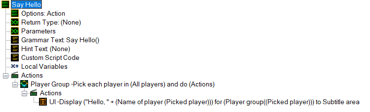
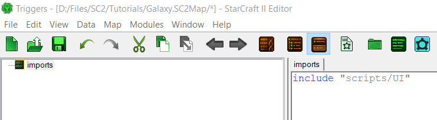
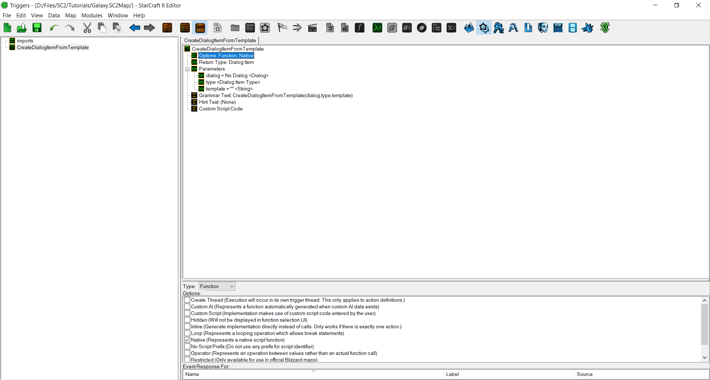
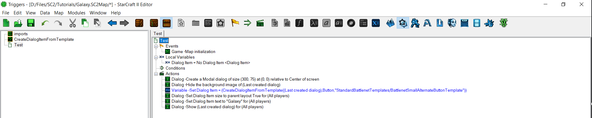
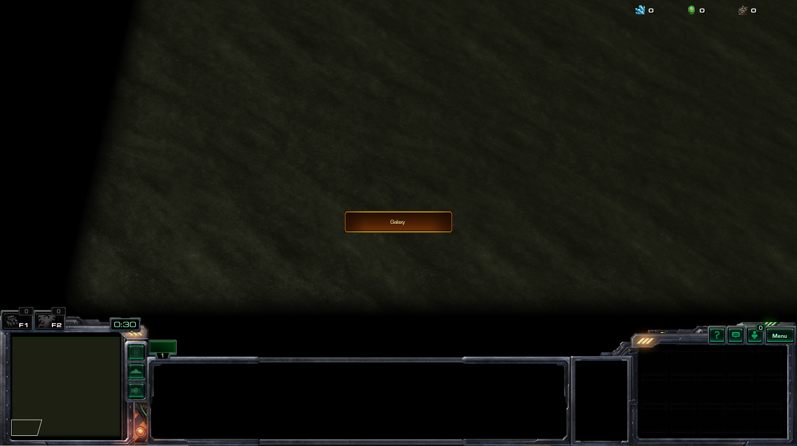

# GalaxyScript

GalaxyScript is the programming language of the SC2 editor. While most of it is hidden behind the GUI layer of the Trigger Editor, all your trigger work eventually boils down to GalaxyScript, autogenerated by the Editor in your MapScript.galaxy.

While many think that GalaxyScript should never be interacted with due to the Trigger Editor, there are reasons to write parts of your project in GalaxyScript. In this guide, you will learn the basics of when and how to incorporate GalaxyScript into your project.

This tutorial assumes that you have a good foundation in either traditional programming or the Trigger editor. It also assumes you have saved your map as a .SC2Components (though there's no real reason to ever *not* do this.) and are using Talv's VSCode extension.

[](./resources/058_GalaxyScript1.png)
*For Example, This GUI Compiles to the Code Below*

```c
void gf_SayHello () {
    // Automatic Variable Declarations
    playergroup auto50B0D547_g;
    int auto50B0D547_var;

    // Implementation
    auto50B0D547_g = PlayerGroupAll();
    auto50B0D547_var = -1;
    while (true) {
        auto50B0D547_var = PlayerGroupNextPlayer(auto50B0D547_g, auto50B0D547_var);
        if (auto50B0D547_var < 0) { break; }
        UIDisplayMessage(PlayerGroupSingle(auto50B0D547_var), c_messageAreaSubtitle, (StringExternal("Param/Value/E3C00EB1") + PlayerName(auto50B0D547_var)));
    }
}
```

# Why GalaxyScript?

*"But we can do everything GalaxyScript can do in the GUI, right? So why should we use it?"*

Nope. There are some things you can only do in GalaxyScript (or are like pulling teeth in GUI). There's also some other reasons, which I've listed below.

### 1. You can Copy/Paste

We've all had that moment when using the editor: You realize you're going to have to do a lot of copy/pasting, or - say you want to transform an `Int` to a `Real`. When trying to make the change in the GUI editor, it overwrites everything in the statement. Copy/pasting is also a lot slower, especially if you want to change just 1/2 letters per iteration. You're going to have to go back through *all* the statements and navigate the maze of windows - it's not ideal! Galaxy solves all these problems by letting you edit the code like you would any other. It also means that code isn't overwritten when changing small things, like the type of a variable.

### 2. The editor has too much Type Safety.

A lot of things in the editor boil down to either `Strings` or `Ints`. `Dialogs` and `Dialog Items`, for example, are just `Integers`. `Unit Types` (or 90% of Data References, really) are just `Strings`. There's a lot of times when the editor forces you to convert between the many inbuilt types. This can be especially annoying when dealing with Game Links, as they often slow down or lag out the game. In my case, `Create Dialog Item From Template` has a 50% chance of crashing my editor when I try and select the item, even though I just defined them in layouts and just want to use a string. 

Being free from the Type constraints of the editor is incredibly liberating, but with great power comes great responsibility. However, the debug functionality is also far easier to read when writing Galaxy, as it will actually provide the Function's name in script, which makes it far easier to find and fix errors.

### 3. There are some things you can do in GalaxyScript that you just can't do in GUI.

Things like Dynamic Trigger creation (see the examples at the bottom of the page) just cannot be accomplished via the trigger editor. You have to do it via script.

---

The type safety and other features, however, can also be extremely benefitial. Galaxy, like Layouts/UI, is a tool, and with use you'll learn when it's a good idea to use Galaxy and when not to. I generally find that you'll end up writing about ~75% of your code in Triggers, and ~25% in Galaxy. Depending on your level of familiarity with code, this may differ from person to person; you'll eventually find a balance that works well for you.

# Getting Started

Let's start out with some basic examples to get you familiar with the workflow of using Galaxy. Once you've learned this, everything else will come naturally.
The first thing you should do is [bookmark this site](https://mapster.talv.space/galaxy/reference), as it'll be incredibly helpful as you continue.

## Step 1: Creating your first Script

Open your map in File Explorer, and create a folder called `scripts`. This will be where we put all the galaxy files.

Create a file called `UI.galaxy`. As I mentioned before, the "Create Dialog Item From Template" function likes to crash my editor. Let's write a wrapper function so we can create Dialog Items from a string instead.

In the file, copy/paste (or write) the following code snippet.

```cpp
int CreateDialogItemFromTemplate(int dialog, int type, string template)
{
    return DialogControlCreateFromTemplate(dialog, type, template);
}
```

Next, we need to import this into the editor so we can use it. Start by creating a `Custom Script Object (Ctrl+Alt+T)`. Name it `imports`. This is the only Custom Script you'll ever write in the editor. Then, add the following line to it:

```c
include "scripts/UI"
```

[](./resources/058_GalaxyScript2.png)
*It Should Look Like This*

Custom Script just appends the script to the top of the MapScript.galaxy when generated. (If you've ever done any work in C/C++, it's like `#include <stdio.h>`) This allows us to use functions from that file in the 'main' script, and all other scripts that come after it.

Now, let's create a `native function` so we can actually use the script we wrote. Create a new function (Ctrl+F) and name it the same thing as the function in the script: `CreateDialogItemFromTemplate`. Open the function options, then check the box that says `Native Function`. Since it's returning a Dialog Item, set the return value to `Dialog Item`. Then, we'll create the parameters.

- **Dialog** is an int, but you should remember that Dialogs are just integers. So its type is Dialog.
- **Type** is a preset: the type of the Dialog Item. 
- **Template** is a string.

[](./resources/058_GalaxyScript3.png)
*This should be your final result.*

Then, let's test it. I create a dialog item and create a button in it using our function.

[](./resources/058_GalaxyScript4.png)
*This is bad practice. Don't write your triggers like this.*

Let's fire up the test map, and -

[](./resources/058_GalaxyScript5.png)
*Voila.*

We're finished! You've written your first script using Galaxy. Now, if you want to write any more functions or actions, you know how to do it.

Admittedly, what we did above was incredibly easy to do in the GUI as well, but it was more for demonstration purposes than actually showing off the power of Galaxy. When deciding when to write script vs GUI, I have a few rules of thumb.

- Write only self-contained functions. Referring to global variables *is* doable (just add a `gv_` prefix before their name), but it's generally good practice not to. The one exception to this rule is constants, but that should be obvious.
- Do any catalog related work in Galaxy. The GUI functions are annoying and working with strings is a lot easier than working with game links.
- Annoying type conversions or frequently repeated (loops won't work) should be done in Galaxy.
- Trigger creation should always be done in GUI.

As I've mentioned above, everyone has their own style of writing code, so perhaps these tips will work for you, and perhaps they won't. You'll just need to try and learn on your own.

# Tips

Galaxy has a few weird things about it by design. 

- All variables must be declared at the start of the function. You can't call another function and THEN declare a variable.
- `var++` doesn't work. You should use `var+=1` instead.
- As long as they are included in the MapScript, you can reference a function from another Galaxy file without having an include statement in *that* file as well.
- For loops can have null values. 
- If you need to create an async/separate thread function, create a trigger for it.

# Examples

These are some general, all purpose utility/example actions I've rounded up to show examples of various tasks in galaxy. All variable names are meant to be self-explanatory. Anything starting with `c_` is a preset.

## Traversing player groups

```c
void DisplayMessageToPlayerGroup(string message, playergroup group)
{
    int player;

    for(player = 1; player <= CONST_MAX_PLAYERS; player+=1)
    {
        if(!PlayerGroupHasPlayer(group, player)){ continue; }
        UIDisplayMessage(PlayerGroupSingle(player), c_messageAreaChat, StringToText(message));
    }
}
```

## Dynamic Function Registration

```c
void CreateButtonAndRegisterToTrigger()
{
    // Create the Dialog Item
    int dialogitem = libNtve_gf_CreateDialogItemButton(
        CONST_DIALOG,
        300,
        75,
        c_anchorCenter,
        0,
        0,
        StringToText(""),
        StringToText("Click Me!"),
        ""
    );

    // Add it to global trigger TRIGGER_VARIABLE
    TriggerAddEventDialogControl(
        TRIGGER_VARIABLE,
        c_playerAny,
        dialogitem,
        c_triggerControlEventTypeClick
    );
}
```

## Creating a Trigger / Creating an async (runs in separate thread) function

```c
trigger MyGlobalTrigger;

// You can name these variables whatever you want; testConds/runActions is just the standard.
bool MyTrigger(bool testConds, bool runActions)
{
    // Echoes the chat message back to the player
    UIDisplayMessage(PlayerGroupSingle(EventPlayer()), c_messageAreaChat, StringToText(EventChatMessage()));

    return true;
}

void MyTrigger_Init()
{
    // Use the name of the function you want to execute as an argument
    MyGlobalTrigger = TriggerCreate("MyTrigger");
    TriggerAddEventChatMessage(MyGlobalTrigger, c_playerAny, "echo", false);
}
```

## Scope

```c
// This function cannot be accessed outside of this file
static bool ThisIsTrue()
{
    return true;
}


// This function can
bool TrueIsTrue()
{
    if(!ThisIsTrue())
    {
        return false;
    }
    else
    {
        return true;
    }
} 
```