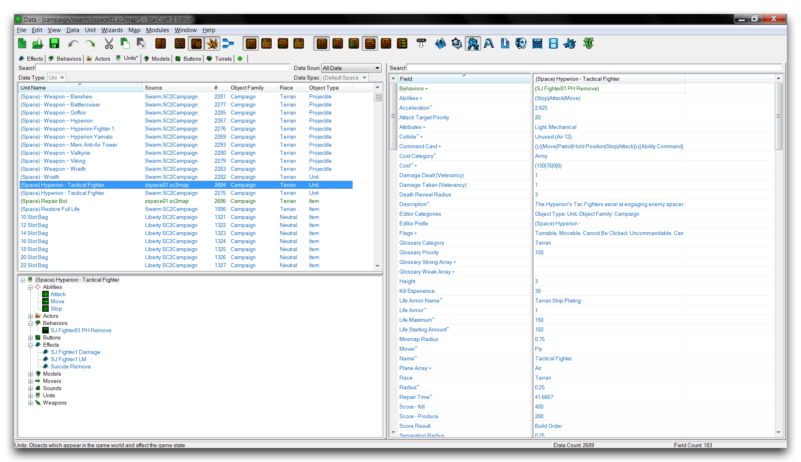
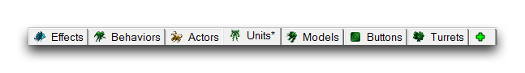
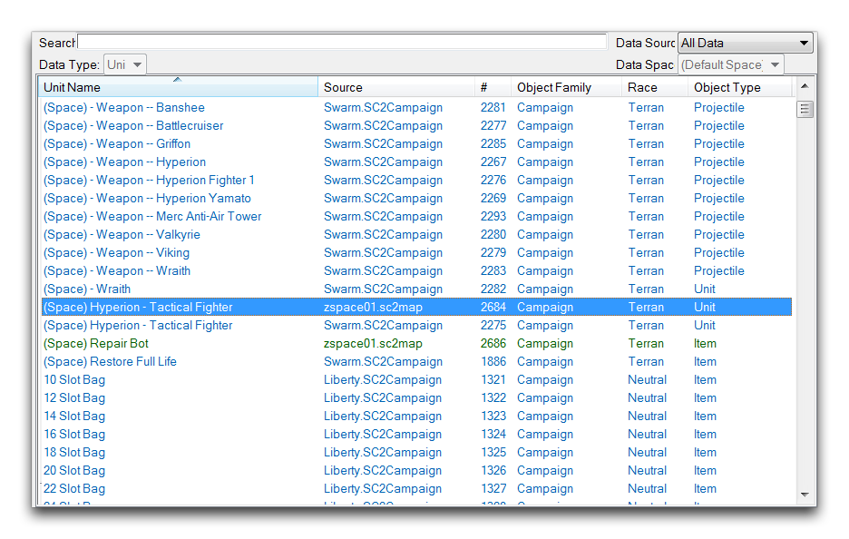
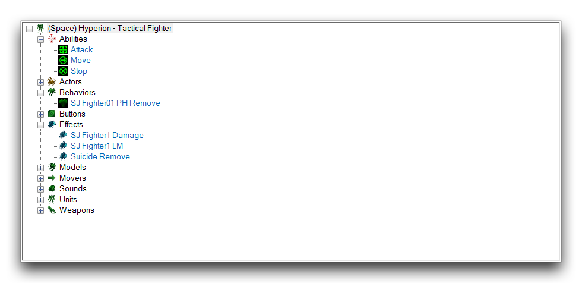
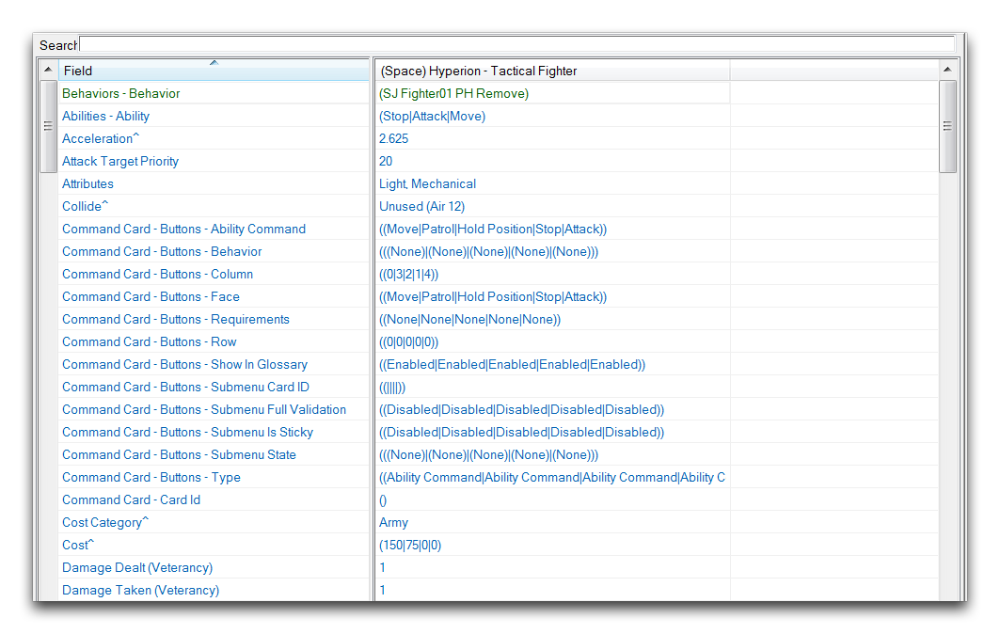
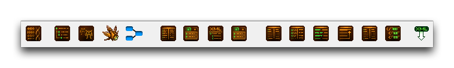
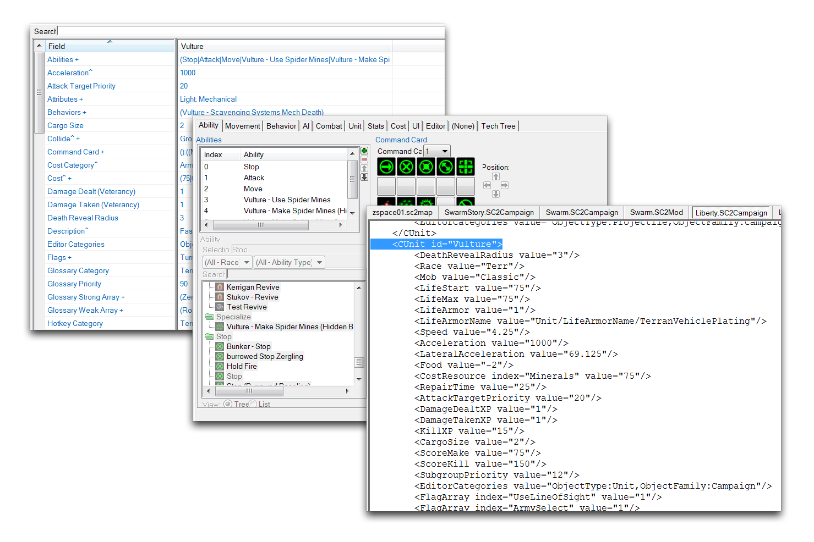
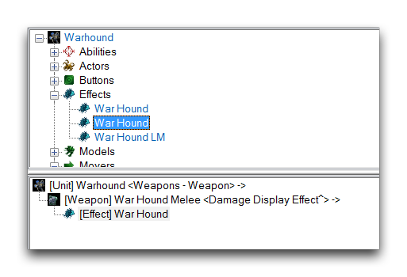

# Data Editor Introduction

The Data Editor houses all of the data assets in the Editor. Every piece of a project's data is built using the basic types found here. It is a deep and powerful system that offers users a great deal of control, the most ever seen in a Blizzard editing suite.

*Data Editor in Use*

Inside the Data Editor you'll find a robust feature set supporting its editing functionality. You should note that data will update dynamically while you work, allowing changes to propagate quickly throughout the whole project. There are also several visualization options offering an overview of any data construct. These are great for building a tactile sense of how the engine operates. Perhaps most importantly, all of StarCraft's assets are made available and can be viewed through the Data Editor. Here you can examine them closely and learn from them, or repurpose them for use in your own mods.

## Data Catalogs

Data in the Editor is organized into Catalogs, each containing a list of every instance of a specific data type currently active in the project. You must navigate to a specific data type's catalog to create or manage any data of that specific type. Each catalog provides a view of all the data fields of its associated type, as well as some context appropriate options. There are 87 catalogs in total in the Data Editor, though most users will find that their work concentrated in a small fraction of them. Most of that 87-catalog count is made up by highly specific types of data, many of which you'll seldom use.

Some examples of catalogs include familiar game types like Abilities and Units, and art assets like Models and Sound. Some of the more specific types mentioned above include Physics Materials, Cursors, and Achievements. You'll find a full list of the engine's catalogs below this paragraph. It's worth noting that the catalogs are organized into broad categories, such as Game Data or Actor Data, to reflect the different purposes of different data types.

  - GAME DATA \[13\]

<!-- -->

  - Abilities --- Behaviors --- Effects
  - Footprints --- Items --- Loot
  - Movers --- Requirements --- Turrets
  - Units --- Upgrades --- Validators
  - Weapons

<!-- -->

  - CAMPAIGN DATA \[13\]

<!-- -->

  - Army Categories --- Army Units --- Army Upgrades
  - Bank Conditions --- Campaigns --- Characters
  - Commanders --- Conversations --- Conversation States
  - Locations --- Maps --- Objectives
  - Preload

<!-- -->

  - ACTOR DATA \[3\]
    
    \--- Actors --- Attach Methods --- Beams

  - ART AND SOUND DATA \[12\]
    
    \--- Buttons --- Digital Sound Effects --- Lens Flare Sets
    
    \--- Lights --- Models --- Reverb Effects
    
    \--- Shapes --- Sounds --- Sound Exclusivities
    
    \--- Sound Mix Snapshots --- Soundtracks --- Textures

  - TERRAIN DATA \[9\]
    
    \--- Terrain Cliffs --- Terrain Cliff Meshes --- Fog of War Data
    
    \--- Physics Materials --- Terrain Types --- Terrain Objects
    
    \--- Terrain Textures --- Terrain Roads --- Water

  - HERO DATA \[11\]
    
    \--- Artifacts --- Artifact Slots --- Configs
    
    \--- Heroes --- Hero Abilities --- Hero Statistics
    
    \--- Mounts --- Skins --- Talents
    
    \--- Talent Profiles --- Voice Overs

  - INTERFACE DATA \[6\]
    
    > \--- Alerts --- Bundles --- Cameras

\--- Cursors --- Game UI Data --- Pings

  - ADVANCED DATA \[20\]
    
    \--- Achievements --- Achievement Terms --- Boosts
    
    \--- Gameplay Data --- Herds --- Herd Nodes
    
    \--- Item Classes --- Item Containers --- Kinetics
    
    \--- Races --- Requirement Nodes --- Rewards
    
    \--- Score Results --- Score Values --- Tactical AI Cooldowns
    
    \--- Tactical AI Data --- Target Finds --- Target Sorts
    
    \--- Trophies --- User Types

## The Interface

*Data Editor Interface View*

You can navigate the Data Editor's catalogs using the Catalog Tabs, shown below.

*Catalog Tabs*

Each catalog has an associated tab that gives access to their data listings. You can bring the tab into a project using the green, plus-sign shaped Catalog Opener. Once you have selected a tab, it will populate the catalog's data in the Object List, as shown below.

*Object List*

This list organizes the entire data catalog based on several context sensitive properties, such as Source, ID \#, Object Family, and Race. As you can see in the image below, the full hierarchy of a data structure is displayed for the selected instance within the Object Explorer.

*Object Explorer*

For higher level constructs like Units, this explorer offers a crucial top-down look at all of the contents of a piece of data. Any piece of data in the Object Explorer or Object List will display its data fields in the Fields Listing, as shown below.

*Fields Listing*

The Fields Listing is the data entry segment of the Data Editor. Here data can be altered directly through user input. Since there is so much variety in the types of catalogs and fields available for editing, there is a selection of viewing options to make the listing as accessible as possible. You'll find these in the Data Bar.

*Data Bar*

Below is a breakdown of the various viewing options.

| Action                      | Effect                                                                                                         |
| --------------------------- | -------------------------------------------------------------------------------------------------------------- |
| View Raw Data               | Changes all the data to its raw ID values used in the back-end code, rather than its more useable Name values. |
| Display Object List as Tree | Displays the Object List as a set of structured folders.                                                       |
| Display All Object Sources  | Displays the original, unaltered source data alongside any current versions of the data.                       |
| Show Object Explorer        | Toggles the availability of the Object Explorer.                                                               |
| View in Data Navigator      | Visualizes the currently selected data instance in the Data Navigator.                                         |
| Table View                  | Displays the Fields Listing as a tabled list of all its individual fields.                                     |
| Detail View                 | Displays the Fields Listing as a combination of its entry windows or subeditors.                               |
| XML View                    | Displays the Fields Listing as its raw XML file.                                                               |
| Sort Fields by Source       | Organizes the listing by the data sources of each field.                                                       |
| Show Basic Field Labels     | Displays the (Basic) label on the any data fields originating from that source.                                |
| Show Field Categories       | Displays any category headings for each piece of data.                                                         |
| Combine Structure Values    | Combines any related fields into a single field.                                                               |
| Show Field Differences      | Displays any differences in the data fields.                                                                   |
| XML Syntax Highlighting     | Enables colored, type-based highlighting for the XML view.                                                     |
| Commit XML Changes          | Saves any currently unsaved changes to the XML files.                                                          |

These options include the structured Fields Listing views: Table View, Detail View, and XML View. These are shown below.

*Table View - Detail View -- XML View*

These viewing options are also accessible from the View Tab of the Data Editor.

*View Tab*

There are different options available in each layer. You can access them from the large panel on the leftmost side of the main terrain view. This is called the UI Panel.

The **UI Panel** changes depending on your current layer; each layer has a Palette that offers most of the major controls for that layer. These Palettes are geared specifically for use in the current layer. You should also note that the top File Tab offers many options. These are broken down into subtabs, which are described in the following sections.

## Subeditors

In some cases, you'll find that there are more specialized, nested editors available during field editing. These Subeditors include the Actor Events Editor, the Footprints Editor, and the Sound Editor. These are shown in the image below.

*Actor Events Editor -- Footprint Editor -- Sound Editor*

## Data Visualization

As the data structures within your project grow and are woven together, it can be useful to have some visualization options so that you can get a better look at what your project is doing. The Data Editor offers a few options for this, most notably the Data Navigator shown below.

*Data Navigator*

The navigator draws the links between each piece of data, presenting the entire instance's data hierarchy in a readable manner. Another useful provision is the Show Explain Link option available for use with the Object Explorer. This will display a simpler version of the data connections to an output panel, as shown in the image below.

*Show Explain Link*
