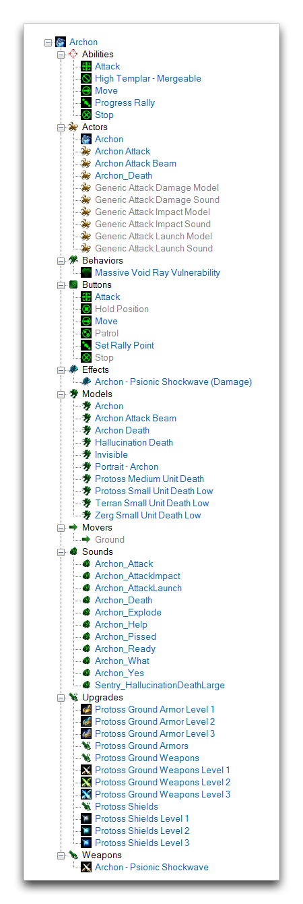
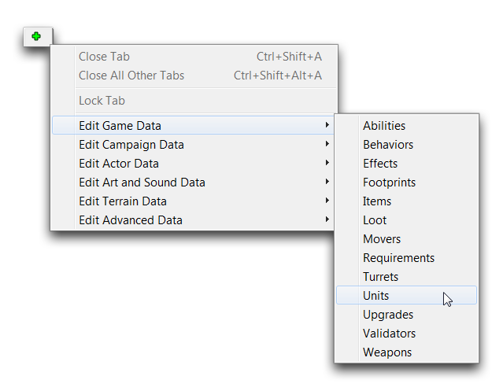
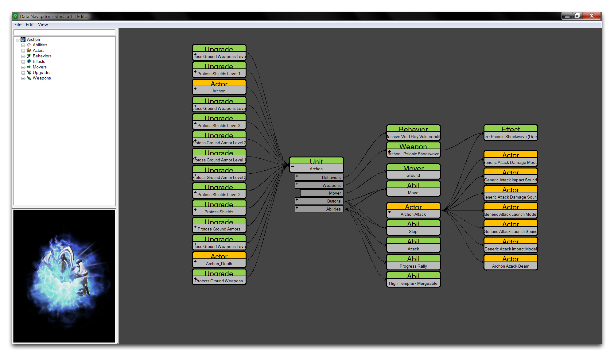
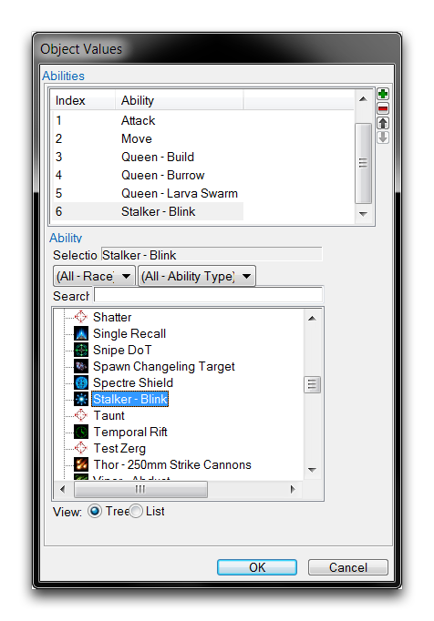
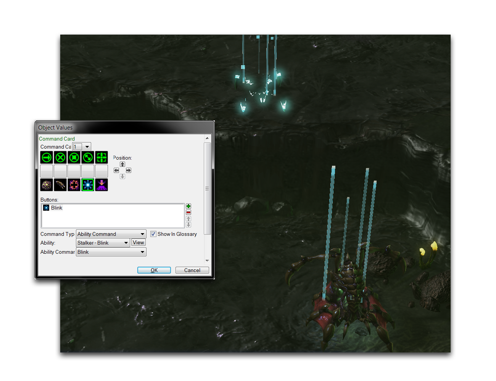

# Units

A Unit is an interactive game object. Despite the term being thrown around in a lot of contexts, in the Data Editor the term 'unit' refers very specifically to a data type placed directly into the game to be manipulated by players. Selecting a unit in the Data Editor will give you a breakdown like the one shown below.

*Unit Data Object*

The unit shown above is the Archon, as displayed on the top of its fairly extensive data hierarchy. The length of the list shown here should give you an impression of the unit data type's main purpose, to serve as a container for various other types of Game Data, Art and Sound Data, and Actors. You can investigate units in the Data Editor by navigating to them via + ▶︎ Edit Game Data ▶︎ Units, as shown below.

*Navigating to Units in Data*

The unit data type is distinguished from other data types by the fact that it can be placed into the game and receive inputs, things like player commands, interactions with other units, and orders from an AI. Communicating these interactions to its connected data types makes the unit one of the primary ways in which data is turned into gameplay. The data composition of a unit is shown in the image below.

*Unit Composition*

As you can see, much of the data in the Editor ends up leading to a unit. The direct contributors are Abilities, Actors, Behavior, Movers, and Weapons. The relationship between these categories and the Units type is described below.

## Abilities

A unit has space for up to 32 abilities. These abilities determine much of its functionality. Common abilities present in a unit include attack, move, stop, hold position, and patrol. These abilities are primarily added to a unit through the 'Abilities' field shown below.

*Unit Composition*

Once added, the abilities are tied into gameplay using the 'Command Card' field. Adding a button to the command card portion of the unit's UI allows player inputs to trigger abilities. You can see this procedure being used in the image below.

*Custom Command and Effect*

## Actors

Actors mainly add art and sound assets into a unit. More specifically, each unit is home to an Actor that shares its name. These hook in the unit's 3D model, portrait, death animation, and operational sounds. Many units also have an attack actor that handles the visual and audio components of their weapons. These actors are linked to the unit in their actor messages. In the image below you'll one of these actors hooking art and sound into a unit.

*Actor to Unit Data Connection*

## Behaviors

Behaviors can exist in the scope of a unit, giving it passive abilities such as auras or timed life. Behaviors are added to a unit using the 'Behaviors' field, as shown below.

*Mothership Behavior View*

## Movers

A unit will have a mover that that dictates its basic movement. Any unit without a mover cannot use move commands. Common movers for units include Ground, Fly, Burrowed, and Cliff Jumper. Projectiles also contain movers, typically more complex ones that simulate dynamic movement. You can customize a unit's movement further within the unit's movement fields, allowing you to set things like Speed, Turning Rate, and Acceleration. Movers are set up within a unit's 'Movers' field.

*Missile Mover*

## Weapons And Turrets

Weapons grant a unit the ability to attack. Without a weapon, attack commands are unavailable. They operate in a relatively straightforward manner. It begins with a unit being targeted, either by a player or the AI. The weapon will then create an effect at the target. If the target unit is in range and the weapon's cooldown period has expired, the weapon will fire, playing an animation, applying its effects, and launching a missile if appropriate. Weapons can also be stacked, giving a unit multiple attacks that each have their own effects, range, cooldowns, and so forth.

Each weapon can also be configured with a turret. Turrets are a special data type responsible for aiming at their attack targets. This aiming creates a timed rotation of the turret before firing, which provides both a visual and gameplay element. Weapons and turrets are added to a unit using their respective fields, 'Weapons' and 'Turrets.'
