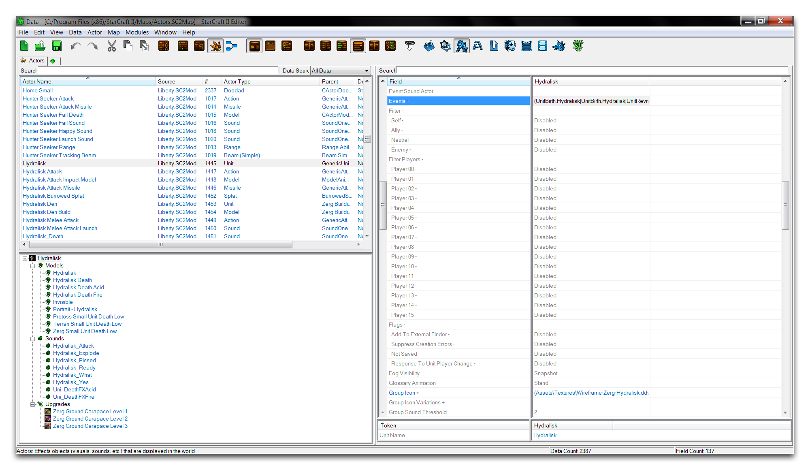
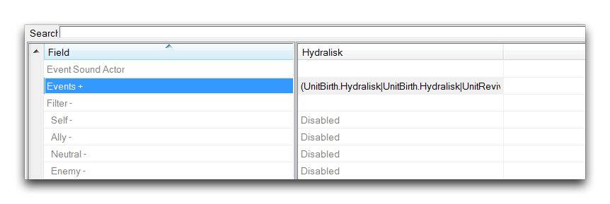
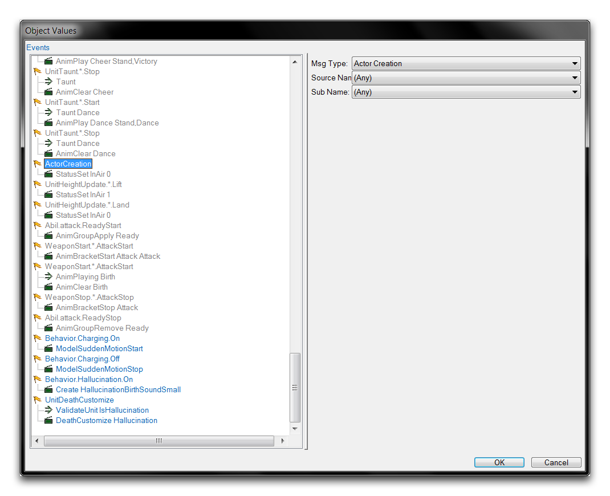
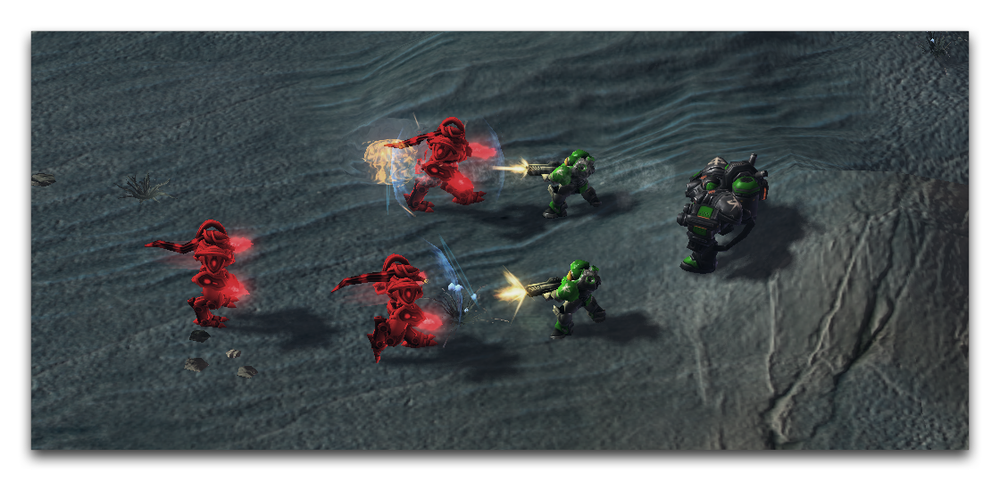

# Actors

Actors are the workhorse of the Data Editor. They are both essential and wide-ranging, so much so that it can be difficult to pin an exact definition to them. Actors can be more easily defined in terms of their purpose. To put it as simply as possible, actors accomplish things within data.

Actors have their own logic system, which is responsible for much of the linking and action between data. Some actors hook together the observable components of the engine, such as models, doodads, and sound, tying them into the game. Other actors affect gameplay by configuring attacks and abilities. There's even a variety of higher level constructs for use with actors, including actor lists that track and organize actors, actor regions that can interact with other actors based on a map area, and event macros that collect common actor logic into a reusable tool. Actors are also the asynchronous component of the StarCraft engine, allowing them to push different data to different players.

You can find the actors section of the Editor by moving to the Data Editor and navigating to + ▶︎ Edit Actor Data ▶︎ Actors, as shown below.

*Navigating to Actors in Data*

This will bring you to the actors tab of the Data Editor, presenting you with the following view.

*Actors Tab View*

The fields in actors are described in the following section.

## Actor Details

Owing to the many types available for actors, a single treatment of every actor property would be too unwieldy to be useful. However, actors have a large list of common properties, which are broken down in the table below.

| Field                       | Details                                                                                                                                                                                                                                                                                                                                                                                                                            |
| --------------------------- | ---------------------------------------------------------------------------------------------------------------------------------------------------------------------------------------------------------------------------------------------------------------------------------------------------------------------------------------------------------------------------------------------------------------------------------- |
| Aliases                     | Alternate reference names for actors. These offer a shortcut, making it easy for actors to send messages to one another. For example, unit actors have a common \_Unit alias. When a separate actor wants to access the unit actor, it may use this alias. This is preferable to looking up the actual actor name, which will differ each time.                                                                                    |
| Copy Source                 | Sets another actor as a proxy parent. This means that any child actors of the current actor will acquire their properties from the Copy Source actor. The properties to be acquired must be set in the Copy Source actor's Accepted Property Transfers field and the child actor's Inherited Properties field.                                                                                                                     |
| Filter                      | Sets the visibility of the actor to Ally, Enemy, Neutral, or Self groups of the actor's owner.                                                                                                                                                                                                                                                                                                                                     |
| Filter Player               | Sets the visibility of the actor on a player basis.                                                                                                                                                                                                                                                                                                                                                                                |
| Flags                       | Flags contains a number of additional options for the actor.                                                                                                                                                                                                                                                                                                                                                                       |
| Add to External Finder      | Moves the actor to a global scope, making it usable by all other actors in the game.                                                                                                                                                                                                                                                                                                                                               |
| Not Saved                   | Marks the actor to not save or load during a game save, reducing the time of these operations.                                                                                                                                                                                                                                                                                                                                     |
| Response to Unit Player     | Sets the actor to automatically update its player ID when its unit actor changes owner.                                                                                                                                                                                                                                                                                                                                            |
| Suppress Creation Errors    | Turns off the actor's creation error message. This is useful if an actor is designed to fail its creation event under certain circumstances.                                                                                                                                                                                                                                                                                       |
| Fog Visibility              | Sets the actor's appearance under fog of war. The behavior options are as follows: Dimmed appears darkened, Hidden hides the actor completely, Snapshot will show the actor's last visible state before leaving vision, and Visible makes the actor remain visible under fog.                                                                                                                                                      |
| Sharing                     | Sets the behavior for sharing the actor if it is requested by multiple functions. The options are: Always shared, Never shared, and Per Effect. Per Effect allows the you to configure sharing on an effect basis.                                                                                                                                                                                                                 |
| Events                      | Allows the setting of actor events and messages, which are the internal logic language for actors.                                                                                                                                                                                                                                                                                                                                 |
| Macros                      | Can add event macros here. Event macros are a collection of common Events that are reusable in many actors.                                                                                                                                                                                                                                                                                                                        |
| Remove                      | Specify the removal of unwanted Events inherited from the parent actor.                                                                                                                                                                                                                                                                                                                                                            |
| Terms                       | Sets conditions that must be passed for the actor to be created. Identical to the term of the creation event within Events and will overwrite that message if entered here. This has an application in data organization.                                                                                                                                                                                                          |
| Host Supporter              | Host Supporter is used to specify a supporter actor. When the supporter dies a SupporterDesctruction message is sent to the actor which hosted it. This is often used to destroy that hosting actor, but can also be used to play animations or propagate messages.                                                                                                                                                                |
| Accepted Property Transfers | Determines which of a set of properties will be passed on to child actors. Controlled via a set of flags. Some of the numerous options here include Model Scale, Opacity, Scale, Team Color, Visibility, and Decal. There are even more transfer properties within the continuation field, Accepted Transfers. Options within Accepted Transfers include Animation Properties, Fog of War Color, Position, Rotation, and Textures. |
| Inherit Type                | Sets if the actor inherits its properties from its host on creation via Once, never via None, or in a dynamically updating fashion via Continuous.                                                                                                                                                                                                                                                                                 |
| Inherited Properties        | Determines the set of properties this actor inherits from its parent actor. For a property to be inherited correctly, it must be selected in both the Inherited Properties and Accepted Property Transfers fields.                                                                                                                                                                                                                 |

## Actor Events

Actor Events is a communication system for actors. It allows for actors to speak to one another, creating context sensitive changes that can affect any aspect of the game. This system is composed of three basic elements, which are described below.

 A specific development that can occur within the game.

 A confirmable set of properties of the game state.

 Commands that can be communicated to elements of the game.

These elements work together in a sequence, creating an actor event. The sequence unfolds as follows. Setting an actor's events makes the actor watch for a specific Event to occur. If it does, then the Terms are checked. If they are found to be true, the Messages are sent out to their targeted game elements.

You may already have noticed that this is similar the Editor's other main communication system, triggers. The events, terms, and messages of the actor events system are parallel to the events, conditions, and actions of the trigger system. While the trigger system can apply to many gameplay elements, the actor events system deals primarily with data. Triggers are usually the option for specific instances of units, objects, and occurrences in a map. Actor events work for the general type of an object. Actor events design a unit and its interactions, while triggers can adjust and alter that unit during gameplay.

You can find the actor events system by navigating to the 'Events' field of any actor type. A view of a typical events field is shown below.

*Actor Events Field*

Double clicking this field will launch the actor events subeditor.

*Actor Events Subeditor*

This subeditor presents an organized view of the events, terms, and messages in an actor's 'Events' field. You should note that the elements are colorized by their data source. Gray elements indicate inheritance from the game's core data, Blue elements are from a Blizzard dependency, and green elements are from the current project.

## Actor Event Use

You can set actor events by highlighting an element in the subeditor view, then selecting its type via the rightmost panel's 'Msg Type' or 'Term Type' dropdowns. Note that both events and messages are referred to using the term 'message.' This is because they're interchangeable, messages can be used as event triggers and vice versa.

Additional options, such as parameters or sources, typically control what the messages are communicating to. Any messages without a target will be sent by the actor to itself. Messages can also be targeted more granularly through the use of aliases. Although actors can be referred to by their direct name such as Marine, they usually have a type alias like \_Unit, and a system reference like ::Creator.

Actor events are incredibly versatile. They can perform the fundamental handling of actors within data, such as creating them, destroying them, and linking them. However, actor events have many more nuanced functions, like playing animations, altering the physical properties of art and sound assets, applying physics, and controlling lighting. As an example of actor events' capabilities, note the following.

*Sample Actor Event*

Here, an event has been set to respond to a zealot's charging behavior. In response to the charge starting, the zealot will send out a message to its own unit actor, resulting in its model being tinted to a reddish color. On testing, the gameplay results appeared as shown below.

*Zealots Tinting an Angry Red during Charge*

## Actor Events & Triggers

As mentioned earlier, there are many parallels between the actor events and trigger systems despite their dealing with different segments of the game. While it can be useful to keep the two separate in your thinking, the fact is that the two systems frequently communicate with one another, overlap in functionality, and can be used to accomplish the same things in several different ways.

An important example of this is that actor messages can be sent to specific actors using the Trigger Editor's 'Send Actor Message' action. You can see this in action below.

*'Send Actor Message' Actions*

Above, an action statement in the body of a trigger has sent out a 'Set Tint Color' message to a hydralisk's unit actor. The unit actor has also received a message to change its team color. Together, these messages have dyed the unit's model a blue color, by speaking directly to its actors from triggers.

*Colorized Hydralisk*
