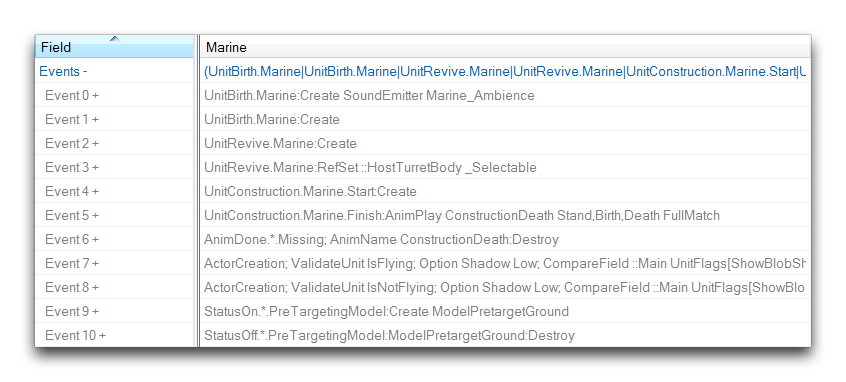
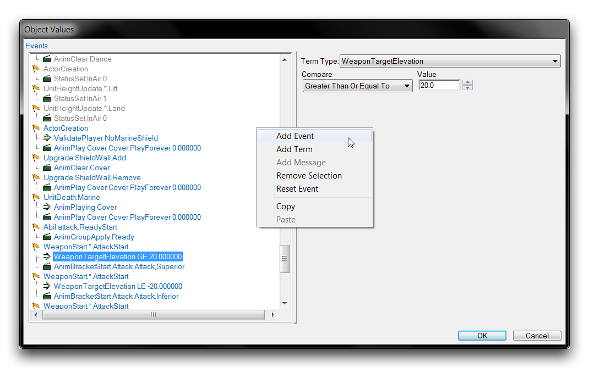
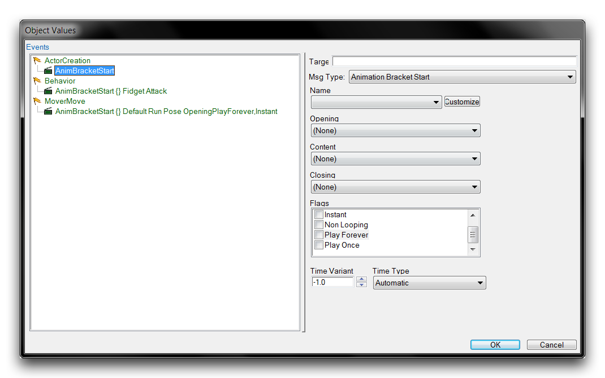
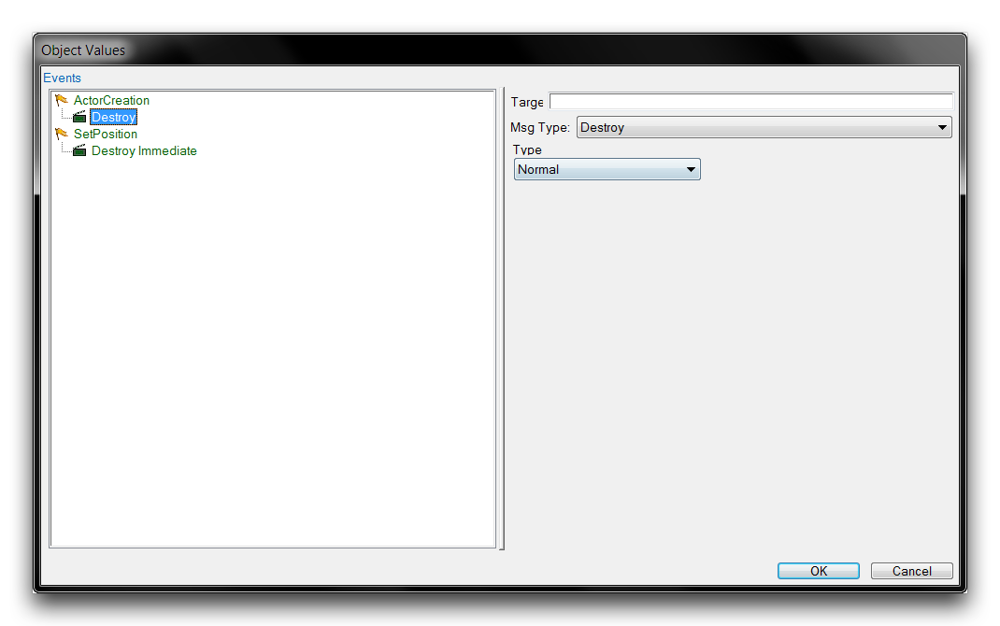
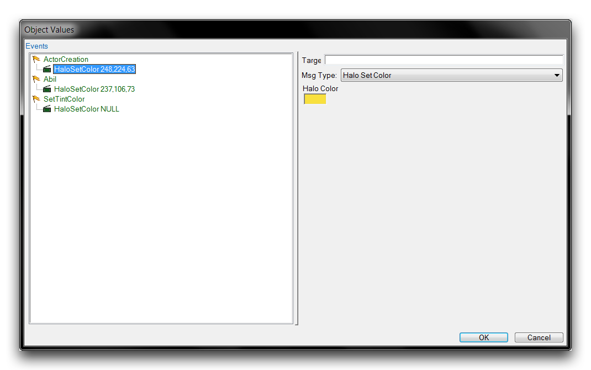
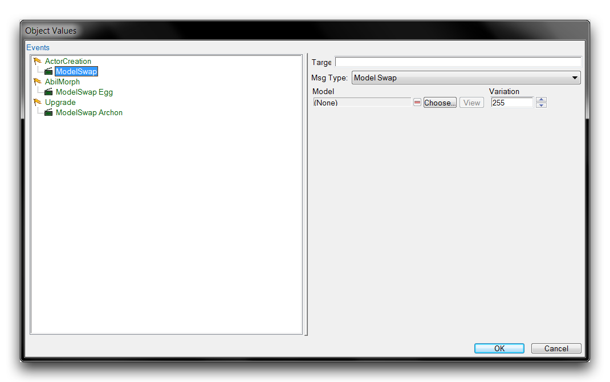
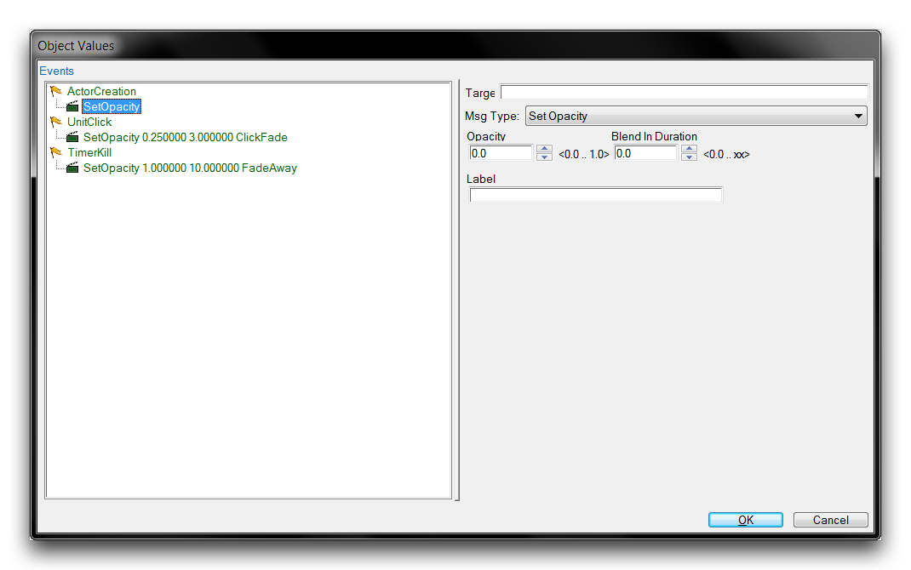
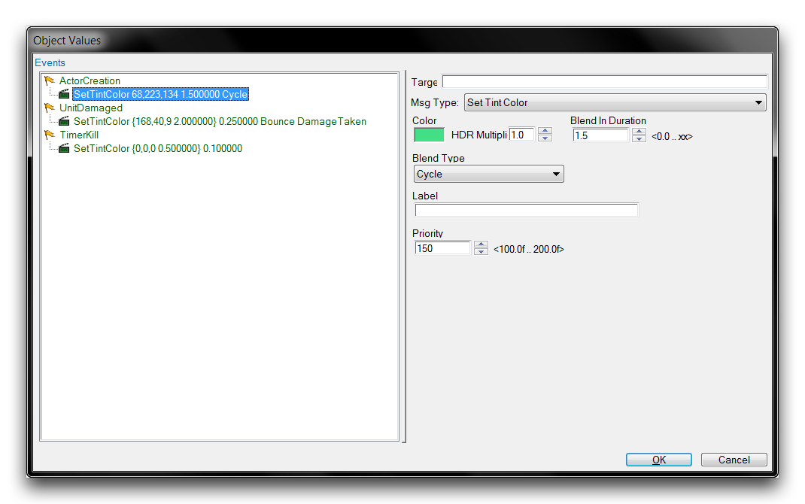

# Actor Messages Rundown

For nearly every data type, there is some associated actor message to provide its logical backend. This guarantees that the stable of actor messages is both diverse and numerous. In this article you'll find a breakdown of many of the types of messages, as well as some suggestions for their use.

Before we start, you should note that you can see an actor's messages both directly, through the expandable 'Events' field, and structured inside the actor event's subeditor. Each entry in this article will also include a view of the message type within the subeditor, but the basic fields view can be sometimes be noteworthy as well. You can see an example of this view in the image below.

*Actor Events Field*

From here you can see the direct ID of actor messages, such as UnitBirth or ActorCreation, rather than their structure form in the subeditor selection panel of 'Unit Birth' or 'Actor Creation.' These IDs may be important when using actor messages in the Trigger Editor or scripting. As such, they have been supplied at the start of each of the following entries.

While this article may serve as a reference, you should be aware that best way to investigate the full library of actor messages is individually, by creating and examining messages in the subeditor view itself. You can create an actor event or message by moving to an actor's 'Events' field, double clicking it to launch the subeditor, then right-clicking inside the white box and selecting 'Add Event.' This will create an event and message pair.

*Actor Event Creation*

Below you'll find a rundown of the many types of actor messages.

## Animation Play

*Animation Play Message*

AnimPlay

Plays the specified animation. This is the essential message for animation control, its options mainly control the physical properties of the animation.

| Field                | Details                                                                                                                                                   |
| -------------------- | --------------------------------------------------------------------------------------------------------------------------------------------------------- |
| Name                 | Sets a reference label for the message.                                                                                                                   |
| Animation Properties | Selects the animation type from a dropdown. All animations are tied to a preset list of states. You can find and investigate them in the Cutscene Editor. |
| Flags                |                                                                                                                                                           |
| Asset Driven Looping | Similar to Play Forever, but loops with more defined behavior set within the animation.                                                                   |
| Full Match           | Will match the animation's consecutive plays to one another without any stuttering.                                                                       |
| Non Looping          | Plays through the current animation once.                                                                                                                 |
| Play Forever         | Continually loops the animation.                                                                                                                          |
| Random Start Offset  | Starts the animation at a random frame.                                                                                                                   |

Blend In Blending dynamically interpolates between two different sets of animations. This sets the amount of time spent blending into this animation from the current one. Blend Out Sets the time spent blending out of this animation into a new one. Time Variant Sets the type of time scale used to set the Time Variant. Time Type Sets the type of time scale used to set the Time Variant. Blend In Start Offset Sets an offset time for the blending process to start. Priority Override Sets the priority for blending in comparison to the other animation's priority.

## Animation Bracket Start

*Animation Bracket Start Message*

AnimBracketStart

Animation brackets act as containers for three-stage animation sequences. The stages are Opening, Content, and Closing.

| Field               | Details                                                                |
| ------------------- | ---------------------------------------------------------------------- |
| Name                | Sets a reference label for the message.                                |
| Opening             | Sets the first stage animation.                                        |
| Content             | Sets the second stage animation which plays following the Opening.     |
| Closing             | Sets the final animation stage which plays after the Content.          |
| Flags               |                                                                        |
| Closing Full        | Confirms that the Closing animation completes under any circumstances. |
| Instant             | Will skip the Opening animation and begin at the Content.              |
| Non Looping         | Sets the Content animation to only play once.                          |
| Play Forever        | Replays the Opening animation until receiving a manual stop.           |
| Random Start Offset | Applies a random offset to the animation start times.                  |

Time Variant Sets the type of time scale used to set the Time Variant. Time Type Sets the type of time scale used to set the Time Variant.

## Destroy

*Destroy Message Options*

Destroy

Destroys the actor, eliminating it from any further updates and removing any visual components. There are two available types, Immediate and Normal. Immediate will instantly destroy the actor and any of its substituents. In the case of units, their death animations are not played. Normal removes the actor and its substituents, but allows death animations to play and particles to naturally fade out.

## Glow Start

*Glow Start Message*

GlowStart

Applies a pulse-like glow effect to the actor's model. This can be stopped with the 'Glow Stop' message. There are no suboptions for this message.

## Halo Set Color

*Halo Set Color Message*

HaloSetColor

Halos add a glowing outline around a model. They are typically used to provide contrast to a unit or highlight it for specific reference. This message sets the color of the halo, while 'Halo Start' and 'Halo Stop' control its addition and removal respectively.

## Model Swap

*Model Swap Message*

ModelSwap

Sets the actor's model to the value selected for Model. This will replace any currently selected model. This also supports picking of the model's specific Variation.

## Set Opacity

*Set Opacity Message*

SetOpacity

Alters the opacity of the actor, propagating that change to any connected visual asset, such as a model.

| Field             | Details                                                                                                    |
| ----------------- | ---------------------------------------------------------------------------------------------------------- |
| Opacity           | Sets the level of opacity applied, with 0.0 being the default status and 1.0 being completely transparent. |
| Blend in Duration | Sets the time period over which the opacity will be applied. By default, application is instant.           |
| Label             | Sets a reference label for the message.                                                                    |

## Set Tint Color

*Set Tint Color Message*

SetTintColor

Applies a tint to the actor, propagating the color change to any connected visual assets, such as a model.

| Field             | Details                                                                                                                                                                                                    |
| ----------------- | ---------------------------------------------------------------------------------------------------------------------------------------------------------------------------------------------------------- |
| Color             | Sets the color applied as a tint. Clicking the color box will launch a color picker window.                                                                                                                |
| HDR Multiplier    | Sets the brightness amplification through HDR lighting.                                                                                                                                                    |
| Blend In Duration | Sets the time period over which the color will be applied. By default, application is instant.                                                                                                             |
| Blend Type        | Selects from different blending methods. One Shot will apply the blend into the color once, Bounce will blend into the color then back out again, and Cycle will repeatedly blend in and out of the color. |
| Label             | Sets a reference label for the message.                                                                                                                                                                    |
| Priority          | Sets the priority of this tinting over similar messages.                                                                                                                                                   |
