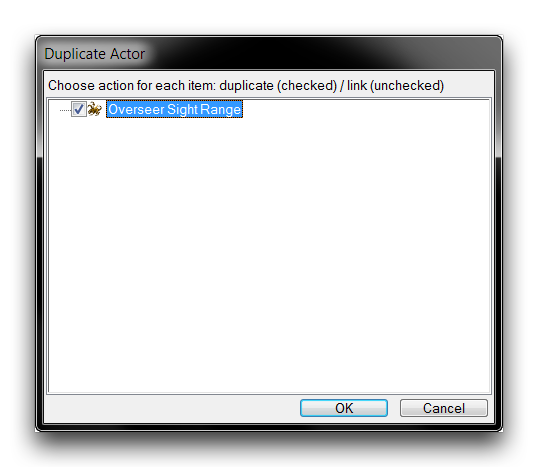
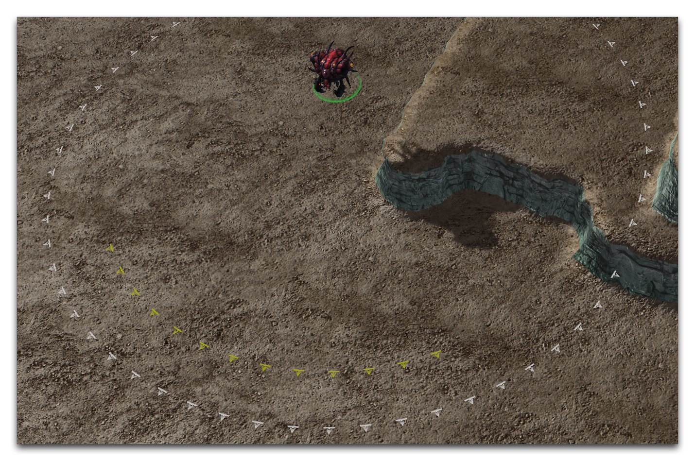

RANGE ACTORS
============

Range Actors are used to draw range indicators on the map. A range actor
is a visual actor with a narrow purpose that sees frequent use in
StarCraft's melee game. In this capacity, range indicators mark a lot of
distances relevant to gameplay, including the casting range for a
ghost's snipe, the vision ranges for an observer's detection, and
perhaps most famously the shelling range for a siege tank.

Siege Tank Range Actor

In actuality, range actors don't draw range indicators. Instead, they
draw a circularly patterned texture on the map, which then operates as a
range indicator. The distinction is made here so that you understand
that range actors can be used in other ways. It's important to have a
full understanding of what the actor is actually doing so that you can
both configure and employ it.

You can set the visibility of range actors in the Terrain Editor by
navigating to View -\> Show Terrain -\> Show Range. You can find range
actors in data, under the actors tab, with the type 'Range,' as shown
below.

Range Actors Listing

RANGE ACTOR DETAILS
-------------------

Range actors have a large number of fields due to their parentage from
actors. However, the reality is that you'll only be using the most
useful of those fields. Range actors' most useful fields are broken down
in the following table.

  ----------------------------------------------------------------------------
  Field      Details
  ---------- -----------------------------------------------------------------
  Ability    Links the actor to an ability and receives a Range value from it.

  Arc        Sets the fraction of a circle, or the arc, over which the texture
             will be patterned. Values are between 0 and 360. By default,
             indicators draw a full circle or 360. The arc begins directly in
             front of the unit and widens equally in both directions.

  Behavior   Links the actor to a behavior and receives a Range value from it.

  Cliff      Sets how the range actor will project its texture to other cliff
  Level      levels. Checking Lower, Higher, or Equal will display the texture
  Flags      onto those levels.

  Sight      Links the actor to a unit and receives a range value from its
             Sight Radius field.

  Weapon     Links the actor to a weapon and receives a Range value from it.

  Icon       Sets the texture to be patterned onto the map. Note that all
             default range actors use the RadarIcon1 texture.

  Icon Tint  Applies a tint to the Icon texture.

  Icon Arc   Sets the spacing at which the Icon is patterned. The spacing
  Length     value is a measurement in units of the arc between individual
             icons.

  Range      Contains two flags, Game World and Range Flag Minimap. The former
  Flags      sets whether the actor displays within the main game, while the
             latter sets if the actor will display a scaled version to the
             minimap.

  Events     Sets the actor events. Range actors use events to create and
             remove themselves, as well as control visibility behavior.

  Range      Directly sets the radius at which the textures are patterned. Do
             not use this in conjunction with the Ability, Behavior, Sight, or
             Weapon fields.
  ----------------------------------------------------------------------------

As noted above, there are several fields that allow you to customize the
appearance of range actors. These properties go largely ignored within
the default data dependencies. This is because traditional StarCraft
typically uses range actors as a communication tool. A result, their
appearance is kept consistent across all units to avoid player
confusion. Nevertheless, these fields may still offer creative options
for developers.

RANGE ACTORS MESSAGES
---------------------

The table below contains a breakdown of the events and messages
pertinent to a range actor's.

  -----------------------------------------------------------------------
  Message      Description
  ------------ ----------------------------------------------------------
  Create       Creates the range actor, displaying the indicator the map.

  Destroy      Destroys the range actor, removing the indicator from the
               map.

  RangeUpdat e Commands the actor to recheck its Range value from its
               source. Since the Range value is set on actor creation,
               this can be useful if a host's properties have changed.

  Ability      Used to apply the actor while an ability is actively
               targeting.

  TargetOn     

  Ability      Used to remove the actor after targeting has finished.

  TargetOff    

  SelectionL   Used to apply the actor while a unit is selected.
  ocalUpdate   
  Start        

  SelectionL   Used to remove the actor when a unit is unselected.
  ocalUpdate   
  Stop         
  -----------------------------------------------------------------------

RANGE ACTOR TYPES
-----------------

There are four base types of range actors used for parentage, Range
Abil, Range Behavior, Range Sight, and Range Weapon.

Range Abil is a basis for range actors designed to provide a range
indicator for targeted abilities. It supports an Ability token, linking
to which will set the actor's Range field to that of the token. The
token also provides an actor events template, which links the range
actor's creation and removal messages to the Ability token's targeting
inputs. This template is shown below.

Range Behavior is a basis for range actors designed to provide a range
indicator for Radar Range or Detect Radius Behaviors. It supports a
Behavior token, linking to which will set the actor's Range field to
that of the token. The token also has an actor events template, which
will create and remove the actor based on the Behavior token's on or off
status. This template is shown below.

Range Sight is a basis for range actors designed to provide a range
indicator for sight radii. It supports a Unit token, linking to which
will set the actor's Range field to that of the token. Range Weapon
similarly accepts a Weapon token, setting the Range of the actor to that
of the token. Note that these last two base types do not contain actor
events, and require the range actor's create and destroy events to be
set before they can be considered operational.

DEMOING RANGE ACTORS
--------------------

Now, open the demo map provided with this article. The course features
an overseer floating above a set of cliff faces, as shown below.

Demo Map Course

The overseer is a unit from StarCraft known for its detection ability.
It reveals invisible units at a certain distance in a circular radius
around the overseer. In this map, there is no indication of this range,
either passively or on selection of the overseer. You can apply some
range actors to change that, giving the player a better impression of
the overseer's utility at a glance.

To do this, move to the Data Editor and then into the actors tab. If the
tab isn't already available, open it by navigating to + -\> Edit Actor
Data -\> Actors. There, create a new actor by right-clicking in the main
view and selecting Add Actor, as shown below.

Creating an Actor

This will launch a popup that you can use to set the details of the
actor being created. Name the new actor 'Overseer Sight Range,' then hit
'Suggest' to generate an ID. Use the 'Actor Type' dropdown to set that
type to Range, then set the 'Parent' to Range Sight. This declares the
actor as the needed range actor, while giving it a base type that will
help with some of the work later. The creation window should now appear
as shown in the image below.

 Range Actor Prepared for
Creation

Click 'Ok' to create the range actor. This will take you back to the
main Data Editor view. From there, highlight the 'Overseer Sight Range'
actor to open its fields. You'll see that, due to its parentage, this
actor has a token at the bottom of the fields listing. Inputting a Unit
type as this token will allow the new range actor to draw some of its
properties from the existing unit. Select the token field, as shown
below.

Range Actor Token Field

Opening this token field will allow you to set a unit, which will have
its Sight value pulled to be used as the range actor's Range. Do so by
double clicking on the token field. This will present you with the
following view.

Token Selection

Selecting a unit in the token popup will set that unit's Sight as the
distance the indicator will be drawn at. Since this range actor is being
designed to show the overseer's vision range, select the 'Overseer'
here. It's worth pointing out that any other unit with the same sight
range could still work here and accurately portray the overseer's
vision. However, inputting the actual overseer itself allows this range
actor to be updated should that vision value change for any reason. This
is good design. Clicking 'Ok' in the token popup will update the actor.
The 'Sight' field should now look like the image below.

Token Selection

The Sight field has been autofilled. You may also have noticed that the
Range value will not display within the actor. The values are linked
directly to the unit, meaning that the 'Range' field is now a manual
override. In general, you shouldn't use this alongside a token.

Now, navigate to the 'Events' field and double click to launch the actor
events subeditor. There should be only a single 'ActorOrphan' event,
responsible for cleaning up the range actor if it ends up orphaned in
the Editor. Right-click inside the white box and select 'Add Event.'

Actor Event Creation

Set the new event's 'Msg Type' to 'Unit Birth' and its 'Source Name' to
'Overseer.' Then set its message to 'Create.' This process is shown
below.

Setting Creation Event

This combination of event and message will create the range actor when
the overseer is created. This means that the range indicator will always
display with the overseer. Next, create another event and set its 'Msg
Type' to 'Unit Death.' Also set its 'Source Name' to 'Overseer' and its
message to 'Destroy.' This will destroy and remove the range indicator
when the overseer is destroyed. The completed actor events should look
as follows.

Completed Actor Events

Click 'Ok' to save the actor events, then return to the main Data Editor
view. At this point, the range indicator should already be functional,
but you can make a slight alteration to improve visibility. Select the
'Icon Arc Length' field and set its value to 1.125. This halves the base
value, which will result in twice as many range indicators being shown
in the circle.

If you test the range actor now, you should get a succesful result.
However, to better illustrate the effects of these actors, the next step
is to build a second range indicator and attach it to the Overseer. You
can do this quickly by selecting the 'Overseer Sight Range' actor, then
right-clicking and selecting 'Duplicate Actor.' This will present you
with the following view.

Duplicating Range Actor

This will launch a 'Duplicate Actor' window, with a single 'Overseer
Sight Range' value.

Duplication Window

Duplicating actors can be very messy, as they will also clone many of
their connected actors. In this instance, the range actor is an
isolated, single purpose actor, so you can feel free to duplicate it.
Make sure that the 'Overseer Sight Range' value is selected in the
window, then click 'Ok.'

This will duplicate the actor into the Editor as 'Overseer Sight Range
Copy.' Highlight this new actor and double click it to change its
properties. In the 'Actor Properties' window that this launches, set the
actor's name to 'Overseer Sight Facing,' then click 'Suggest' to
generate an ID. Confirm the window's values with the image below, then
click 'Ok.'

Duplication Window

Highlight the 'Overseer Sight Facing' actor, select its 'Arc' field, and
change the value to 90. This actor will now only project a quarter of a
circle in front of the Overseer, emphasizing the direction the unit is
facing. Highlight the 'Sight' field, right-click it, and navigate to
Reset to Parent Value -\> \[Core.SCMod\] CActorRange. You can see this
procedure being carried out in the image below.

Resetting Actor Sight Field

This has unlinked this facing actor's range from the overseer token.
Now, create a new value by selecting the 'Range' field and setting its
value to 8. This will allow you to differentiate between it and the
'Overseer Sight Range' indicator. Otherwise, the both indicators would
be drawn at the same Range and just overlap.

For the final step, select the 'Icon Tint' field and double click it to
launch an 'Object Values' window. Click the colored box to open a color
picker. Set the color to yellow, or R255 G255 B0, and click 'Ok.' Leave
the Alpha value as 255 and click 'Ok' to finalize the icon tint.

Selecting the Icon Tint

At this point, confirm the fields in the constructed actors below. The
'Overseer Sight Range' actor is displayed on the left, while the
'Overseer Sight Facing' actor is on the right.

Overseer Sight Range Fields -- Overseer Sight Facing Fields

The map is now complete. As you can see, the overseer has been set with
two separate range actors, one that draws an indicator at its sight
range in white and one that draws an indicator showing its facing in
yellow. Testing the map should show these actors in action. Launching a
test using the 'Test Document' function should give a result like the
one pictured below.

Custom Overseer Range Indicators
