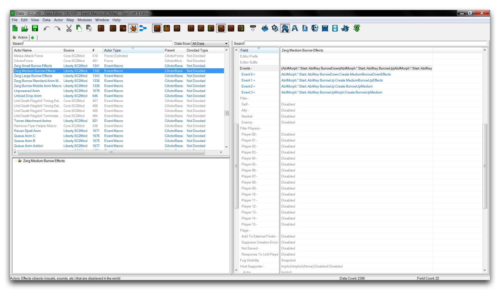
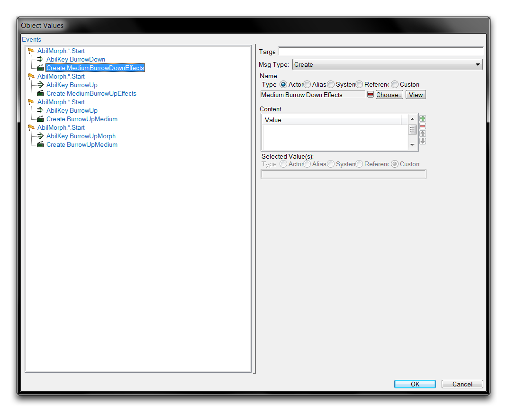
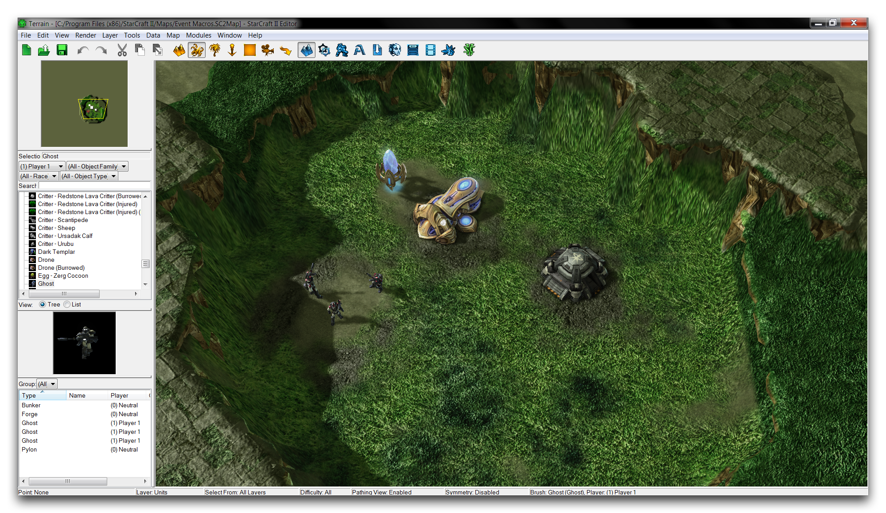
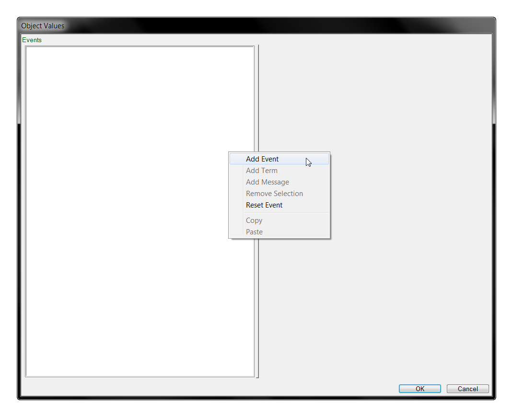
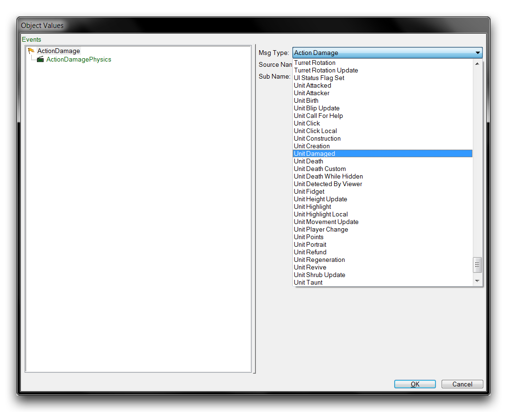
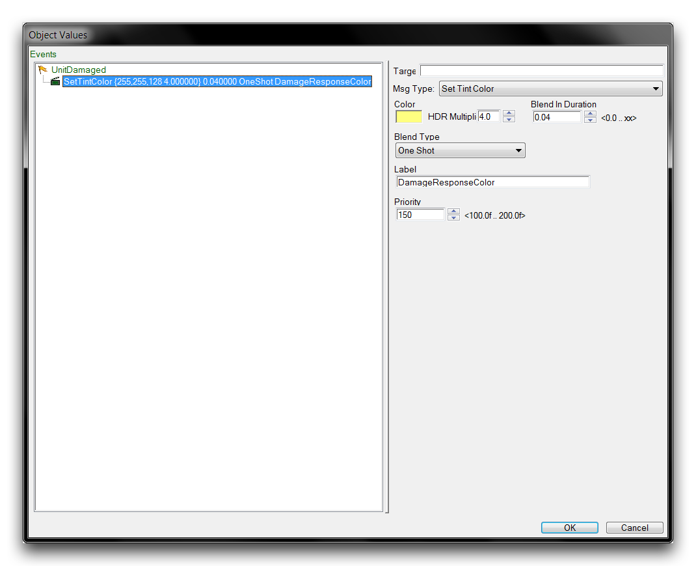
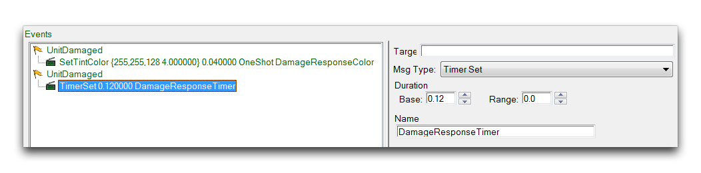
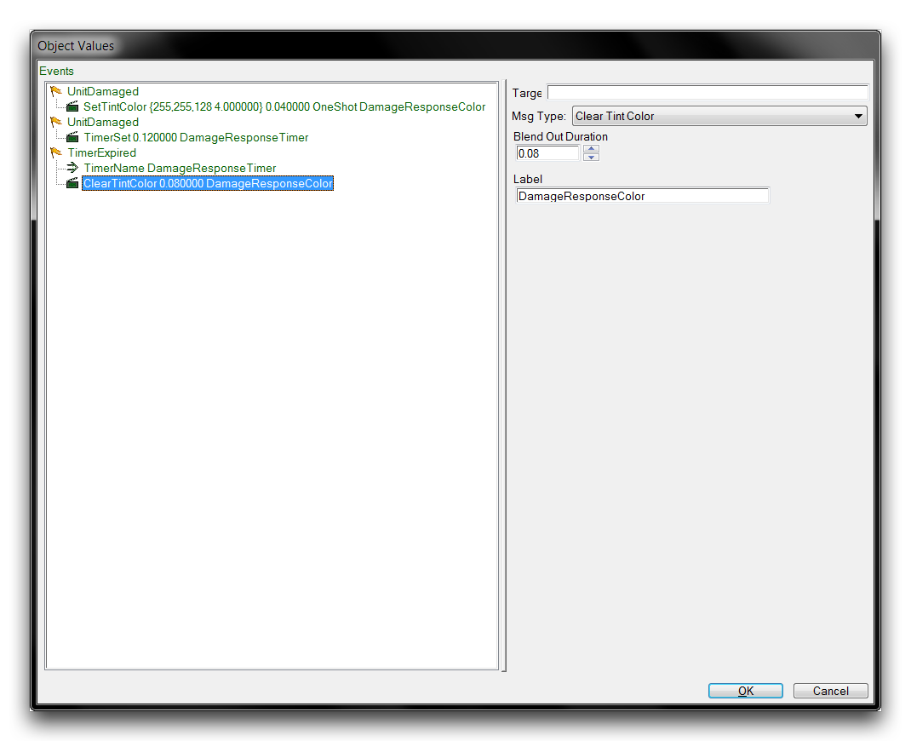
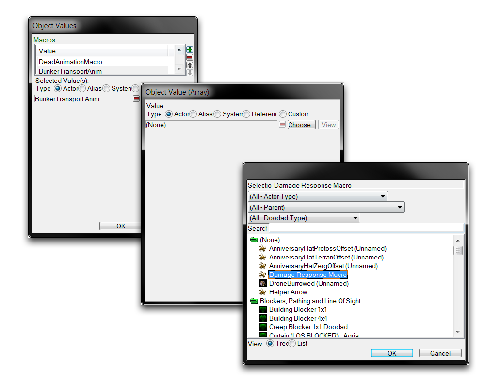

# Event Macros

Much like any logic system, actor events have a lot of commonly performed procedures. In the Trigger Editor, this issue is solved by pulling these repeat tasks into definitions, then applying these definitions universally where the task is required. This can save you a lot of time and effort. Event Macros are a similar option for reusing actor events.

Macros are a type of actor that carries a set of events. You can then plug the macro into any number of actors by linking it into a 'Macros' field of those actors. Hosting the macro this way has the effect of combining the macro's events into the host actor's events. Sharing the macro allows it to be a source for a common set of events, serving as a reusable definition. Below you'll see a typical view of an event macro.

*Event Macros Listing*

Event macros make working with actor events more manageable. Separating events that occur frequently can help to keep your project organized. Event macros also keep mistakes from creeping into your project by allowing you to update a single definition, rather than cycling through a group of actors making changes.

## Event Macro Details

Event macros don't have many configurable elements. While they appear to have many fields, most of them are defaults they inherit by virtue of being actors. The field of interest at the moment is the one labelled 'Events.' Investigating the 'Events' field for a macro will launch the actor events subeditor shown below.

*Event Macro Events*

Elements defined in the macro's 'Events' field form its main definition. Once hosted, this definition transfers all of its events, terms, and messages into the host actor's event. It's worth noting that these events aren't actually visible within the host's 'Events' field.

## Demoing Event Macros

Open the demo map provided with this article. The course presents a set of buildings and some ghosts in a crater, as shown in the image below.

*Demo Map Course*

In this exercise, you'll change the map to apply a special damage animation to objects that are being attacked. Every unit in the scene will get this new animation. You'll be able to achieve this quickly by using event macros to push the new behaviors to the four unit types from just one definition.

Start by moving to the actors tab in the Data Editor. If the tab isn't visible, open it by navigating to + ▶︎ Edit Actor Data ▶︎ Actors. Create a new actor here by right-clicking in the main view and selecting 'Add Actor.' This will open the window shown below.

*Creating an Event Macro*

Set the actor's name to 'Damage Response Macro,' then hit 'Suggest' to generate an ID. Set the actor type to Event Macro and hit 'Ok.' You will be presented with the following view.

*Creating an Event Macro*

Highlight the new macro in the actors tab and navigate to its 'Events' field, then double click to open it. This will launch the actor events subeditor. Right-click inside the white box and select 'Add Event,' as shown below.

*Adding an Actor Event*

This will create an event, denoted by a flag icon, and an actor message, denoted by a clapperboard icon. You can change any element in this view by highlighting it and selecting its 'Msg Type' from the rightmost view. You can now set the event by highlighting the 'ActionDamage' event and using the 'Msg Type' dropdown to set it to the 'Unit Damaged' event.

*Configuring an Actor Event*

Highlight the 'ActorDamagePhysics' message and use the dropdown to change it to 'Set Tint Color.' This will reveal a variety of suboptions allowing you to customize the tint effect. Set the Color to yellow, or R255 G255 B128, the HDR Multiplier to 4.0, and the Blend Duration to 0.04. This event and message will combine to make the actor quickly turn a bright yellow when it is attacked. Finally, set the message's Label to 'DamageResponseColor' so that you can easily refer back to it. Your events list should look shown in the image below.

*Completed Tinting Event*

Add another event of the type 'Unit Damaged Event' and set its message to 'Timer Set.' Set the timer's Duration Base to 0.12 and set its Name to 'Damage Response Timer.'

*Completed Timer Event*

Add one final event to the list and set it to the 'Timer Expired' type. Highlight the event, right-click it, and select 'Add Term.' Use the dropdown to set the term to 'TimerName.' Set the Name field to 'DamageResponseTimer' and then set this event's message to 'Clear Tint Color.' Set the message's property Blend Out Duration to 0.08 and the Label to 'DamageResponseColor.' The completed list should look as shown below.

*Completed Actor Events*

The macro should now result in the following behaviors. On damage, the actor will turn yellow and start a timer. When this timer expires it is noted by another event and confirmed by the event term. This triggers the actor to turn back to its normal color. The quick on and off of the coloration creates a flash effect triggered once per attack. The length of the flash is about equal to the length of the timer. You can now install the macro into any actor to confer these effects on it. Click 'Ok' to save the events and return to the main Data Editor view.

Find the 'Bunker' actor in the actors tab and highlight its 'Macros' field. Double click it to launch the 'Object Values' window. This shows a list of macros already present in the actor. Click the green + to add to the list. This launches the 'Object Value (Array)' window, where you can select the macro to add. Click 'Choose' to get a list of all the 'Event Macro' actors in the current project. Select the 'Damage Response Macro' then confirm the three windows in turn. This will appear as shown below.

*Adding Macro to an Actor*

Now repeat this process for the 'Pylon,' 'Forge,' and 'Ghost' actors to complete the exercise. The game has attached the event macro, and consequently the flash on attack behavior, to each unit in the demo course. You can now test the map and command the ghosts to attack anything to see the effect in action.

*Macros Illuminating Damage*

## Attachments

 * [065_Event_Macros_Start.SC2Map](./maps/065_Event_Macros_Start.SC2Map)
 * [065_Event_Macros_Completed.SC2Map](./maps/065_Event_Macros_Completed.SC2Map)
