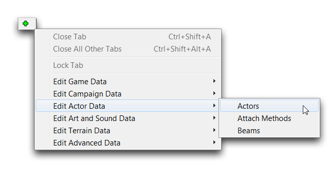
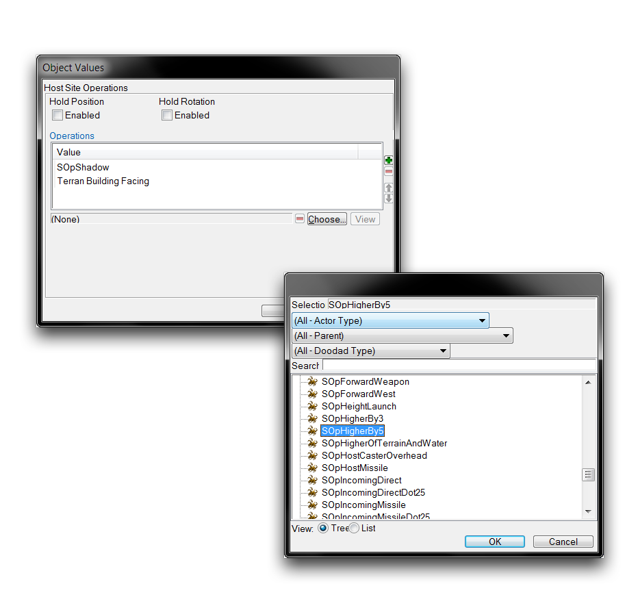
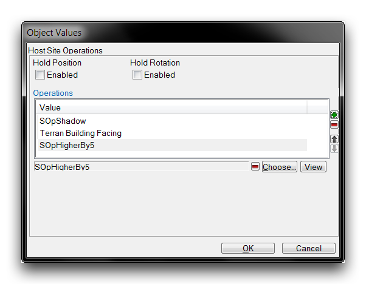

SITE OPERATIONS
===============

Site Operations is a family of actors that modify a host actor's
physical properties. Since these modifications will be propagated to any
visuals connected to an actor, site operations can be used to alter the
looks and placements of models at game-time.

Site operations include staples like translations and rotations, but
also extend to more elaborate controls. You can use operations to graft
objects together or even dynamically update an object's properties over
time, simulating independent movement or random variations in effects.
It's also worth noting that operations are not exclusive, they can be
stacked and combined in many ways. The image below shows some of the
uses of site operations.

Terratron Built from Attachment Operations -- Random Variation Operation
on Thor's Barrage Effect

CREATING SITE OPERATIONS
------------------------

As a type of actor, you can find site operations under the actors tab of
the Data Editor. Open this tab by navigating to + -\> Edit Actor Data
-\> Actors.

Navigating to Actors in Data

You can create a site operation actor in the actors tab just as you
would as any other actor, by right-clicking in the Object List and
navigating to 'Add Actor.'

Creating a Site Operation Actor

This will launch the 'Actor Properties' window. Use the 'Actor Type'
dropdown and scroll down the list to the site operations. They have the
prefix 'Site Operation' and are differentiated by their subtype in
brackets. An example of this naming convention is the Site Operation (2D
Rotation) actor type, which represents the 2D Rotation Site Operation
responsible for rotation strictly in the XY plane. You can see the
process of selecting a site operation actor below.

Site Operation Actor List

From here, select any site operation and click 'Ok' to finish creating
the actor.

APPLYING SITE OPERATIONS
------------------------

You can apply site operations through the 'Host Site Operations' field
of any applicable actor, an example of which is shown below.

Site Operation Hosting Field

Double clicking on this field launches an 'Object Values' window, which
provides a list of the currently hosted site operations, as shown below.

Site Operations View

In this case, the 'SOpShadow' and 'Terran Building Facing' site
operations are already installed on this actor. These represent
instances of the Shadow Site Operation and Explicit Rotation Site
Operation respectively. A new site operation is added by selecting the
'Choose' field, which will launch the window below.

Selecting Site Operation for Addition

This window allows you to select a site operation. Once you've decided
on one, click 'Ok' to return to the main site operations view. For the
purposes of this exercise, choose the 'SOpHigherBy5' operation. This
will take present you with the view shown below.

Site Operation Readied for Addition

You can now add the site operation to the actor by hitting the green '+'
button on the right-hand side of the window. This will add it to the
list of active site operations, as shown below.

Site Operation Added to Actor

From here, click 'Ok' to save the addition and return to the main Data
Editor view.

ORDER OF OPERATIONS
-------------------

It is important to note that site operations are order dependent.
Applying site operations in different orders might have wildly varying
effects or no noticeable difference at all. To help you manage this, the
Editor features a 'Host Site Operations' subeditor that lets you change
the order in which operations are applied.

Site Operation Ordering Controls

You'll find the controls for changing the order in which site operations
are applied on the right-hand side of this window. To use them, select a
site operation from the list, then click the up or down arrow buttons to
move it in the operations list. Site operations will be applied in the
order listed in this window, from top to bottom.

To understand the impact of the order in which site operations are
applied, consider the 'Local Offset' and the 'Rotator.' The former
operation will move an actor a certain distance in 3D space, while the
latter rotates an actor around a point. In this example, both will be
applied to a 'Game Ball' actor in different orders. Pictured below is a
case in which the local offset was applied first.

Local Offset then Rotator Site Operation

The next image shows what happens when the rotator operation is applied
before the local offset.

Rotator then Local Offset Site Operation

The most important takeaway here is that the results are not equal
despite the same operations having been applied. Below is a breakdown of
what has happened in these cases.

-   You should note that the local offset was downward, equal to about
    25% of the ball's height. The rotator was equal to about 90 degrees,
    or a quarter turn.
-   Applying the local offset first offset the ball downwards, but also
    offset the axis of rotation for the rotator. This moves the axis of
    rotation outside the ball's center. As a result, rotation actually
    causes a change in the position of the ball, plunging it forward and
    into the ground. The ball has altered its rotation and positions in
    the X & Z axes.
-   By contrast, applying the rotator first rotates the ball on the
    spot. It is then offset downwards into the ground. This means that
    the axis of rotation is still in the center of the ball. In this
    instance, the ball only sees rotation and change in its Z axis
    position.

As shown above, the sensitivity of site operations to the order in which
they're applied can sometimes cause unpredictable results. The best
remedy for this potential unpredictability is either careful planning or
experimentation with how operations react when combined.
