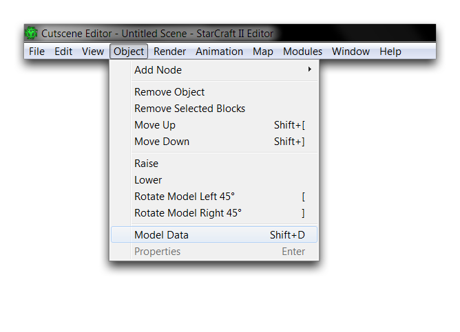
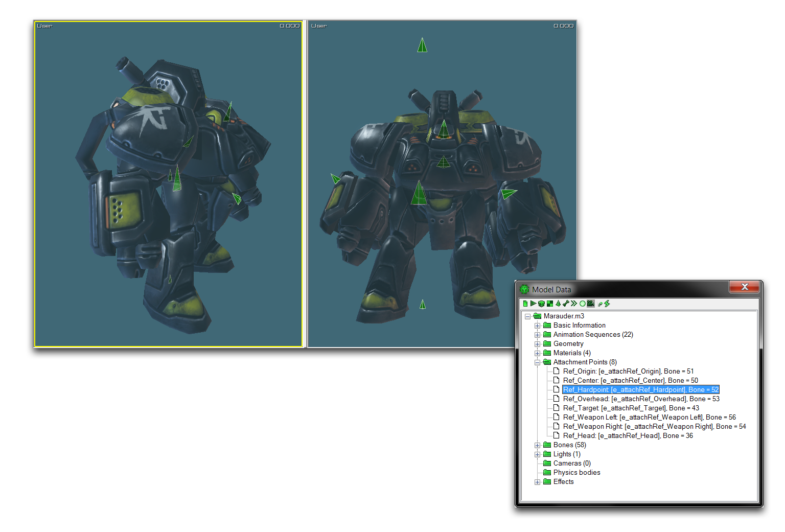

MODEL DATA VIEWER
=================

Some procedures in the Data Editor call for the use of 'Model Data,' the
structural properties of model assets set during their construction. You
can always retrieve these properties by inspecting the assets where they
were created, in the published suite of Blizzard Art Tools. In many
cases, this can be overkill. A shortcut is to use the Cutscene Editor as
an inspector. There you'll find a special Model Data Viewer for this
very purpose. The viewer is shown in the image below.

Model Data Viewer

LAUNCHING THE VIEWER
--------------------

You can find the Model Data Viewer by opening the Cutscene Editor and
navigating to Object -\> Model Data, as shown below.

Opening the Model Data Viewer

You can also get to the viewer by right-clicking on a model in the Actor
Timeline Tree, or the bottom-left pane where components of the current
scene are listed, and selecting 'Show Model Data.'

Opening the Model Data Viewer from the Actor Timeline Tree

UNDERSTANDING THE VIEWER
------------------------

Once launched, the model data viewer will populate itself with the data
of the currently selected model type.

Model Data Viewer in Cutscene Editor

Inside the viewer, you'll see that the model data is broken up and
organized into folders. Each folder holds either a detailed breakdown of
one of the structural types of the model or an overview of the whole
model's data. These folders follow the layout outlined below.

-   Unit Type
    -   Basic Information
    -   Animation Sequences
    -   Geometry
    -   Materials
    -   Attachment Points
    -   Bones
    -   Lights
    -   Cameras
    -   Physics Bodies
    -   Effects
        -   Particle Effects
        -   Ribbons

The information you'll find in each folder is broken down in the
following table.

  ------------------------------------------------------------------------------
  Field         Details
  ------------- ----------------------------------------------------------------
  Basic         Offers an overview of the model's file structure and collision
  Information   sizes.

  Animation     Breaks up each model animation into a folder listed under the
  Sequences     animation's reference name, length, and starting frame. Moving
                into each animation's folder reveals their looping settings,
                individual bounding sphere sizes, and several other flags.

  Geometry      Contains counts of the bones, vertices, divisions, and skinned
                bones within the model.

  Material      Breaks down each material in the model, listing their texture
                and map compositions alongside lighting information and any
                display property flags that are set. Also contains folders for
                each material that show any parallax height or motion blur data.

  Attachment    Shows a list of all the available attachment points on the
  Points        model. Each point is listed under its reference name and the
                bone number to which it is attached.

  Bones         Breaks down each bone in the model by identifying number and
                reference name. Every bone also has a subfolder containing
                information about billboarding, animation, and inverse
                kinematics.
  ------------------------------------------------------------------------------

MODEL DATA APPLICATIONS
-----------------------

The applications for information found in the model data viewer can vary
from project to project.

If a project is using custom assets, then the viewer can be your first
stop to confirm that everything is loading into the engine. Here, the
model data is compared to the information found within the Blizzard Art
Tools, checking for any discrepancies. Any differences might suggest
that certain components are not exporting correctly.

In other cases, the viewer is used for looking up reference names. These
names are used frequently within triggers and data as identifiers. The
Animation Sequence reference names are used in actor events, as the
'Animation Property,' or in the animation trigger actions, as
'Identifier.' Attachment Point reference names are used for attachment
site operations and the 'Attach Actor to ...' trigger actions.

LOCATING ATTACHMENT POINTS
--------------------------

The Model Data Viewer has a special use in locating attachment points
using the Cutscene Editor. You can do this by enabling the visibility of
attachment points by navigating to Render -\> Show Geometry -\>
Attachment Points, as shown below.

Showing Attachment Points

Once enabled, each attachment point is represented by a triangular solid
overlaid on the model. Each triangle represents a position where the
attachment point is found and points in the direction the attachment
point faces. The image below shows the attach points of a marauder.

Attachment Points Basic Visualization

This visualization shows the distribution and direction of attachment
points, but offers no help in finding out the reference names of each
point so that you can use them elsewhere in the Editor. Some of the
attachment points have useful names, but others can be difficult to
decode.

If you open the viewer and navigate to the Attachment Points folder, you
can find each individual attachment point by selecting the listing of
the point that is being searched for. Once highlighted in the Model Data
Viewer, an attachment point will glow bright green in the main view of
the Cutscene Editor and begin pulsing. This is shown in the image below.

Attachment Point Highlighted Using Model Data Viewer

This effect is far more prominent in motion, but the image above still
shows that the selected attachment point is brighter and much larger. In
this instance, the method has identified Ref\_Hardpoint, which would
have been difficult to locate using its reference name alone.
