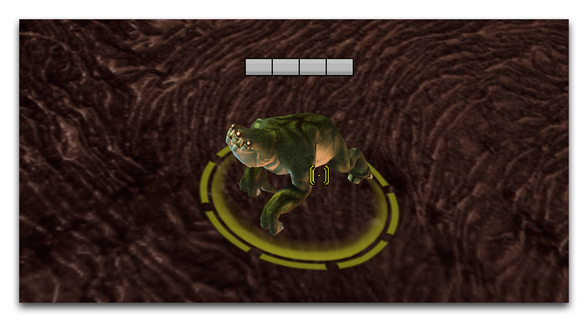
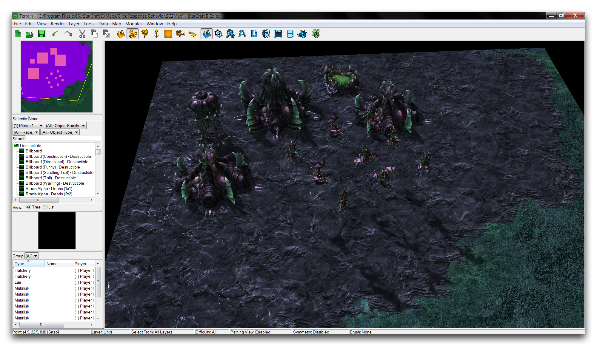
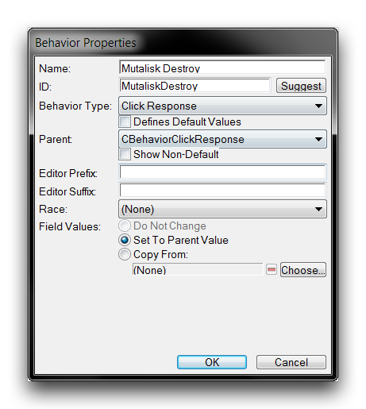
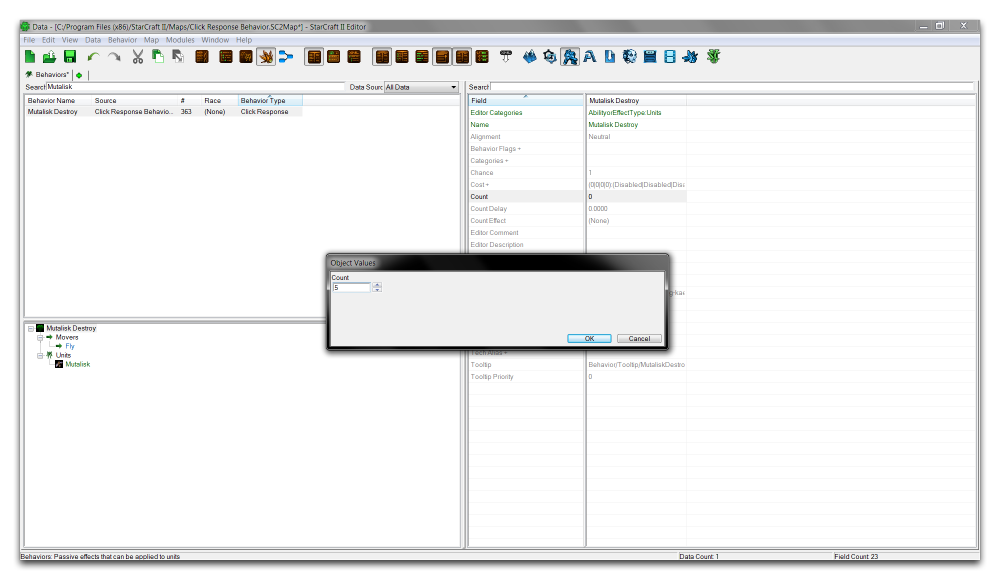
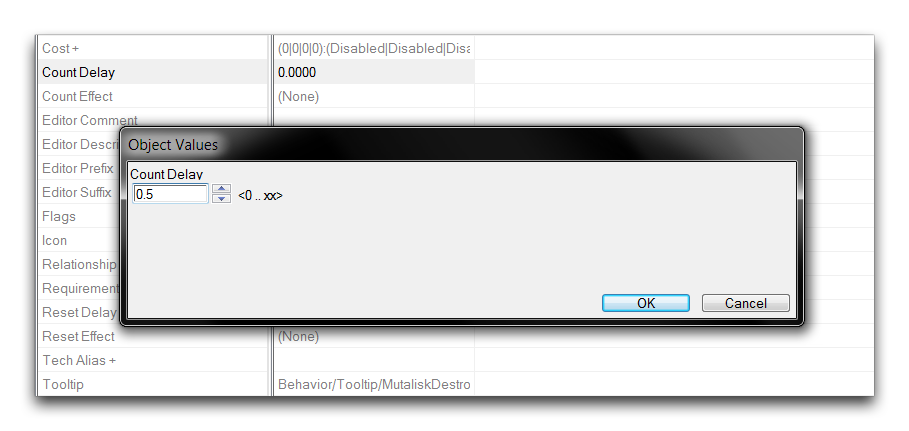
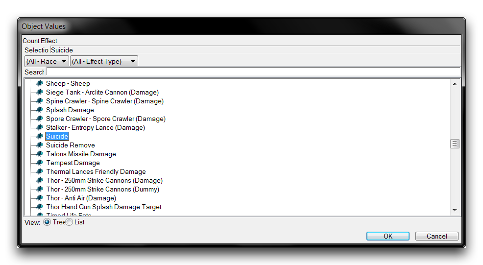
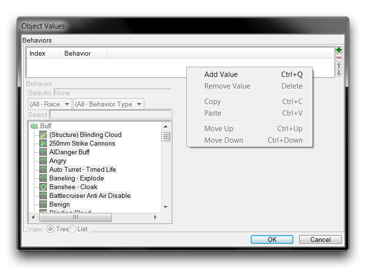
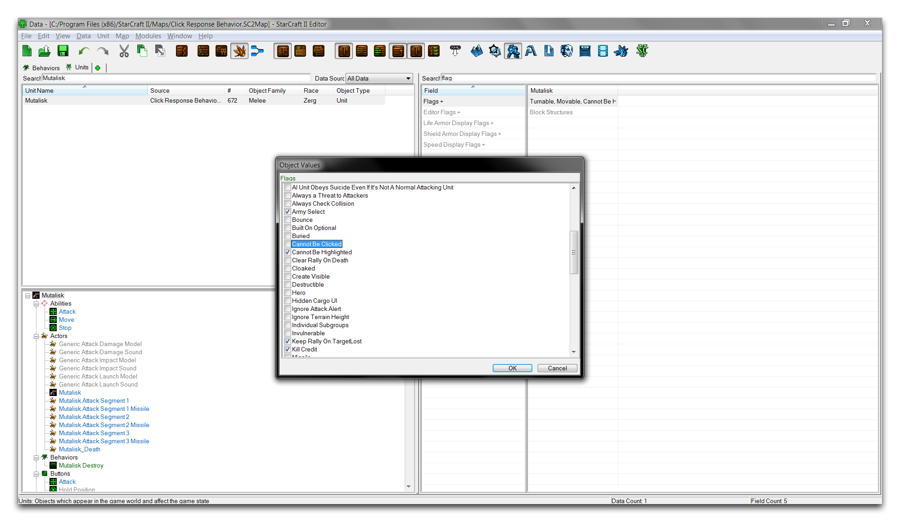
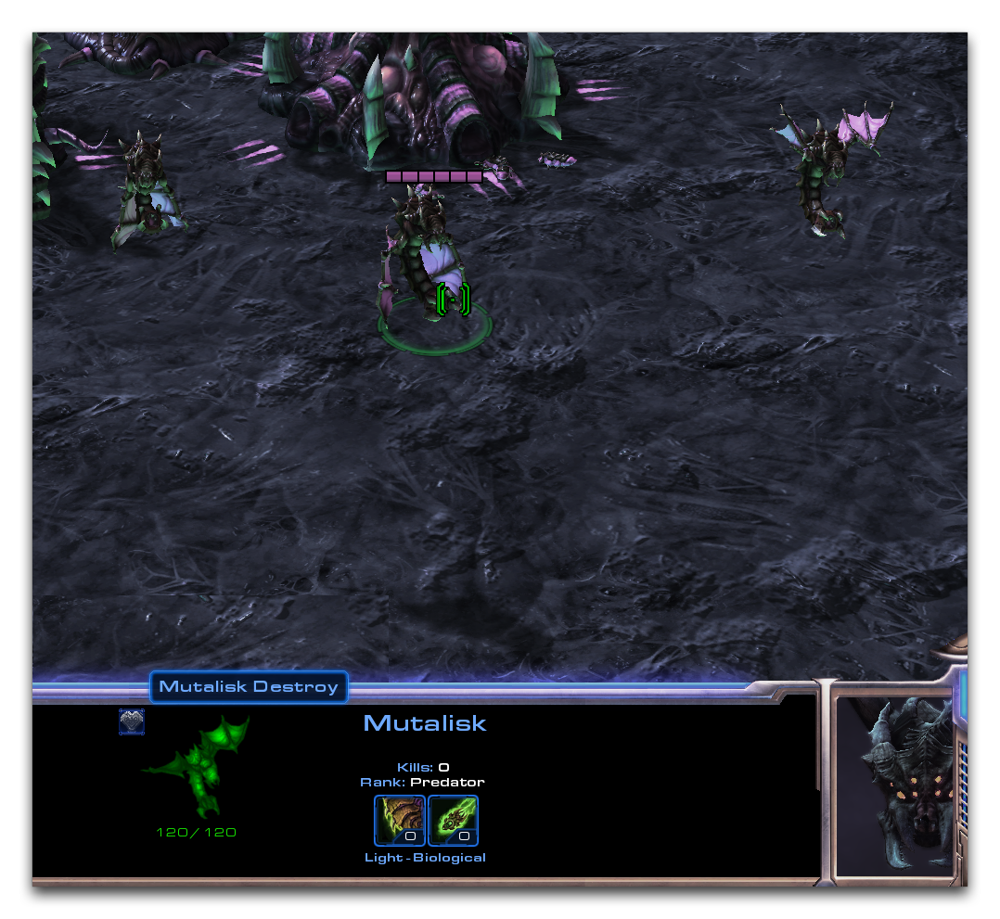

# Click Response Behavior

The Click Response Behavior applies an effect in response to a player's clicks on its hosting unit. This is an esoteric behavior that is used in StarCraft's data dependencies just once, inside each map tileset's local wildlife, the critters. If you weren't aware, critters in StarCraft, and in the lineage of --Craft games, exhibit some spontaneous behavior after being clicked repeatedly. If you haven't had the pleasure, there are far worse ways to spend your time than testing this behavior now.

*Click a Critter 30 TImes*

Despite its lack of traditional use, the click response behavior shows an interesting direct relationship between player input and a data effect. It's worth investigating.

## Demoing Click Response Behavior

Open the demo map provided with this article. There you'll find a small Zerg base with a flock of mutalisks drifting outside, as shown below.

*Demo Map Course*

This course has been configured to allow the player to spawn mutalisks from the hatcheries for free and at an accelerated pace. You'll take advantage of this by adding a custom click response behavior that destroys mutalisks after a series of clicks.

Start assembling the behavior by moving to the Data Editor and navigating to the behaviors tab. If the tab is not already open you can launch it by navigating to + ▶︎ Edit Game Data ▶︎ Behaviors. Right-click inside the main behaviors window and select 'Add Behavior.' This will appear as shown in the image below.

*Creating a Behavior*

In the behavior creation window, enter 'Mutalisk Destroy' as the name, then click 'Suggest' to generate an ID. Now set the 'Behavior Type' to 'Click Response.' The finished creation window should like this.

*Click Response Behavior Creation*

Click 'Ok' to finish the creation and return to the main Data Editor screen.

## Setting The Behavior'S Fields

Once you've created the behavior, select it to edit its fields. First, move to the 'Count' field, where you will set the number of clicks required to apply the behavior. Double click the field to launch a 'Object Values' window and set the 'Count' value to 5, as shown below.

*Setting Behavior Click Count*

Next, move to the 'Count Delay' field. Double click the field to launch another 'Object Values' window and set its value to 0.5. This will set a timer that runs between clicks. If this value is exceeded, the click count will be reset. This can be useful if the behavior needs some sort of protection against being set off accidentally during normal use.

*Setting Behavior Count Delay*

Now move to the 'Count Effect' field, select it, and double click to launch its editing window. This field will set the effect to be triggered in response to the clicks. This is a good location to come back to later for experimentation, but for now select 'Suicide.' This will command to unit to be removed on repeated clicking.

*Setting Click Response Effect*

Now select 'Ok' to finish the behavior's construction. The finished fields should look as they do in the image below.

*Completed Behavior Fields*

## Applying The Click Response Behavior

The behavior is now completely prepared and ready to be hooked into gameplay. One nice attribute of this behavior type is that you can slot it directly into a unit, making it quite easy to set up. This is sensible, as the behavior grants an effect that responds directly to player input, so the behavior's most natural location is within the unit itself. You can make this connection by navigating to the units tab or opening it via + ▶︎ Edit Game Data ▶︎ Units. From here, select the 'Mutalisk' and move to its 'Behaviors' field.

*Mutalisk Behavior Field*

Double click the 'Behaviors' field to launch the 'Object Values' window. Right-click inside the 'Behaviors' box and select 'Add Value.' This will add a blank behavior to the unit, as shown below.

*Adding Mutalisk Behavior*

Once created, highlight the new value and find the 'Mutalisk Destroy' behavior with either the window's search feature or the scroll bar.

*Mutalisk Destroy Behavior is Set*

Click 'Ok' to select the behavior. At this point, you have one last change to make to the unit. By default, units do not respond to player clicks as a data event. They may be clickable and useable within the gameplay view, but as a signal they produce no event on the data side of things. To correct this, highlight the 'Mutalisk' and navigate to its 'Flags' field. Double click the field to launch it, then move to the 'Cannot Be Clicked' flag and deselect it.

*Allowing the Mutalisk to be Clicked*

Click 'Ok' to return to the main Data Editor view. The map is now complete and you can run the 'Test Document' feature. If you inspect a mutalisk inside the map, you'll find that they're now tagged with a behavior status, as shown below.

*Mutalisk with Mutalisk Destroy Behavior*

Clicking on this mutalisk five times will reveal the design of this behavior.

*Mutalisk Click Response Effect*

## Attachments

 * [070_Click_Response_Behavior_Start.SC2Map](./maps/070_Click_Response_Behavior_Start.SC2Map)
 * [070_Click_Response_Behavior_Completed.SC2Map](./maps/070_Click_Response_Behavior_Completed.SC2Map)
