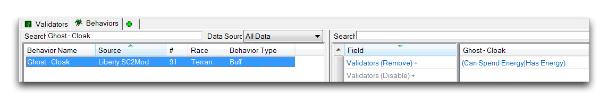

VALIDATORS
==========

Validators conduct tests. While they are a data type themselves, their
purpose is to hook into other data types and perform tests, checking if
a statement is true or false. Depending on the result, the hosting data
type will make a choice and take certain actions accordingly. As such,
validators control data in a manner reminiscent of the way conditions
control triggers. Still, the application of validators is quite unique
and they have extensive uses, from building game objects to controlling
AI.

VALIDATOR DETAILS
-----------------

How you apply validators depends on the type of validator and the
hosting type where the validator will be used. There are many types of
validator available and they can be used in effects, behaviors,
abilities, and actors, taking on a slightly different role each time. To
get a feel for these myriad configurations, it's best to start by
looking at the many examples of their use in the existing data
libraries. You can find validators in the Data Editor by navigating to +
-\> Edit Game Data -\> Validators, as shown below.

Navigating to Validators in Data

This will launch the validators tab.

Validators Tab Listing

In this view, all of the validators are organized by their Validator
Name, Source, \#, and a Validator Type. You'll see that validators
typically have names look like sentence fragments. Examples include,
'Threatens Baneling,' 'Is Phoenix,' and 'Can Charge.' This reflects the
fact that validators slot into other things and conduct a test. The
names make more sense when phrased in terms of their host, like 'Can
this Zealot Charge?' or 'Is this unit a phoenix?' As a result, a
validator's name can give a clue to its eventual use. When you're
creating your own custom validators, this is a good style to mimic.

From the validators tab, highlight the 'Caster Not Attacking' validator
in the main editor view to reveal its fields, as shown below.

Validators Fields View

This 'Caster Not Attacking' validator is a Unit Order Queue validator.
This type tests if a unit has been ordered by a player to use a certain
Ability. Having selected the validator, the rightmost view will now show
fields that enable and support this test. Most validator fields are type
specific, but examining a typical validator's composition will help you
understand how to break them down. There are three main fields to the
Unit Order Queue validator, which are broken down in the table below.

  -----------------------------------------------------------------------
  Field     Details
  --------- -------------------------------------------------------------
  Ability   Sets the ability to be tested.

  Find      Checks the status of the ability. Enabled means it is
            occurring, Disabled means it is not occurring.

  Unit -    Sets the unit being tested by the validator.
  Value     
  -----------------------------------------------------------------------

For the validator you're examining now, the Ability being tested is
Attack, the Find status is Disabled, and the Unit -- Value is Caster or
the user of the ability. Together, these will check if a unit is
currently not using the attack ability, which is neatly covered by its
name, 'Caster Not Attacking.'

VALIDATOR APPLICATIONS
----------------------

Validators see application in effects, behaviors, and abilities. To
apply a validator to any of these data types, you can navigate to its
field, 'Validators,' and double click to launch the 'Object Values'
window. There, click the green + to add a new validator. This will
trigger a new 'Object Value (Array)' window where the validator is
selected. This procedure should look as it does in the image below.

Applying a Validator

For effects, validators are used to test if the effect should be
applied. This test will occur at the normal application time for each
effect type. If the validator returns false, the effect will not take
action. If it returns true, it will proceed as normal. You can see an
example of an effect validator below.

Effects Validators

Here, the MULE -- Repair effect has a set of five validators. Should a
unit for example be Warping In, then the first validator will fail,
resulting in the effect not being applied. In this case, every validator
must be found to be true for the effect to take action.

In behaviors, validators allow you to either disable or completely
remove a behavior based on the response of a test. This is shown in the
example below.

Behaviors Validators

The validators are broken up into Validators(Disable) and
Validators(Remove). Each case will apply its specific action to the
behavior when the validator fails. For Validators(Disable), a false
result of a validator test causes the behavior to be disabled, but
remain within the unit for further testing. For Validators(Remove), a
false test causes the behavior to be stripped from the unit permanently.
In this example, the Ghost -- Cloak will be removed once the unit runs
out of energy. For the next cloak, the behavior will need to be
reapplied by another 'Add Behavior' effect.
