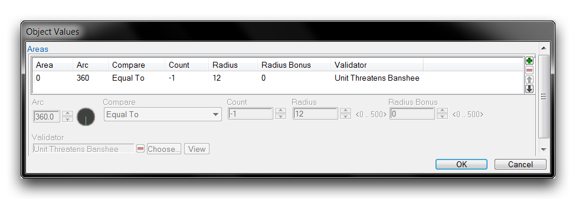
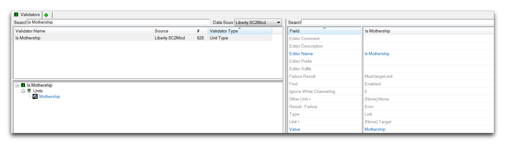
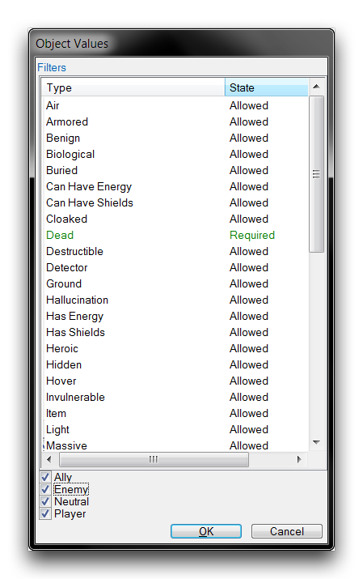
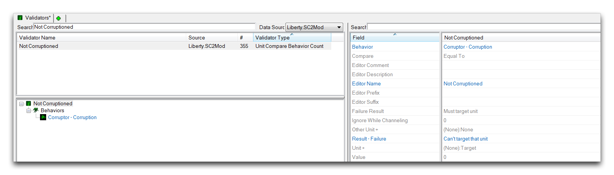

# Validators Rundown

This article gives a breakdown of some of the different types of validators. Each section describes the fields of its validator, as well as providing some details on its use and application.

## Combine

The Combine validator joins a list of validators together. While 'Validators' fields typically support multiple validators, combining them like this can be a useful tool for organization and clarity. Combine validators can be sequenced indefinitely by repeatedly inserting a combine validator into themselves.

| Field             | Details                                                                                                                                                                                                                           |
| ----------------- | --------------------------------------------------------------------------------------------------------------------------------------------------------------------------------------------------------------------------------- |
| Type              | Selects an AND or OR combination of the terms. The AND combination requires that every validator be true for the combined validator to be true. By contrast, the OR combination is true as long as one of its validators is true. |
| Combines          | Sets the validators to be combined. These can contain another combine validator.                                                                                                                                                  |
| Negate            | Reverses the test result, any true results will draw as false and vice versa. This is also known as a NOT operator.                                                                                                               |
| Result -- Failure | Sets the error message to be distributed on failure.                                                                                                                                                                              |

You can see an example of a combine validator below.

*Combine Validator Example*

Here, three individual validators have been combined, Caster Not Dead, Energy Not Full Caster, and Not Dead. You can use the Object Explorer and Data Navigator to see this link in detail, as shown in the following image.

*Combine Validators Linkage Views*

You should note that these visualizations will only ever display a single hierarchical level of combinations. If the combine validator is sequenced, you'll have to select any additional levels of combine validators to see their component validators.

## Enumerate Area

The Enumerate Area validator performs a test by counting the objects in an area and then comparing its count with a test value. Depending on the result of this test, the validator will draw a true or false. It can count objects in general or count only objects that test positively for a certain validator.

| Field          | Details                                                                                                                                                                                                                              |
| -------------- | ------------------------------------------------------------------------------------------------------------------------------------------------------------------------------------------------------------------------------------ |
| Areas          | Defines a list of areas to be searched. You can also define a validator for each area that will cause the search to only count objects with the validator. Not setting any validator in any area will result in a simple unit count. |
| Compare        | Defines the operator for comparing the number of objects located in the Areas with the Count.                                                                                                                                        |
| Count          | Sets the test value against which the located objects are compared.                                                                                                                                                                  |
| Location       | Checks the status of the ability. Enabled means it is occurring, Disabled means it is not occurring.                                                                                                                                 |
| Search Filters | Sets the point on the map where the Areas are created and then searched.                                                                                                                                                             |
| Search Flags   | Sets some option flags. Extend by Unit Radius will expand the area by the unit's Radius value. Same Cliff Level will only search for units sharing the same cliff level as the validator's host.                                     |

Once activated, an enumerate area validator creates its Areas at a Location. It then counts how many objects meet its criteria within the Areas, whether that means simply existing or having a defined validator. That value is then compared with the Count test value by the operator defined by Compare. If the value is successfully compared, it returns true, if it is unsuccessful, it returns false. You can see an example of an enumerate area Areas field being built below.

*Enumerate Areas Search Area*

## Function

The Function validator allows you to construct controlled sequences of validators. Each step of the sequence tests a validator, then either returns a result or moves on to the next test. The function validator can contain an indefinite number of terms and each test can return several types of unique results. This distinguishes it from the other conditional validator, Combine, which must be sequenced to extend beyond two terms and has tests that can each only return a simple true or false result. The function validator is typically used to construct extensive AI procedures.

Function validators are built in a subeditor view that you can access through the Line field. The function validator proceeds through its tests on a line by line basis in the order of the line Index, moving from top to bottom. Each test measures if the validator set in its line is true. Then, depending on which of the five fields the validator has been placed under, an action is taken. An example of a function validator is shown below.

*Function Validator Composition*

In this case, the first test is made on Caster Force Unburrow. If this validator is found true, then the function validator returns Failure and concludes. If the validator is found false, then the next line is executed. The next line, Index 1, tests if Tactical Burrow Hostile Search Empty is true. This happens to be an Enumerate Area validator. A true result from it will result in the validator returning Ignored. This will end the function validator. A false result will run the next line. This process continues until the Index is exhausted. Clearly, this validator can deliver a very robust profile of results. A breakdown of the individual fields is shown in the table below.

| Field            | Details                                                                                                                                                                                                             |
| ---------------- | ------------------------------------------------------------------------------------------------------------------------------------------------------------------------------------------------------------------- |
| Line             | Sets the tests to be made by the validator on a line by line basis. There are five possible return results: Failure, Ignored, Return, Success, and Test. Break, described below, offers another control option.     |
| Break            | Stops the validator once reached.                                                                                                                                                                                   |
| Failure          | If the selected validator is true, returns a Fail for the function validator overall and exits the test. This also displays any error messages that have been set.                                                  |
| Ignored          | If the selected validator is true, returns a Fail for the function validator overall and exits the test. This does not display any error messages.                                                                  |
| Return           | Returns the same True or False result as the selected validator                                                                                                                                                     |
| Success          | If the selected validator is true, returns True for the function validator overall and exits the test.                                                                                                              |
| Test             | If the selected validator returns true, then the other validators in the line are skipped. This can be used with an additional Failure, Ignored, Return, or Success validator to make an upfront test of an object. |
| Result - Failure | Selects the error message to be displayed on failure.                                                                                                                                                               |

## Location Range

Location Range validates the distance between two objects. Depending on whether or not that range meets a test value, a true or false value is returned. An example of a location range validator is shown below.

*Location Range Validator*

| Field             | Details                                                                  |
| ----------------- | ------------------------------------------------------------------------ |
| Range             | Sets the distance to be tested using the Compare operator.               |
| Compare           | Defines the operator for comparing the Range from one object to another. |
| Location          | Sets the starting point for measurement.                                 |
| Value - Value     | Sets the end point for measurement.                                      |
| Result -- Failure | Sets the error message to be displayed on failure.                       |

## Player Requirement

The Player Requirements validator tests the status of a certain requirement for a player.

*Player Requirement Validator*

| Field               | Details                                                                                                                                                                                                                                                                                                           |
| ------------------- | ----------------------------------------------------------------------------------------------------------------------------------------------------------------------------------------------------------------------------------------------------------------------------------------------------------------- |
| Value               | Sets the Requirement to be tested.                                                                                                                                                                                                                                                                                |
| Find                | Selects how the unit will be tested. Enabled means the unit being identified as the selected unit type will return as True, while not being identified will return as False. Disabled means a unit being identified as the selected unit type will return as False, and not being identified will return as True. |
| Player - Value      | Specifies the player that the validator will target.                                                                                                                                                                                                                                                              |
| Result -- No Player | Selects the error message to be distributed if a player is not set or found.                                                                                                                                                                                                                                      |

## Unit Type

The Unit Type validator tests whether or not a unit is of a specified type. You can see one example of a unit type validator below.

*Unit Type Validator*

| Field            | Details                                                                                                                                                                                                                                                                                                                  |
| ---------------- | ------------------------------------------------------------------------------------------------------------------------------------------------------------------------------------------------------------------------------------------------------------------------------------------------------------------------ |
| Unit - Value     | Sets the Unit to be tested.                                                                                                                                                                                                                                                                                              |
| Value            | Sets the type of unit which the Unit - Value will be tested to be.                                                                                                                                                                                                                                                       |
| Find             | Selects how the unit will be tested. Enabled means that the unit being identified as the selected unit type will return as True, while not being identified will return as False. Disabled means a unit being identified as the selected unit type will return as False, while not being identified will return as True. |
| Result - Failure | Selects the error message to be distributed on failure.                                                                                                                                                                                                                                                                  |

## Unit Filters

The Unit Filters validator checks whether or not a unit contains the specified filters.

*Unit Filters Validator*

| Field            | Details                                                     |
| ---------------- | ----------------------------------------------------------- |
| Filters          | Sets the filters to be tested for.                          |
| Unit - Value     | Sets the Unit which will be examined for the filter states. |
| Result - Failure | Sets the error message to be displayed on failure.          |

Filter selection can target both a unit's state and its alliance status, as shown below.

*Filter Selection View*

## Unit Compare Behavior Count

The Unit Compare Behavior Count validator compares the behavior stack count on a unit with a test value. Depending on the comparison, a true or false value is returned.

*Unit Compare Behavior Count Validator*

| Field            | Details                                                                        |
| ---------------- | ------------------------------------------------------------------------------ |
| Behavior         | Sets the Behavior to be tested for.                                            |
| Compare          | Defines the operator for comparing the behavior stack count with a test value. |
| Value            | Sets the test value that the behavior stack count is compared to.              |
| Unit - Value     | Sets the unit being tested for the Behavior.                                   |
| Result - Failure | Sets the error message to be displayed on failure.                             |

You should note that a unit is typically considered to have a behavior at a stack count of 1. As such, this validator is commonly employed to test if a behavior can be applied to a unit or if that unit already possesses that behavior. In this case, the test examines if the behavior stack is Equal To a test Value of 0. If this returns True, the unit does not currently possess the Behavior and it may be applied. If it returns False, the unit already has the Behavior and should not receive an additional stack as the design does not support this.
