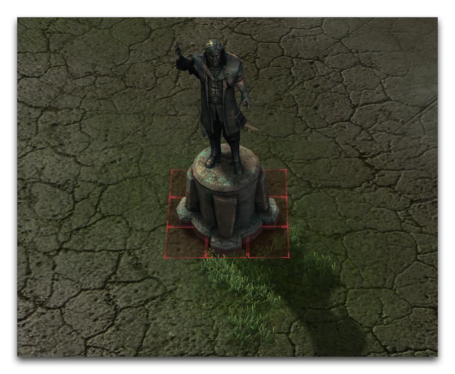
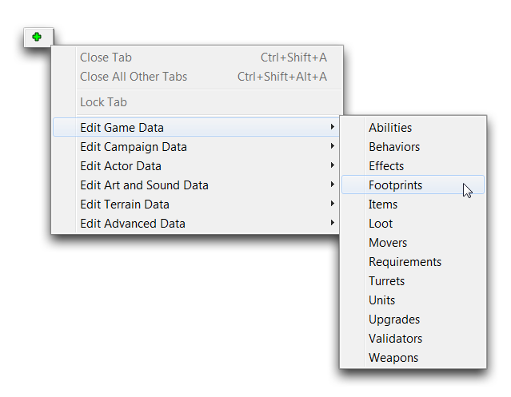
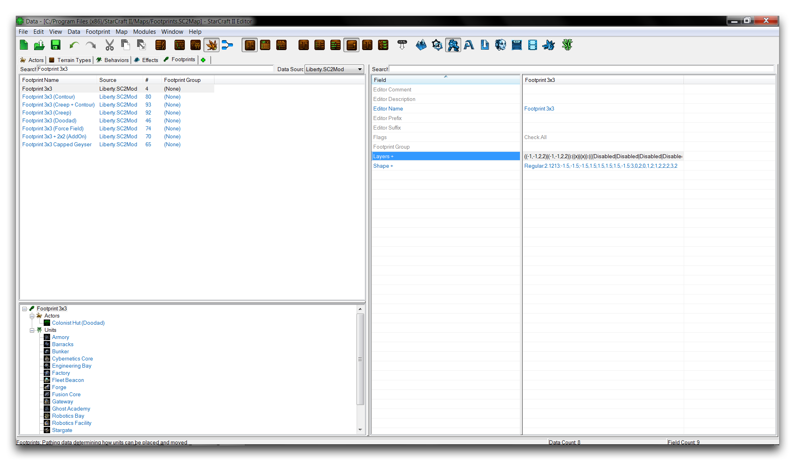

# Footprints

Footprints attach pathing to other objects. Take a statue doodad as an example. To function in the Editor, it must prevent units from walking through it and clipping the model. A footprint can be used to prevent this by being attached to the doodad, creating a pathing blocker around the statue's area. You can see this in the image below.

*Doodad Footprint*

The doodad has sectioned off a grid area where neither unit pathing nor building can occur. The type is determined by the amount of pathing area the footprint takes up on a unit grid basis. This footprint is a 3x3, measuring three units in both axes. You can view and edit footprints by moving to the Data Editor and navigating to + ▶︎ Edit Game Data ▶︎ Footprints, as shown below.

*Navigating to Footprints in Data*

## Footprint Details

Selecting a footprint in the Editor will show its fields in the right subview and its connected objects in the Object Explorer. A footprint hooks into an actor through the 'Footprint' field and a unit through its 'Pathing Footprint' field. You should note that, when it comes to units, many buildings have their own footprints, but actual moveable ground units handle pathing with their own systems. Below you'll find an image of the footprints tab and a breakdown of its essential fields.

*Footprint Data Fields*

| Fields          | Details                                                                                                                                                                                                                     |
| --------------- | --------------------------------------------------------------------------------------------------------------------------------------------------------------------------------------------------------------------------- |
| Footprint Group | Sets the index category within the editor. Most footprints are found under the default Generic or blank grouping. Some unique footprints for destructibles and uncommon shapes are found under the SpecifcDoodads grouping. |
| Layers          | Determines the composition of pathing applied to the footprint. This can be altered using the Footprint Editor.                                                                                                             |
| Shape           | Determines the visible shape of the footprint. This can be altered with the Footprint Editor.                                                                                                                               |
