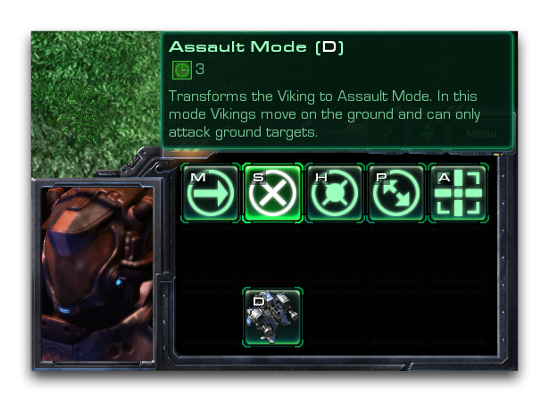
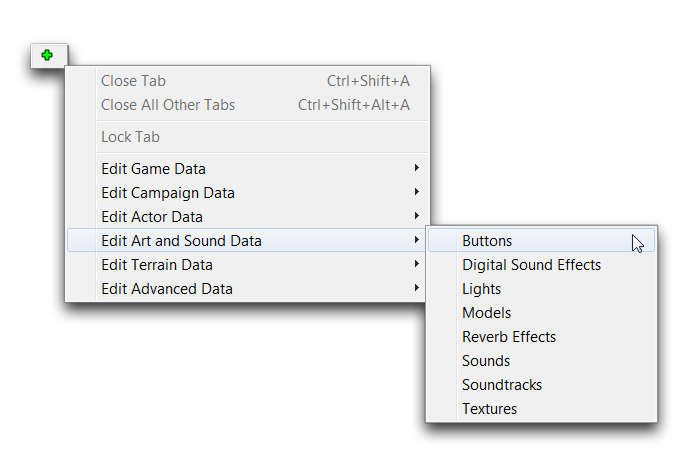
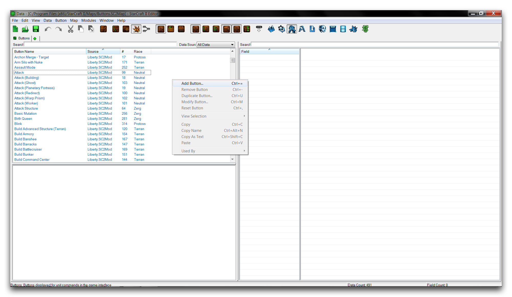
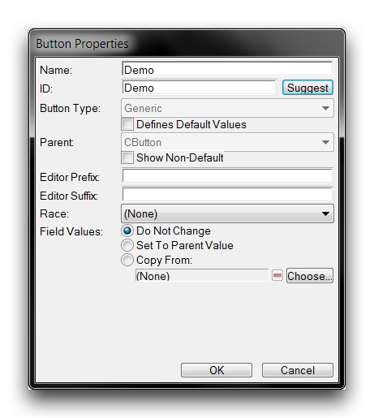
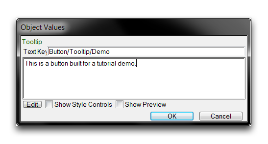
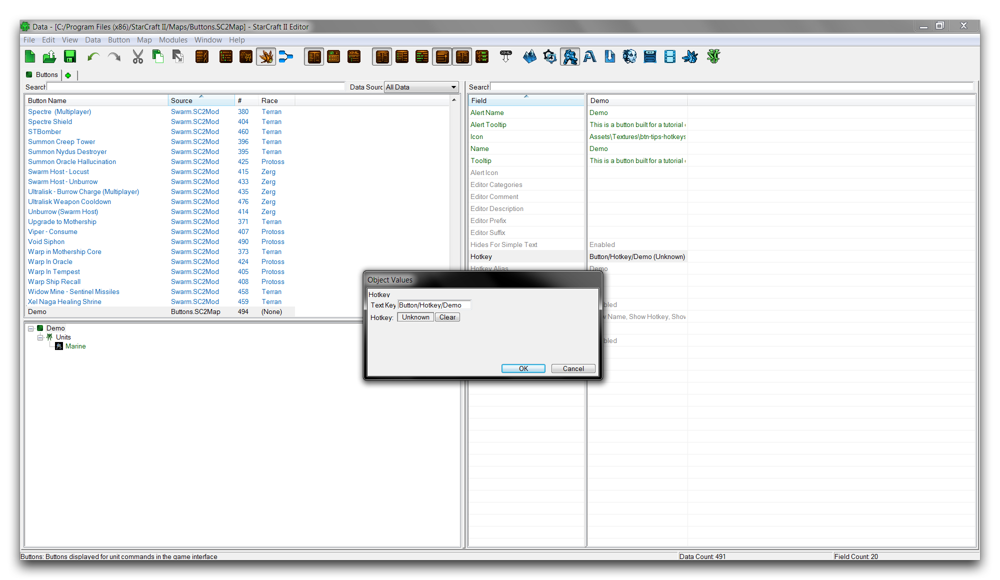
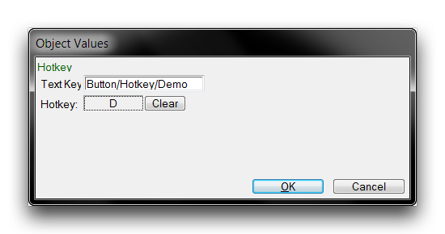
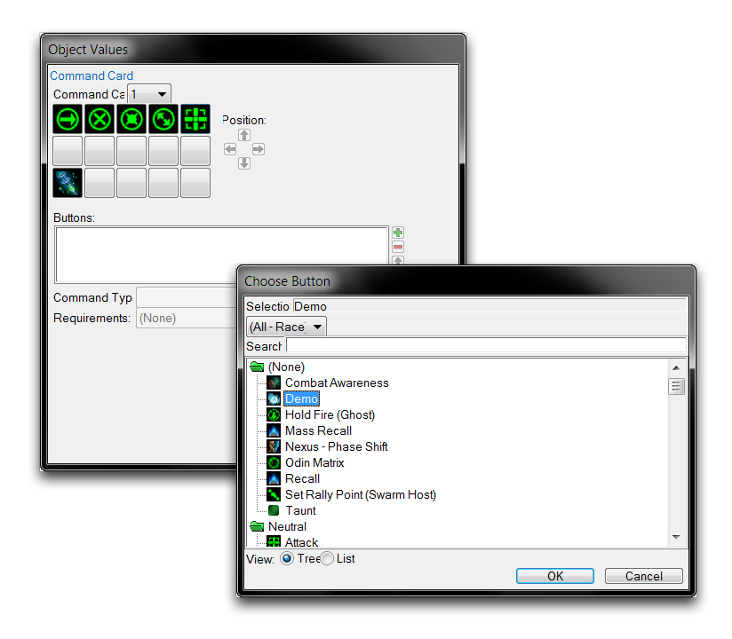
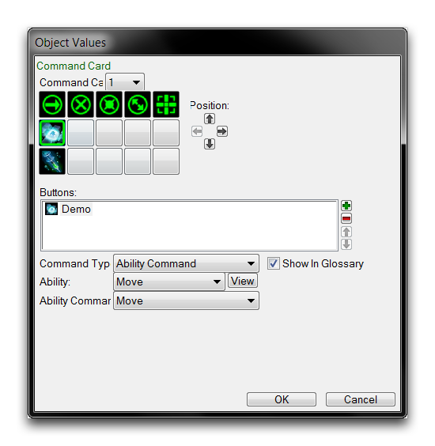
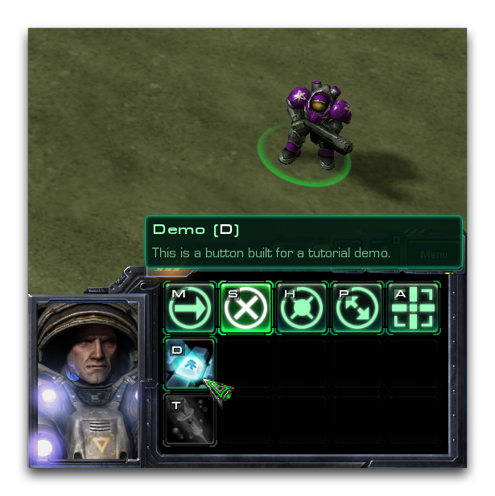

# Buttons

The term 'button' is used broadly in StarCraft to refer to any interactive interface element, be it a menu button, a dialog, or anything clickable. Conversely, in the context of the Data Editor the term refers very specifically to an art datatype. These Buttons are the visuals for abilities in the command card, the section of a player's UI with which they can interact directly. A typical view of a command card filled with buttons is shown below.

*Templar Command Card with Buttons*

Here there are eight Buttons on the templar's command card including 'Psi Storm,' 'Feedback,' and the basic control elements, such as 'Move,' 'Attack,' and 'Stop.' Each button has been tied into the unit through its command card field. This sets the button's look as well as some supplementary properties for use inside the interface.

## Button Data Fields

Compared with the varied, multi-purpose buttons of the engine at large, the Button datatype is quite scant. The properties contained in this type are broken down in the table below.

| Field         | Details                                                                                                                                                                                    |
| ------------- | ------------------------------------------------------------------------------------------------------------------------------------------------------------------------------------------ |
| Icon          | Sets the texture with which the button will be made. This typically uses a member of the specially styled set of 76x76 textures included with the Editor, identified by their prefix btn-. |
| Hotkey        | Sets a keyboard key that, when pressed, will automatically trigger the button in the UI. In StarCraft hotkeys are almost universally used to speed player input.                           |
| Tooltip       | Sets the text displayed during button mouseover.                                                                                                                                           |
| Name          | Sets the name displayed during button mouseover.                                                                                                                                           |
| Tint By Race  | Colorizes the button overlay based on race selection. The races are colorized as follows: Zerg -- Orange, Terran -- Green, and Protoss -- Blue.                                            |
| Universal     | Adds the button and its hotkey to every unit. Typically used for only the elementary unit actions, 'Move,' 'Attack,' 'Stop,' 'Cancel,' and so forth.                                       |
| Alert Icon    | The alert panel can make use of the Button type to push warning or teaching information out to the player. This sets the icon sent by this button's ability.                               |
| Alert Tooltip | Similar to the Alert Icon, but sets a tooltip to be delivered for alerts.                                                                                                                  |
| Alert Name    | Similar to the Alert Icon, but sets a name to be delivered for alerts.                                                                                                                     |
| Race          | Sets a race attribute of the button, for organizational purposes.                                                                                                                          |

Leaving the mouse idle over a button will display a dialog containing its Tooltip and Name, along with times relevant to the connected ability. This dialog is shown below.

*Button Mouseover Tooltip and Name*

## Creating A Button

Open the Data Editor and move to the buttons tab. If it isn't already open, you can navigate there via + ▶︎ Edit Art and Sound Data ▶︎ Buttons, as shown.

*Navigating to Buttons in Data*

Create a new button by right-clicking in the main window view and selecting 'Add Button.'

*Creating a New Button*

This will launch the 'Button Properties' window. There you can set the 'Name' of the new button, then hit 'Suggest' to generate an ID. Note that typically a button is named for the ability it will represent, rather than being named as a button itself. So choose a name like 'Attack' or 'Plague' rather than 'Attack Button' or 'Plague Button.' A typical creation screen is shown below, filled out with the name 'Demo.'

*Completed Button Creation Screen*

## Setting The Button Icon

The primary button field you'll need to set is the icon field. This will determine the texture to be transformed into a Button. Highlight the 'icon' field and double click it to launch an 'Object Values' window. Clicking 'Browse' here will launch the Archive Browser. Inside the browser, you can select any texture for use as a button, but the standard is 76x76 and with the filetype .dds. You can find a large collection of these textures by searching with the prefix btn-, as shown below.

*Icon Selection with the Archive Browser*

In this demo, the texture btn-tips-hotkeys.dds has been selected. Note that these textures lack the colored border typical of in-game buttons. This is because the border is overlaid by the engine and colorized using the Tint By Race field. You can see the many types of borders within the textures by searching under the prefix btn-border.

## Setting The Button Tooltip

To provide helpful information to the player, a button is usually fitted with a tooltip to be displayed by the game on button mouseover. To create that text, navigate to the 'Tooltip' field and double click to open an 'Object Values' editing window.

For this demo, sample text has been inputted containing the message, 'This is a button built for a tutorial demo.' At this point, it is common to also set this for the Alert Tooltip field using the same procedure.

## Setting The Button Hotkey

For many players, buttons are seldom clicked in what might be considered the 'standard' fashion. They are usually interacted with via their hotkeys. A hotkey sets up an automatic 'pressing' of the target button in response to the direct press of a player's keyboard key. This is an arrangement built for speed, but some prefer it for simple convenience.

While these hotkeys can be decided by players through the game's 'Hotkeys' section, base hotkeys are set through data. To do so, move to the 'Hotkeys' field in the Data Editor and double click it. This will launch an 'Object Values' window, presenting you with the following view.

*No Hotkey Assigned*

From here you can set the hotkey by clicking inside the 'Hotkey' box, where the value is currently Unknown. This will turn the current hotkey value red and allow for keyboard input. Pressing a key at this time will set it as the hotkey. For this demonstration, the D key was hit, giving the following result.

*Hotkey Assigned*

Clicking 'Ok' at this point will save the hotkey and return to the main Editor view.

## Adding A Button To A Unit

Buttons are specifically designed to slot into a unit's command card. In this exercise, you'll slot the demo button into a pre-existing unit. To do this, move to the units tab via + ▶︎ Edit Game Data ▶︎ Units. Any unit would be useable here, but for this instance select the 'Marine.' Then select its 'Command Card' field as shown below.

*Command Card Field*

Double clicking the field will open a subeditor view for configuring a unit's command card. You can add a new button by navigating to an unoccupied slot in the command card and clicking the green +. This will launch a window called 'Choose Button.' Inside that window, select the 'Demo' button for addition to the command card. This procedure is shown below.

*Adding a Button to the Command Card*

Click 'Ok' to add the button to the command card. You will now need to link an ability to the button in order for it to be functional and display in game. Select the new button in the command card subeditor and set its 'Command Type' to 'Ability Command,' set its 'Ability' to 'Move,' and then set its 'Ability Command' to 'Move.' This will give you the following view.

*Completed Linked Button*

From here, you can complete the button by hitting 'Ok.' For this demo, the 'Move' ability is being used as a stand-in for what would normally be at least a non-traditional skill on the unit, if not a completely custom ability. For the purposes of this demonstration, the ability itself isn't all that relevant. Your button should now be visible in game on the command card. You can confirm this by launching the map with 'Test Document' and checking it.

Doing so should give you a result like the one pictured below.

*Custom Button In-Game*

## Attachments

 * [075_Buttons.SC2Map](./maps/075_Buttons.SC2Map)
