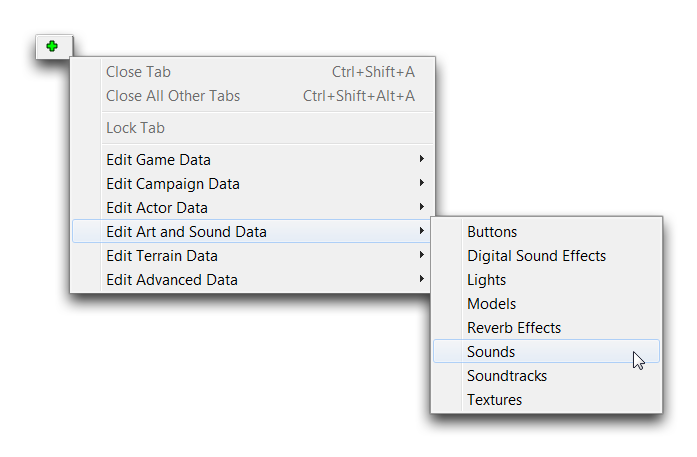
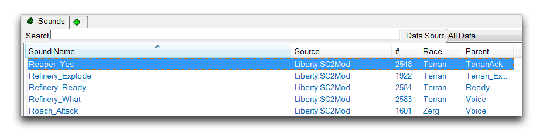
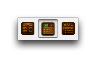
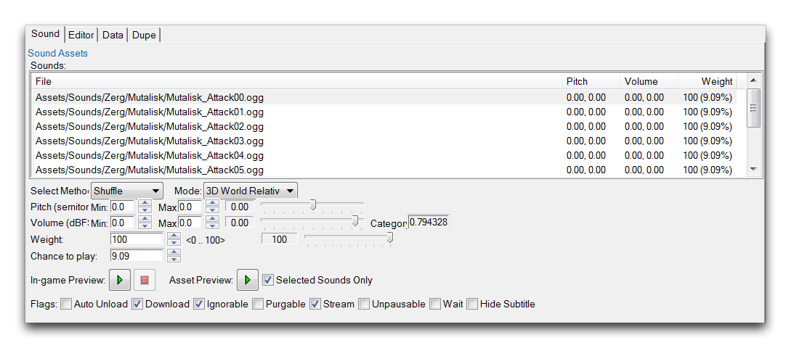
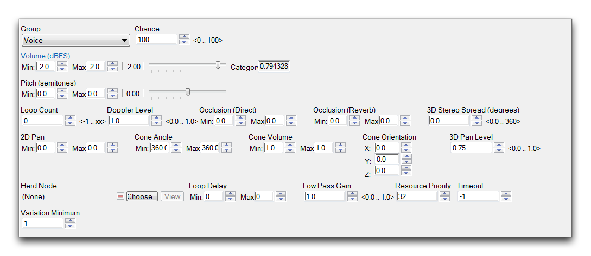
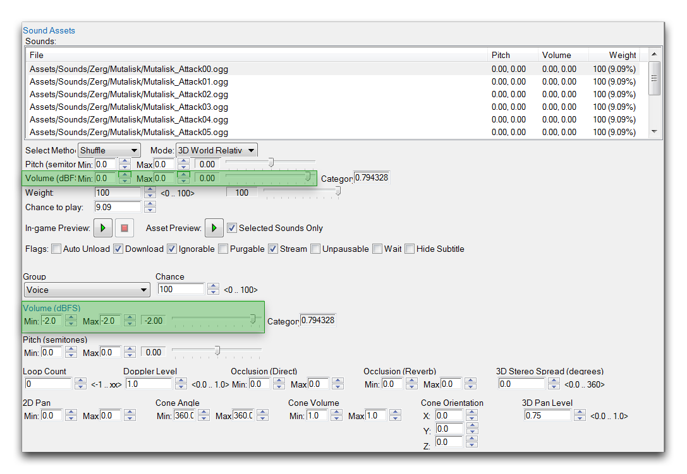
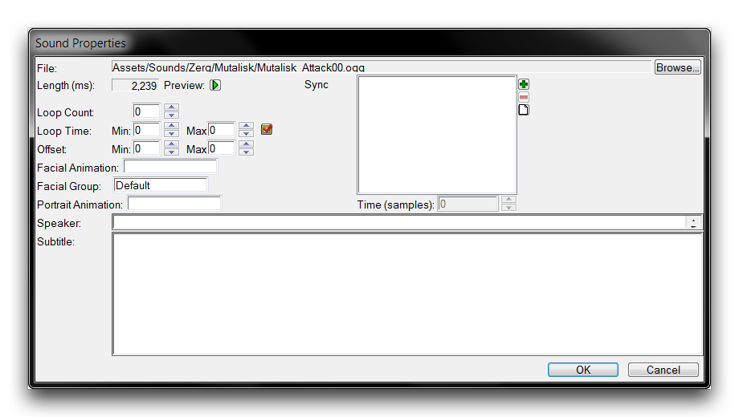
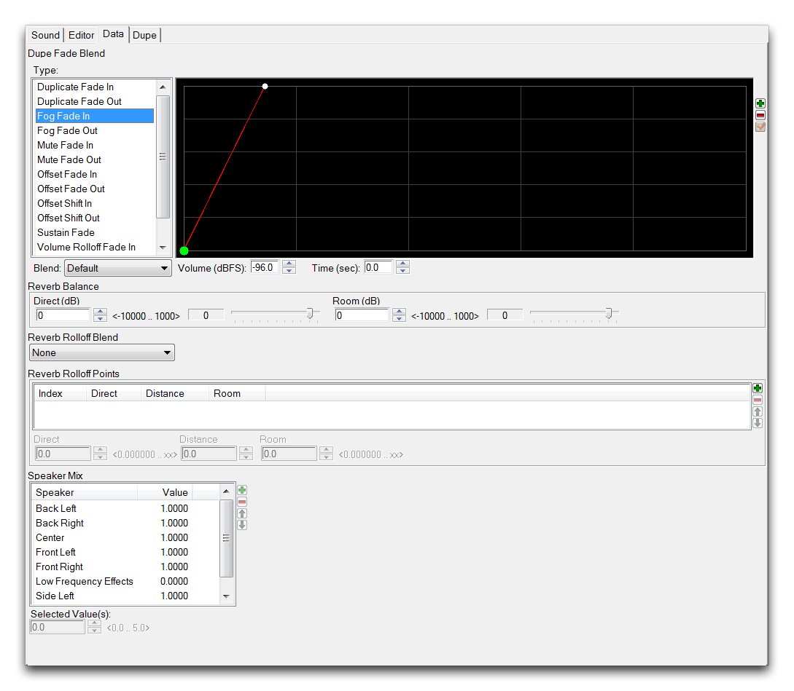

# Sounds

Sound is the primary audio datatype of the Editor. It can represent either an individual file or collection of audio files, and is the source of almost every type of sound heard within the game. Things like music, sound effects, unit voiceovers, and narrative dialog are all stored in the game as a Sound type. This type is a building block asset, it takes raw files from data or import and configures them, readying them for play. These sound assets are then incorporated into gameplay using either a sound actor or direct operation through triggers. You can see a typical view of Sounds being manipulated in the Data Editor below.

*Sound Data View*

## Finding Sounds In The Data Editor

As a datatype, sounds are handled through the Data Editor. Once inside this module, you can open the sounds tab by selecting the green + and navigating to Edit Art and Sound Data ▶︎ Sounds, as shown below.

*Navigating to Sounds in Data*

You should note that sounds differ from the data type Soundtracks. That type is largely designed for in-game ambient music and cinematic scoring. Opening the Sounds data tab will present you with the following view.

*Sounds Data Listing*

## Sound Categories

The sounds tab is organized in the same way as any other datatype tab in the Data Editor. It is divided in two, with the left being a list of every sound in the current data scope, while the right offers a detailed view of the currently selected sound with all its fields available for review. The sound listing is shown below.

*Sounds Category View*

The sounds tab is separated into five categories for organization, described in following table.

| Field      | Details                                                        |
| ---------- | -------------------------------------------------------------- |
| Sound Name | The name of the sound object.                                  |
| Source     | The data source in which the sound object is located.          |
| \#         | The sound object's index in the current scope.                 |
| Race       | A race the sound object has been tagged to be associated with. |
| Parent     | The template basis of the sound object.                        |

The Sound Name is often broken into a prefix and suffix with the format Unit\_SoundType. This allows the listing to be further broken down by unit and the types of sounds required for each unit. Some examples shown above view are Refinery\_Explode, Refinery\_Ready, and Refinery\_What. These three sounds are each connected to the refinery unit and are intended for three states that trigger sound.

## Sounds Detail View

The basic view of the sound fields in the Editor will look as follows.

*Sound Fields*

Here, the type is broken down into a variety of property fields and the 'Sound Assets' field, which contains the base sound file links. These sound assets are brought into the Editor in two formats, .ogg and .wav. The .ogg format makes up the majority of the sounds. Once inside the Editor, these assets must be made part of a Sound via this 'Sound Assets' field before they are useable in game.

Beyond illustrating this point, the basic view of the sound's fields doesn't offer an awful lot. Due to the number of files that can be packed into each Sound type, a much more extensive view was designed for this tab of the data editor. You can access it by switching the Data Editor into 'Detail View,' using the Data Bar. The button for this is shown below.

*Detail View Button*

Once you have the detail view set up, highlighting a Sound in the sounds tab should present you with the following, hereafter referred to as the Sound Editor.

*Sound Editor View*

## Sound Editor

The enhanced Sound Editor view gives you a much more useful look at the Sound datatype. Take note of the 'Sound Assets' box at the top of the editor as it's seen below.

*Sound Assets Close-Up*

The topmost box here shows the contents of the sound's 'Sound Assets' field. As previously described, this can contain one or multiple raw sound files, which in this case are .ogg. You'll also find the individual Pitch, Volume, and Weight values for each asset in this view. Further down are the individual controls that set these values, as well as some supporting options. These are broken down in the following table.

| Field          | Details                                                                                                                                                                                                                                       |
| -------------- | --------------------------------------------------------------------------------------------------------------------------------------------------------------------------------------------------------------------------------------------- |
| Select Method  | Selects the play method for previewing sound assets as Sequential or Shuffle. Most in-game sounds use Shuffle to produce varied response noises. One notable exception is the \_Pissed series of sounds for each unit, which uses Sequential. |
| Mode           | Selects the playing mode as 2D or 3D sound.                                                                                                                                                                                                   |
| Pitch          | Sets the pitch alteration of the raw sound using a slider.                                                                                                                                                                                    |
| Volume         | Sets the volume alteration of the raw sound using a slider.                                                                                                                                                                                   |
| Weight         | Sets a value from 0-100, which determines the Chance to Play.                                                                                                                                                                                 |
| Chance to Play | The weight of this sound asset divided by the total weight of all sound assets within the Sound. This works out to the percentage chance this sound will be played anytime the object is used.                                                |

As you may have guessed while reading the properties above, a Sound composed of multiple sound assets will play a random one of its component sound files each time it is used in the game. The random chance is dependent on the individual Weight of each asset and is expressed exactly as a Chance to Play.

At the bottom of this section of the editor, you'll find eight flags that can be configured inside any Sound. These flags offer additional modifications to the sound's organizational properties, including its file handling, streaming status, and ability to be paused.

## Play Controls

One of the most important features of the Sound Editor is its set of preview controls for sounds and sound editing. These are shown below.

*Play Controls Interface*

These controls allow you to listen to raw sounds through the 'Asset Preview' button, while also giving you the option to test altered sounds with the 'In-game Preview' button. Having both of these features available is important when you're working with imported sound assets. Without such a feature, it would be extremely onerous to find the proper volume balance or effects controls for making custom assets sound right in-game.

## Sound Group Volume Controls

Another section of the sound editor gives you the ability to set group volume controls. These controls are shown below.

*Sounds Group Volume Controls*

Sound groups offer an additional level of control for sound properties by allowing you to add individual sound assets to a specific channel. This channel can then be altered with an extensive level of sound options, which are best demonstrated and understood through experimentation with the preview controls. Below you can see a table showing the many channels available for use.

| Alert    | Alert       | Build          | Combat     |
| -------- | ----------- | -------------- | ---------- |
| Death    | Dialogue    | Doodad         | Flames     |
| Foliage  | Gather      | Master Effects | Missions   |
| Movement | Movie       | Music          | Other      |
| Ready    | Set Ambient | Set Emitters   | Set Pieces |
| Spell    | TV          | UI             | Voice      |

It's worth noting here that sound channels can be affected by players' personal settings. For example, if a player has their music disabled, they will not hear any sound that is in the music channel.

One consequence of the extensive controls found in the Sound Editor is a common confusion between the group sound controls and the individual sound options. The image below should help you to avoid this confusion.

*Individual and Group Volume Controls*

The individual volume controls used to set each sound asset's volume are found in the upper highlighted box. The lower highlighted box allows you to set the sound alteration for each channel.

## Sound Properties

Selecting any individual file from the 'Sound Assets' box and double clicking it will open a new window called 'Sound Properties,' as shown below.

*Sound Properties View*

Here you'll find a number of important secondary controls dealing with how and when a sound asset will play. The Loop Count controls how many times a specific asset will play in a row when used in-game. Usually, most sounds won't need to be played more than once, but there are exceptions.

Importantly music files are usually set on a constant loop during gameplay. To get this specific behavior, set the Loop Count to -1. Loop Time supports this by setting a random minimum and maximum length for a loop playthrough. Offset will apply a random offset in between its minimum and maximum to the sound file's playback. The Speaker and Animation controls are configured for narrative dialogue. They allow you to tag a piece of pre-recorded audio with information and details that can be useful in setting up a story-type campaign or cinematic.

## Sound Editor Data View

If you look to the top tabs of the Sound Editor, you'll find another set of useful options under the data tab. These options are shown below.

*Sounds Editor Data Tab*

These controls allow you to set the speaker-centric volume properties of each sound. Due to the vast number of options, the best way for you to figure out how to use this panel is to experiment with the play controls.
