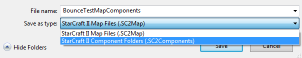
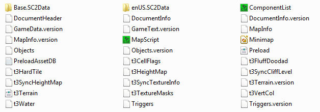
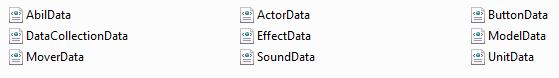
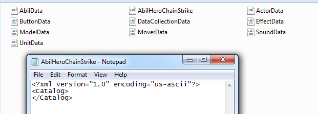
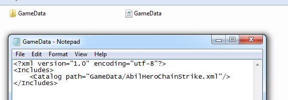
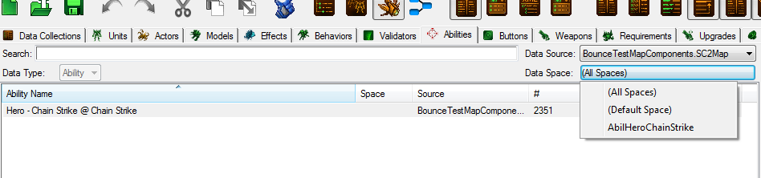
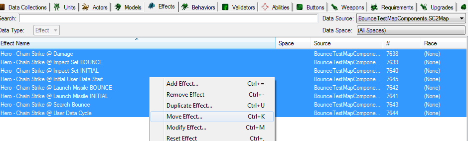
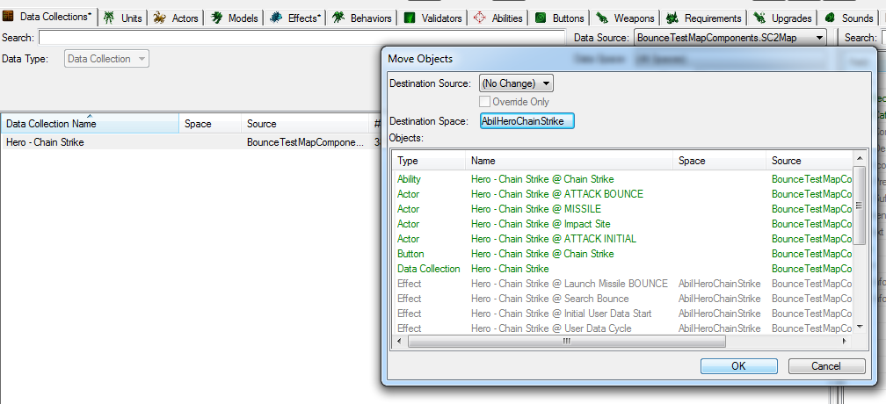
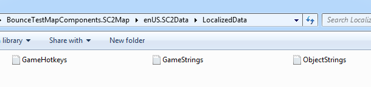

# Data Spaces

A method of clumping relevant data into a single file so that in can be copied into other maps in a organized and least time-consuming manner.

This tutorial assumes that you've never seen .xml in your entire life and just want to flip the table at the mentions of any sort of complex stuff.

## Step 1. Saving map as components

File->Save As-> chose save as .SC2Components instead of usual .SC2map file.



Then find to the newly created map folder and head into `Base.SC2Data` -> `GameData` folder



Saving map as components gives you an insight of what the map is made of. In `Base.SC2Data` -> `GameData` folder you can see the data edits you've made.



You can easily copy paste all the data from one map to another by saving both maps as components and then copy-pasting those xml files.

## Step 2. Creating a data space

Here we see data edits separated by their categories – units, actors, effects, behaviors etc..

We will be creating a single .xml file in which all of our relevant data will be stored (rather than being split over multiple different files).

You can either create new or just copy-paste any of xml files, rename it to how you want the data space to be called, open it, erase everything inside and copypaste

```xml
<?xml version="1.0" encoding="us-ascii"?>
<Catalog>
</Catalog>
```




## Step 3. Making editor see data space

We'll need to make a new xml file called `GameData.xml` in the `Base.SC2Data` folder (create it same way we created our previous xml file in step 2). Copypaste following, except in catalog path specify the name of our dataspace file.

```xml
<?xml version="1.0" encoding="utf-8"?>
<Includes>
    <Catalog path="GameData/AbilHeroChainStrike.xml"/>
</Includes>
```



## Step 4. Transfering data into data space

Now everything is setup to work. After we load up the map we can see that data spaces menu now has the data space we made.



Select data entries you want to move to data space, right click on them and select "Move ...".



!!! info

    If you are using data collections feature, moving data collection will also move all of it's contained elelemnts.



After everything has been moved, save the map and check the dataspace. You'll find all the information you moved in editor to now conveniently reside in that one file. It can now be easily shared around.

To import it into a new map or mod we'll need to save that map/mod as components, move our dataspace file into `\Base.SC2Data\GameData` folder and create/add catalog path into GameData.xml file like we did in step 3.

## Step 5. Everything's "(Unknown)" and "(Unnamed)"

Turns out text is stored separately. If we add data space to different map or mod we'll find out that all descriptions and data field names are gone/messed up. Because there are game clients in many languages besides english, all text that is displayed to users is stored separately. In map's component folder you can find localization folder, in my case it would be `enUS.SC2Data`. It stores text files with texts for data entries. We will have to manually add/merge revelant data of localization files for the map to which we're importing our dataspace.



## Example map

* [BounceTestMap.SC2Map](./data-spaces/BounceTestMap.SC2Map)

**Additional Links**

- Mapster's Github's tutorial link: <https://sc2mapster.github.io/mkdocs/data/>
