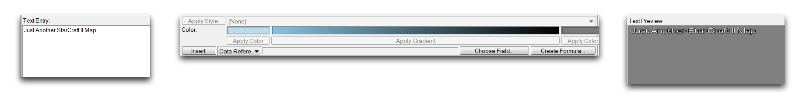
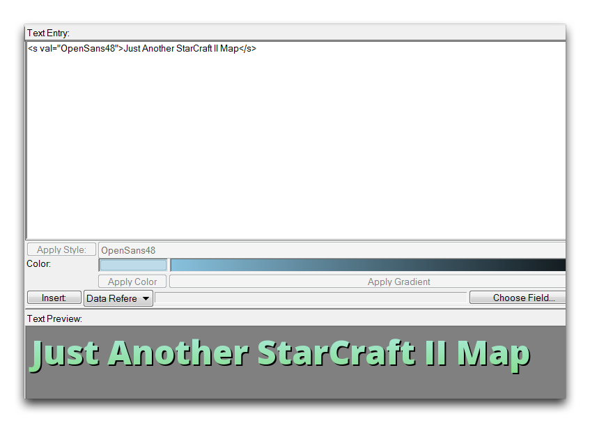

FONT STYLES
===========

Font Styles allow you to change the basic presentation of your text.
Font styles don't need to be particularly elaborate or exotic. They
represent any distinction made to a font from the default text used by
the game.

CREATING A FONT STYLE
---------------------

Creating font styles lets you use font assets from outside the standard
dependencies. You can set up styles with any choice of existing or
imported fonts, but for this exercise you'll use a free font sample of
OpenSans. First, import the font using the Importer. You can get there
via Module -\> Import. There, right-click inside the white box and
select 'Import Files,' then locate the font file, either a .ttf or .otf,
and click 'Ok.' Saving your project after the import should present you
with the following.

Imported Font

Font styles themselves are created from the Text Editor. To build a font
style, navigate there via Modules -\> Text. Move to the 'Font Styles'
heading and right-click in the main listing. Select 'Add Style' to
begin, as shown below.

Adding a Font Style

In the 'Style Properties' pop up, set the 'Name' to 'OpenSans18.' This
denotes the font type and its intended size.

Style Naming

Once the font style has been created, you can configure it using the
panel on the right-hand side of the Text Editor. In this case, set Font
Height to 18, Horizontal Justify to Left, and Vertical Justify to
Middle. Set the text's color to white. The set fields should look as
follows.

Configured OpenSans18 Style

Turn your attention to the 'Text Preview' to get a feel for the style.
With the options above set correctly, it should look as shown in the
image below.

OpenSans18 Style Preview

CREATE FONT STYLE FROM TEMPLATE
-------------------------------

From here you can create more font styles using the 'OpenSans18' style
as a template. This will set all fields of the child style to that of
its parent. This option is a useful timesaver, you can use it to build
out a family of styles that has a degree of consistency.

Create a new font style from a template by navigating to 'Add Font
Style' in the Text Editor. Name the style 'OpenSans48' then set its
'Template' to 'OpenSans18,' as shown below.

Style Creation from Template

Configure this style's Font Height to 48, then check the Shadow flag and
set a Shadow Offset of 2. Add an Outline Width of 4 then set the two
color choices to (R175, G237, B230) and (R133, G220, B139). Alternately,
you can choose to experiment with how the font looks now. This should
leave you with a style panel that looks as shown in the image below.

Configured OpenSans48 Style

The preview will now show a more substantial typeface, as in the image
below.

OpenSans48 Style Preview

APPLYING A FONT STYLE
---------------------

Once created, you can apply font styles from anywhere in the Editor that
you can edit text. The Text Editor is a top-down solution for changing
the content or font styles of any text within a project. Navigating to
the 'Text' tab will display a list of all the project text. This view is
shown below.

Text Editor Main View

Highlighting an instance of text will push its details to the right-hand
side of the screen, which consists of three sub-panels, Text Entry, Text
Controls, and Text Preview.

Text Entry -- Text Controls -- Text Preview

You can apply a style to a highlighted piece of text by selecting it
from the 'Apply Style' dropdown.

Selecting Style for Application

Clicking the 'Apply Style' button will finish the operation by appending
a style tag around the text entry. A style tag will precede the raw text
with \<s val ='Style Name"\> and follow it with \</s\>. These elements
instruct the game to change the contained text's style at run-time. For
now, you can preview the text output from the Text Preview panel.

Text with Applied Font Style

Alternately, you can style text while you fill any text field in the
Trigger Editor. Selecting a text field and navigating to the 'Value'
source should bring up another editor reminiscent of the Text Editor.

Styling a Text Field

As before, highlight any inputted text to unlock the Text Controls.
Select a style with the 'Apply Style' dropdown and click the button
itself to style the text. The results of this process are shown below.

Styled Text in the Trigger Editor

In this case, you can test the updated text by launching the map.
Pictured below is a standard example of the styled text in the
game-view.

Styled Text in Game-View
