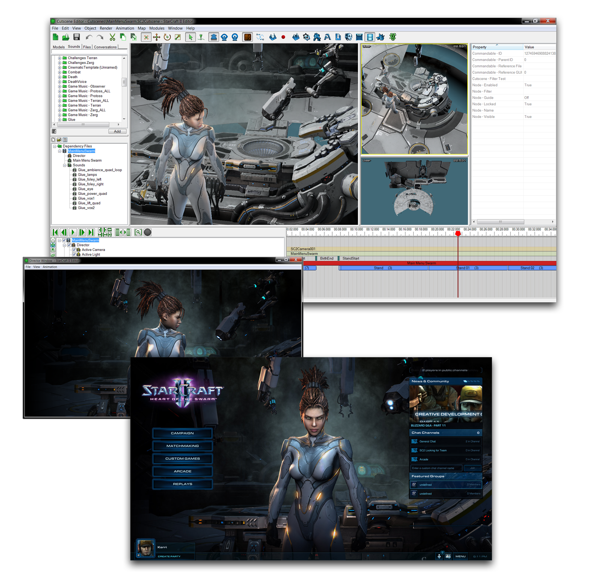

CUTSCENE EDITOR INTRODUCTION
============================

The Cutscene Editor is a set of tools that allows you to assemble,
direct, and produce cutscenes using any assets available to the Editor.
It serves as a studio where you can weave many elements together,
including audio, visual, animation, effects, voiceover, and lighting.
You can arrange set pieces that can fill many roles in your project,
whether as storytelling cuts during a game, narrative cinematics for a
campaign, menu screens, or even standalone films.

Cinematic Cutscenes Building into Game Assets
