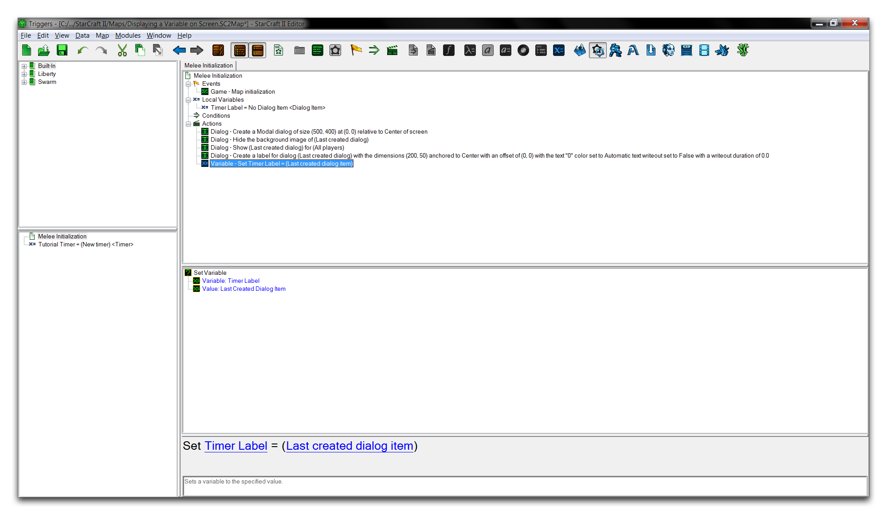
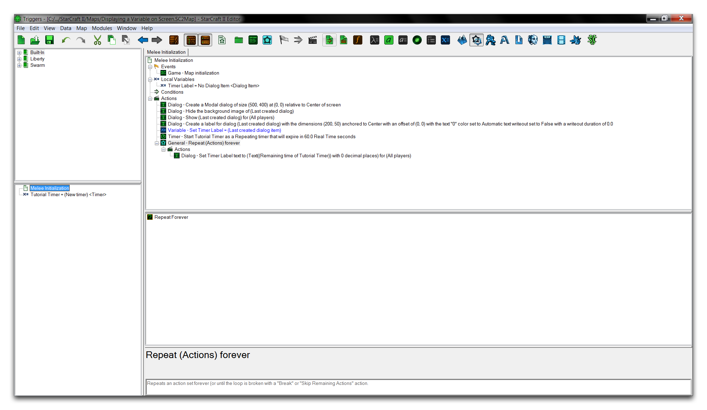

DISPLAY A VARIABLE TO THE SCREEN
================================

Directly outputting variables from the trigger editor to screen space
can be very useful. You can use it as a technique for quick diagnostic
spot checks when testing a new function or for conveying information
directly as part of a simple UI.

This exercise will show you how to construct a basic counting timer, a
type of variable, which will display to the screen.

BUILDING A DIALOG
-----------------

With this method, the timer will be displayed on the screen using a
dialog. You'll begin by assembling both this dialog and the variable to
be shown in it. Create a new document and start a melee map on any
terrain type. Move to the Trigger Module and select the 'Melee
Initialization' trigger. Delete the default actions from this trigger.
Create a global variable of the type Timer, then name it 'Tutorial
Timer.' From here, add the following actions, configuring them as
described below.

-   'Create Dialog,' leaving the default settings.
-   'Show/Hide Dialog Background,' setting the 'Visible' term to 'Hide.'
-   'Show/Hide Dialog,' setting the 'Visible' term to 'Show.'

Your trigger should look like the one shown below.

Base Dialog & Timer Variable Created

CREATING A LABEL
----------------

From here, create a new action of the type 'Create Dialog Item (Label)'
and change the terms 'Offset X,' 'Offset Y,' and 'Text' to Zero. Set
'Anchor' to 'Center,' and configure the 'Writeout Duration' to 0.0.
Finally set the dialog dimensions to (200, 50).

This process has created the label, but it still requires a reference so
that you can call on it easily later. Create a local variable for this
purpose by navigating to Local Variables -\> New -\> New Variable. Name
this variable to 'Timer Label.' Next, set the variable type to 'Dialog
Item' so that it can properly hold the label.

Moving back to the trigger body, create a 'Set Variable' action and
configure the value term to 'Last created dialog item.' Now is a good
time to make sure that the 'Set Variable' action is ordered beneath the
'Create Dialog Item' action. This order ensures that the label was the
last created dialog item at the time of 'Set Variable' action. This
means that the label will be set to the newly created local variable,
completing your reference. The trigger's progress is shown below.

Dialog Label Hooked Up

TIMER
-----

Now you can move on to creating the timer that will be displayed to
screen space. Continuing in the trigger body, create an action of the
type 'Start Timer.' Set the action's 'Timer' term to the 'Tutorial
Timer' variable. Now configure the timer's additional terms. Set the
'Repeating' flag to 'Repeating,' set the 'Duration' to 60.0, and set the
'Time Type' to 'Real Time.' This will configure the timer to continually
reset after intervals of 60 real world seconds. It will also be bound to
the 'Tutorial Timer' variable for functional reference.

DISPLAYING THE VARIABLE
-----------------------

You'll need to make some provision to constantly update the dialog label
with the timer's value. This is a common use of control statements, and
in this case you'll find a loop appropriate. Assemble a loop by creating
the action 'Repeat Forever.' In the body statement of the loop, denoted
by a new 'Actions' heading, create the action 'Set Dialog Item Text.'

Note that, due to the function inputs, the prepared label must output to
the screen in the 'Text' type. Since our timer is counting in a 'Real'
type, a conversion is necessary. Click the 'Text' term of the 'Set
Dialog Item Text' action. This will launch a window showing potential
functional input. Navigate to 'Conversion' in the left-hand subview to
see a list of possible conversion functions.

Text Conversion Options

The 'Convert Real to Text' option is appropriate here. Select it, then
click 'OK' to return to the trigger view. This function still requires
an input, so select the 'Value' term and set it to 'Remaining Time of
Timer' to give it that property. Once you've done that, set the timer to
the variable 'Tutorial Timer.' Your trigger should now be complete,
compare your result to the image below.

Completed Trigger

You can now launch the 'Test Document' and note your result. You should
see the timer variable displayed to screen space, as shown below.

Timer Variable Displayed on Screen
