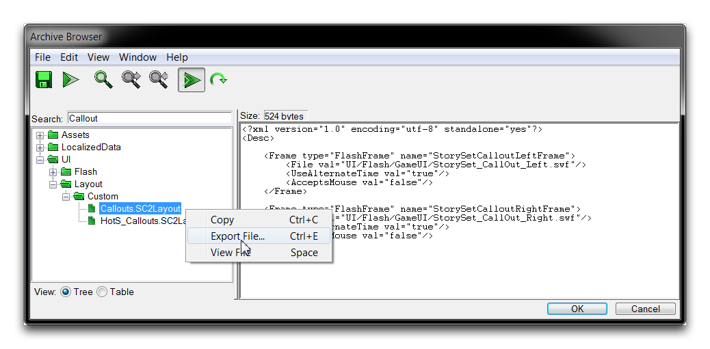
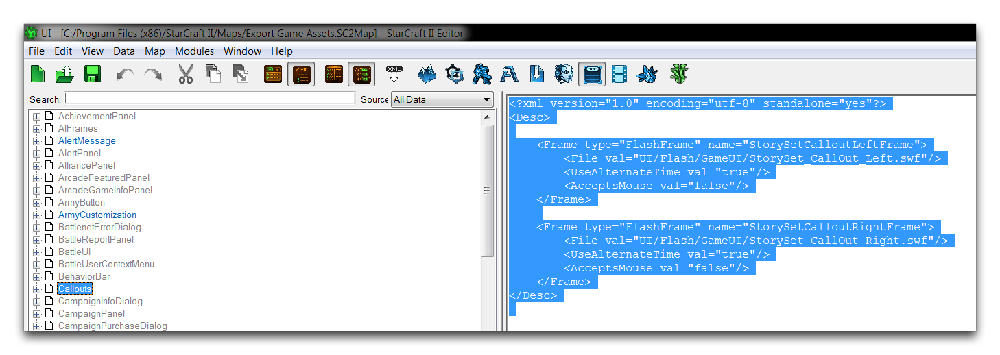
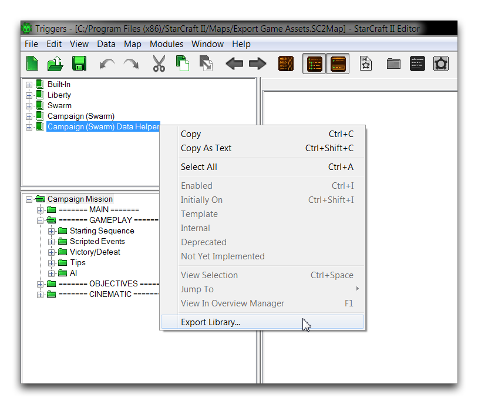

EXPORT GAME ASSETS
==================

Just as custom assets can be brought into the Editor with the Importer,
the standard assets can also be exported out of projects into basic file
types. Each type of asset requires you to use a slightly different
method to extract it from a project. These methods are described in this
article.

Exporting from the Editor is often used to get a closer look at the
standard assets. They can be taken out of the Editor, inserted into
different programs, altered and recomposed, then imported again for use.
Knowing how to export can also be valuable if you ever lose any source
parts of a project. You can then export files from the base project as a
recovery method. For each asset type, there some common file formats
that you should be aware of. A list is provided below.

  --------------------------------------------------
  Type                   File Format
  ---------------------- ---------------------------
  Texture                .dds

  Model                  .m3

  Sound                  .wav

  UI Layout              .SC2Layout, .xml

  Trigger Libraries      .SC2Lib

  Lights                 .SC2Lighting

  Components Folders     .SC2Components, Various
  --------------------------------------------------

OPENING THE ARCHIVE BROWSER
---------------------------

You may already be familiar with the Archive Browser for its use in
finding files for various data and trigger operations. It also serves as
the main hub for exporting things from a project. To use it for this
purpose, you'll need to access to browser directly, rather than as part
of an editing prompt. You can do so by navigating to Window -\> Console
from anywhere in the Editor, as shown below.

Opening the Console

Once you've launched the console, enter the command browse then select
the 'Enter' button, as shown below.

Asset Browser Launch Command

This will launch the Archive Browser. It will show a structured folder
arrangement of all the assets currently in the project.

Archive Browser View

EXPORTING FROM THE ARCHIVE BROWSER
----------------------------------

Assets can be exported from the Archive Browser by right-clicking them
and selecting Export File.

Archive Browser View

EXPORTING UI LAYOUTS
--------------------

You can also use the Archive Browser to export UI layouts. Do so by
locating them in the UI folder, highlighting them, and selecting Export
File.

Archive Browser View

Alternatively, you can extract them directly from the UI Editor.
Navigate to the .SC2Layout file, then highlight the XML data and hit
Ctrl+C to copy. The data can then be pasted into a text editor or
plaintext file for later use.

Highlighting XML for Export

EXPORTING TRIGGER LIBRARIES
---------------------------

You can export trigger libraries from the Trigger Editor using the
Library Panel by highlighting the library, right-clicking, and selecting
Export Library.

Exporting a Trigger Library

EXPORTING LIGHTS
----------------

You can export lighting files from the Lighting Window. Select the
lighting arrangement to be exported, then right-click and select Export
Light.

Exporting a Light

EXPORTING COMPONENTS FOLDERS
----------------------------

A map project can be broken into its Components Folders through an
export process. This format is a collection of scripts, component lists,
image files, and raw data that can be useful for diagnostic and analytic
procedures that you can do outside the Editor. To export, open the map
to be saved as component folders and navigate to File -\> Save As.
Change the 'Save as type' field to .SC2Components and select 'Save.'

Saving as StarCraft II Component Folders

This process will result in a folder with the specified filename,
appended with the suffix .SC2Map. This folder will contain a set profile
of data components and assets that will look similar to those shown
below.

StarCraft II Components Folder
