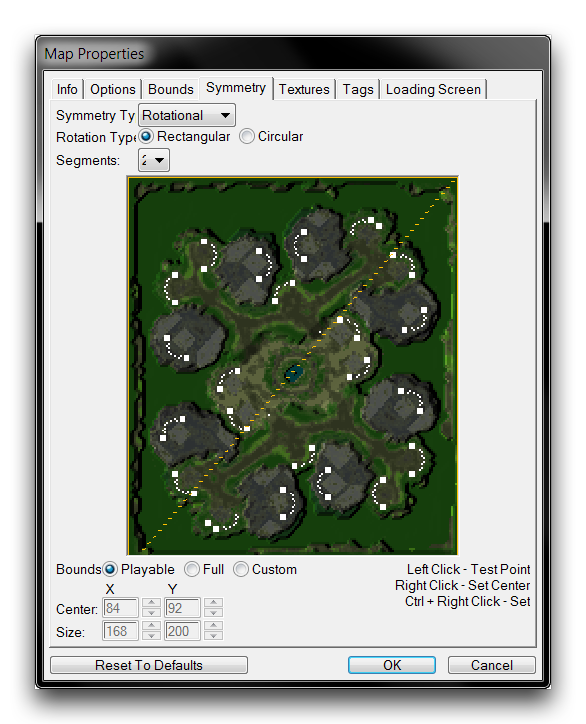
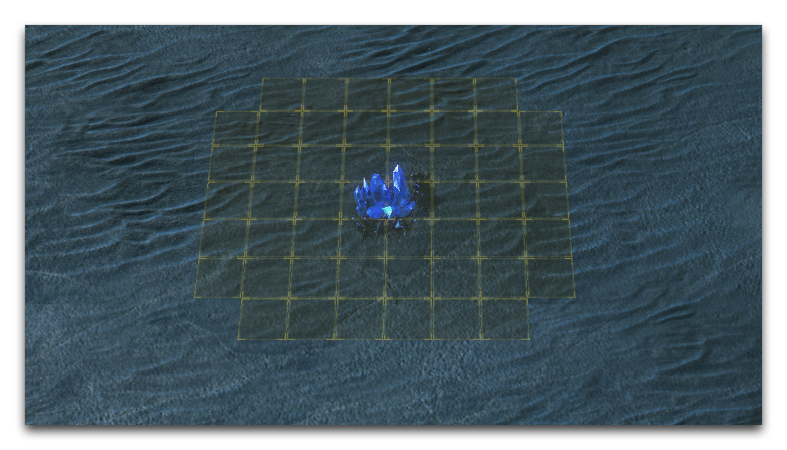
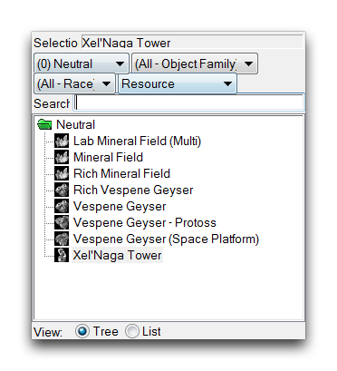

# Resource Placement For Competitive Play

Every element placed in a melee map has at least a small gameplay connotation, this varies from a single grass doodad shaping the way a battlefield feels, to the paths and terrain layout that shape the possible styles of gameplay that might emerge.

As a melee map maker, your greatest adventure is in exploring and experimenting with this relationship between shape, look, and gameplay. However, there is one area in which you have very little room to experiment. For competitive play, there is an established model dictating how resources need to be placed on the map. Introducing even the smallest variation to this layout can have a profound impact on the game's resource model, altering the state of balance for the competitive game.

*Cassandra Gemini's Well Designed Third by SeinGalton*

## Map Symmetry

Placing melee resources properly is fairly simple, but there are a few rules and techniques you'll need to use to meet the requirements. Begin by going over map symmetry, as this will save time compared with configuring every base individually. Access the symmetry controls by navigating to Map ▶︎ Map Symmetry, this will launch the 'Map Properties' window shown below.

*Map Symmetry Controls*

Applying a 'Symmetry Type' results in the construction of a mirror axis, across which all units created in the map will be duplicated. Connecting a map design to symmetry doesn't necessarily need to be permanent; you can use it and then toggle it off later without losing the results.

## Placement Considerations

When preparing to place resources, consider using the 'Placement Grid' overlay available in the Editor. You can activate it by navigating to View ▶︎ Show Placement Grid ▶︎ Show Grid. This overlay will show the area of three units around any resource item in which players can't place a command centre. This overlay is shown below.

*Placement Grid*

Next, consider the possible resource layouts for a base. There are two standard plans that account for almost all of the competitive layouts. Those two plans are shown in the images below.

*Same-sides Vespene Base Layout*

*Both-sides Vespene Base Layout*

## Placing Resources

Now it's finally time to place some resources. You can find them in the Units Layer of the Terrain Editor. Navigate to the Units Palette and set the 'Object Type' search filter to Resources. This will show all of the available melee resources, as in the image below.

*Resources in the Unit Palette*

Select the minerals and lay them out in your base structure, keeping the standard layouts in mind. Remember that the traditional base plan contains eight mineral fields, and two vespene geysers. There are also high-yield bases with six mineral fields and a pair of geysers. Although these standards are negotiable, be aware that every liberty you take with a competitive map endangers its chances of play. Despite this, some experimentation and play is required in every map.

You should avoid placing vespene geysers diagonally, as it can cause a reduced harvesting rate. You can see this in a test by checking to see if the geyser can support a fourth worker. Testing in general can be a great method for feeling out whether or not your resource placement is correct. Resources are so fundamental to the feel of a melee game that the slightest changes in their layout can be discernible even to amateur players.

Note, that you should also consider the version of StarCraft that you are designing for. In Legacy of the Void, there is a different resource model than the earlier incarnations of the game. These require different values inside mineral deposits.
