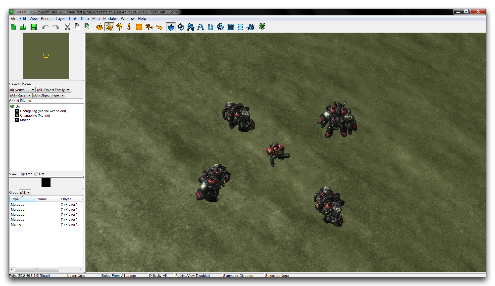
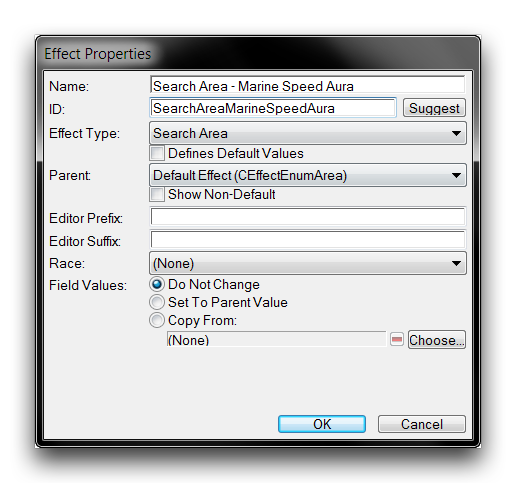
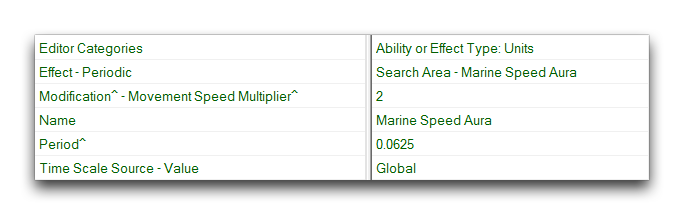
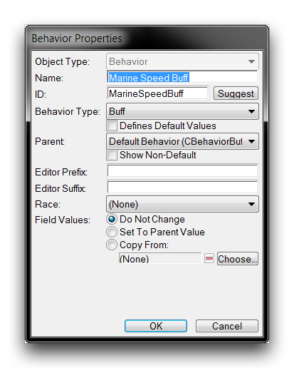
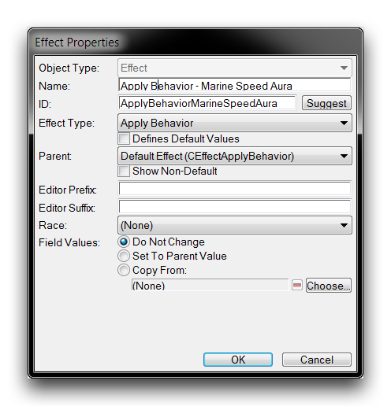
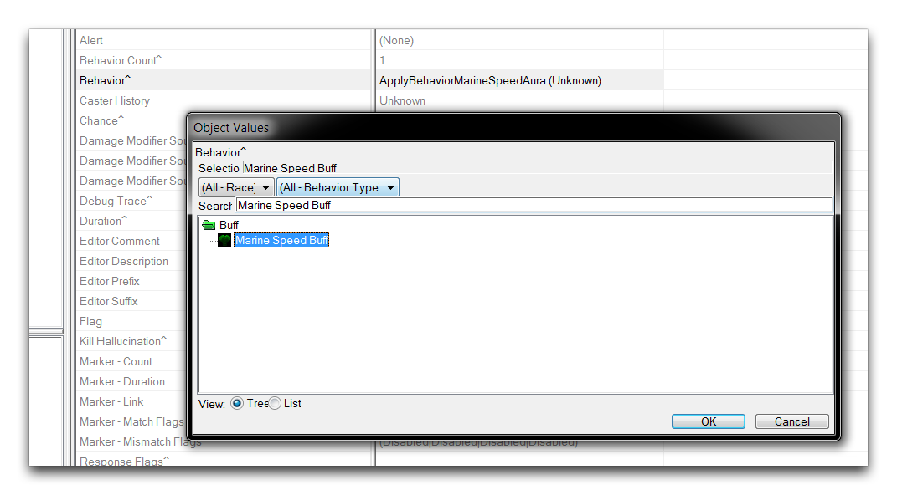
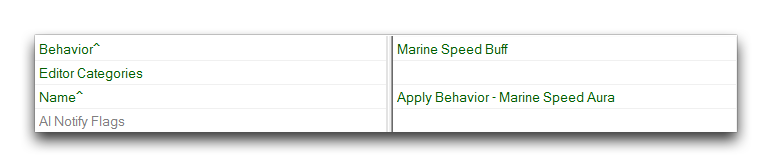
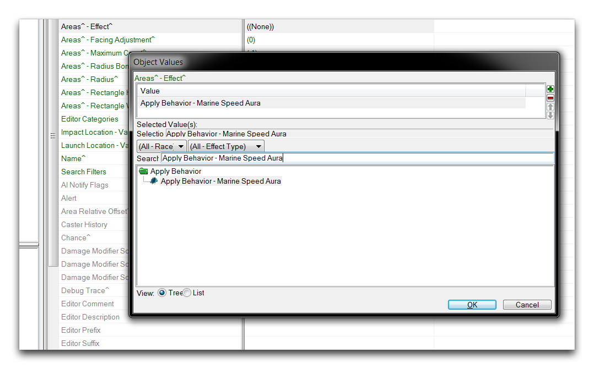
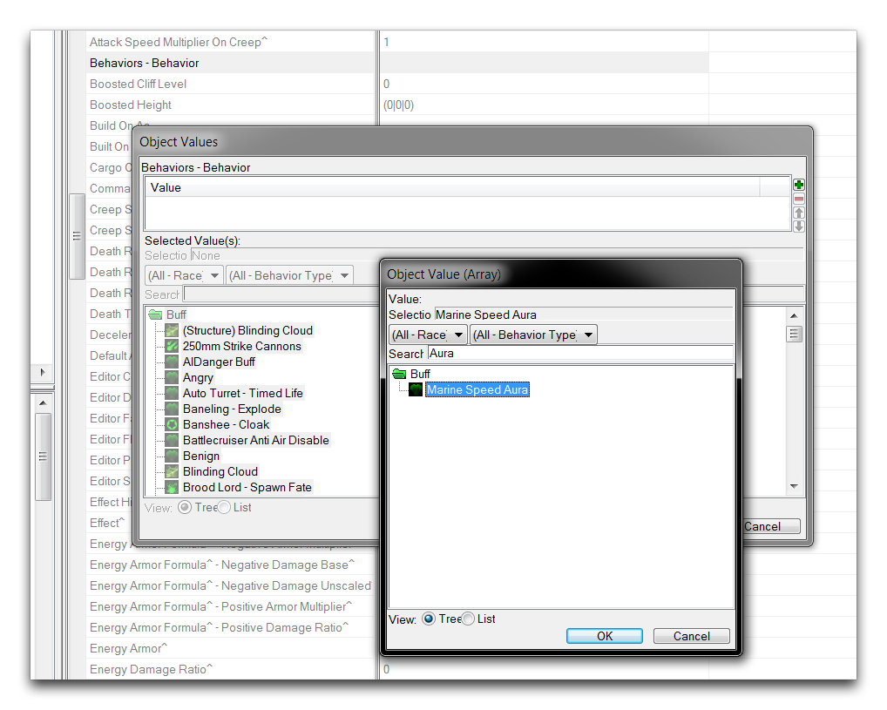
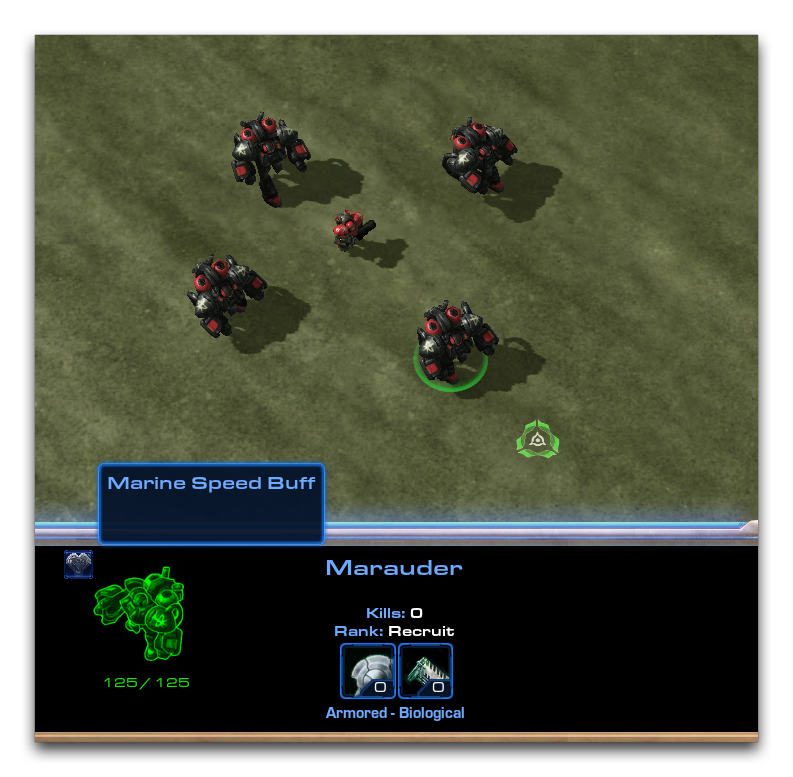

# Create An Aura Ability

An Aura refers to a common class of abilities used in games. Auras typically emanate from a single unit, bestowing beneficial effects on any friendly units in an area of effect around the aura-holder. Thematically, auras usually support the idea that the presence of a heroic unit can energize and enliven those around them. You can see an example of an aura effect in the image below.

*WarCraft III's Endurance Aura*

In WarCraft III, the Tauren Chieftain's 'Endurance Aura' grants nearby allies a bonus to speed and attack rate. While this is a traditional application of an aura, there are many varieties and similar ideas in different games. Abstracting the key points of the concept gives something like the below.

  - Auras are passive, non-useable abilities that are hosted on a source unit.
  - Auras create a change in units in an area around the source.

This abstraction produces a true definition of auras; they have no specific connection to positive or negative effects, nor are they found only on hero units. With this in mind, possible designs for an aura ability can be quite varied. A torch-bearing unit could possess a burning aura that applies damage over time to enemies. These auras could also be set to stack for however many of the torch bearers are grouped together. Alternatively, there may be a cursed artifact, a ring pulsing with a shrinking aura that scales down the size of any units that approach it. Any thief who draws close enough to steal the treasure would soon find themselves too small to carry it.

## Designing An Aura

Auras clearly have the potential to add a lot of interesting play elements to a game. You'll find that learning to create an aura in the Editor is a very worthwhile exercise. Fortunately, having the key points of an aura figured out ahead of time allows you to introduce them very quickly.

The first important point to note here is that there are several possible ways to implement an aura. The method you'll learn from this article is a data-based option that you should find simple and intuitive. However, there is one upfront discrepancy with what has already been mentioned. In this case, the aura ability won't actually fit the definition of an ability within the StarCraft Editor. In the Editor, Abilities refer to changes that are made within the game and accessed using the command card interface. Examples of this include the marine's 'Stim Pack' or a zealot's 'Charge.' While it is possible to develop an aura in this way, the aura in this article will actually be implemented using two Behaviors and two Effects.

Behaviors alter the properties of units and are hosted within a unit directly. This fits well with the definition of auras outlined above. You'll use a Behavior to grant the aura to a source unit, which will in turn transmit a second, property-changing Behavior to each of the aura's recipients. This pair of Effects will be used to find the aura recipients and apply the property-changing Behavior respectively.

Talking through the aura's mechanics like this has helped get an idea of its general design. This design will be explained and expanded upon in the following sections, but for now it is provided below. Keep a note of this plan as a reference. Many creative alterations like those mentioned in the introduction to this article can be built using this general scheme.

  - Unit -- Hosts the aura
      - Behavior (Buff) -- Grants the aura to source Unit
          - Effect (Search Area) -- Finds the aura recipients around the Unit
              - Effect (Apply Behavior) -- Applies the buff to the found recipients
                  - Behavior (Buff) -- Applies the aura's property changes to the recipients

To design a specific implementation of an aura, you'll need to pick a source Unit and a specific buff Behavior. For the purposes of this demo, you'll make a speed aura that doubles the movement speed of all its recipients. This aura will be granted to the marine unit. The design plan will be as follows.

  - Marine -- Hosts the speed aura
      - Speed Aura -- Grants the speed aura to the marine
          - Speed Aura Search Area Effect -- Finds allied units around the marine
              - Speed Aura Apply Behavior Effect -- Applies the speed buff to allied units
                  - Speed Buff -- Doubles the unit's speed

To begin putting this design together, open the demo map provided with this tutorial. The map should look as shown in the image below.

*Map Preparation*

Move to the Data Editor to begin constructing the aura's logic.

## Search Area Effect

It's important to note that you don't need to build your aura in the same order as laid out in the plan. As such, the best place to start here is the 'Search Area' Effect, which will locate allies around the aura-host. Create a new effect and set its properties to those shown below.

*Search Area Effect Creation*

Now select the newly created effect and open the field 'Search: Search Filters.' Set the 'Self' filter to Excluded, as shown below.

*Search Filters*

This will prevent the effect from locating the caster or aura-hosting unit. Now set the fields 'Impact Location -- Value' to 'Target Unit' and 'Target: Launch Location -- Value' to 'Caster Unit.' The former sets the unit that will be found in the radius, while the latter will start the search at the position of the aura-host. Finally, you'll set the actual search area and size. You can do so by altering the 'Search: Areas -- Radius' field to 3. Then change the 'Search: Areas -- Arc' to 360. The search area is a full circle around the aura-host that stretches three map units in any direction. The fields of this effect will appear as in the image below.

*Search Area Effect Fields*

You'll note that, the 'Effect' field is not yet set. This starts the 'Apply Behavior' Effect onto the aura recipients.

## Buff Behavior -- Marine Speed Aura

Next, create the Behavior that serves as the aura source. Create a new behavior and set its properties to the following.

*Aura Behavior Creation*

Select the Behavior and set its 'Movement: Modification - Movement Speed Multiplier' field to 2. This applies a speed buff to the aura hosting-unit, in this case the marine. That way the source of the speed aura will be able to keep up when moving with the recipients of its bonus. Next, set the field 'Time Scale Source -- Value' and set it to Global. The time scale is a modification of how time is counted in the engine. Individual units may use their own scale, but in this case the Behavior will operate off Global or standard time.

As shown in the design, the aura begins its changes by first finding aura recipients using the search area Effect. This link is made by setting the 'Effect - Periodic' field to the 'Search Area - Marine Speed Aura' effect created in that last step. This process is shown below.

*Selecting the Aura's Search Effect*

Now, set the 'Period' to a value of 0.0625, this will cause the 'Effect -- Periodic,' and consequently the search effect, to happen 16 times per second. The completed aura behavior fields should look as shown below.

*Marine Speed Aura Fields*

## Buff Behavior - Speed Buff

This component is the behavior responsible for the speed boost in the aura recipients. It too is a buff type and its creation window should look as follows.

*Speed Buff Behavior Creation*

Once you've created the behavior, modify the field 'Modification -Movement Speed Multiplier' to a value of 2. This will create the speed boost in units hosting this behavior. Since each unit in the aura will individually receive this behavior, the boost will be handed out amongst the aura's entire search area through this speed buff behavior.

Also set the field 'Duration' to a value of 0.2. This is the lifetime of the modification in the unit, meaning that if a unit leaves the aura's area the boost will dissipate after 0.2 seconds. As a last step, set the 'Time Scale Source -- Value' to Global, as with the previous behavior. The completed fields for this behavior should match the following.

*Marine Speed Buff Fields*

## Apply Behavior Effect

The final component is the effect that applies the speed boost buff to found allied units. This is an 'Apply Behavior' effect, and its creation screen should look as shown below.

*Speed Buff Behavior Creation*

The only field that needs to be set here is 'Effect: Behavior.' Set it to the previously created the 'Marine Speed Buff.'

*Setting the Behavior for Application*

This effect will now be called on for every unit found by the 'Search Area -- Marine Speed Aura' effect. It then pushes the 'Marine Speed Buff' behavior onto each of those units, boosting their speed. At this point, the behavior's completed fields should look like the following.

*Apply Behavior Effect Fields*

## Linking The Data Together

Creating a large piece of data by first building each individual component is an efficient process, but it has left some holes in the connective part of the data. You can fix this now. Move back to the 'Search Area -- Marine Speed Aura' Effect and open its 'Areas -- Effect' field. Set this to the 'Apply Behavior -- Marine Speed Aura' Effect.

*Linking Behavior Application Effect to the Search Effect*

You have now set the search effect to start the 'Apply Behavior' effect in each found, allied unit. To finish up, you'll need to set the aura into its source Unit, the marine. Thanks to the implementation method you've used for the aura, this is a simple process. Move to the 'Marine' in the units tab and open its 'Behaviors -- Behavior' field. Inside the pop up, hit the green + to add a behavior to the unit. Select the 'Marine Speed Aura' and hit 'Ok' through the two windows. This process is shown below.

*Adding the Aura to the Source Unit*

## Testing The Aura

Your aura is now fully composed. You can confirm this by taking a look at the Data Navigator, which should give you a helpful look at the aura's whole data structure.

*Aura Data Structure*

You can see the following connections by looking at this visualization.

  - Unit (Marine) -- Hosts the 'Marine Speed Aura' Behavior through its Behaviors -- Behavior field

  - Behavior (Marine Speed Aura) -- Applies the 'Search Area' effect with its Effect -- Periodic field

  - Effect (Search Area - Marine Speed Aura) -- Applies the 'Apply Behavior' through the Areas -- Effect field

  - Effect (Apply Behavior - Marine Speed Aura) -- Creates the 'Marine Speed Buff' via its Behavior field

  - Behavior (Marine Speed Buff) -- The end point of the aura
    
    > This fits nicely with the design presented in the introduction to this article. Testing the project should result in the aura being created in the marine host and any units in a circular area of about two units around it. All affected units should move at about double their normal speed. They will also display a buff icon, highlighted below.

*Apply Behavior Effect Fields*

## Attachments

 * [087_Create_an_Aura_Ability.SC2Map](./maps/087_Create_an_Aura_Ability.SC2Map)
