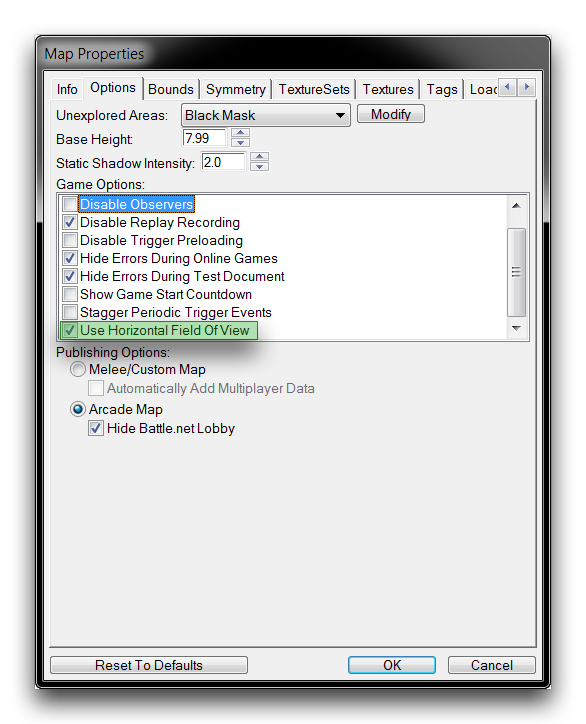
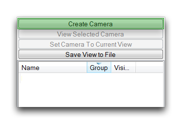
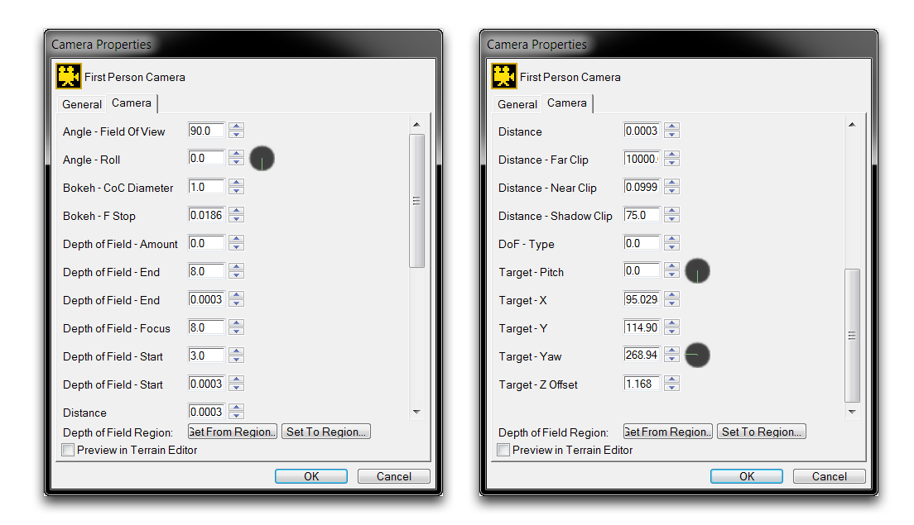
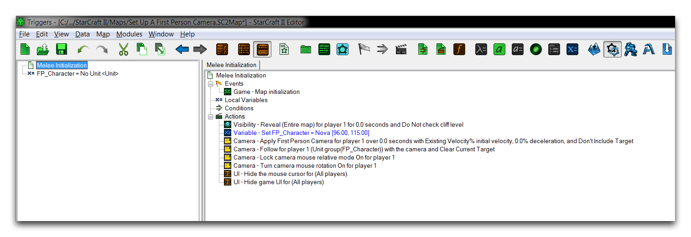
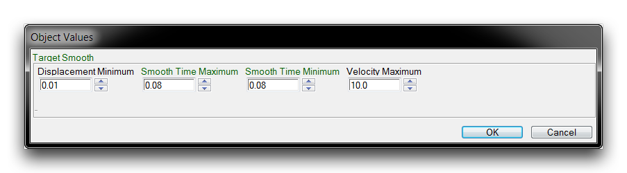
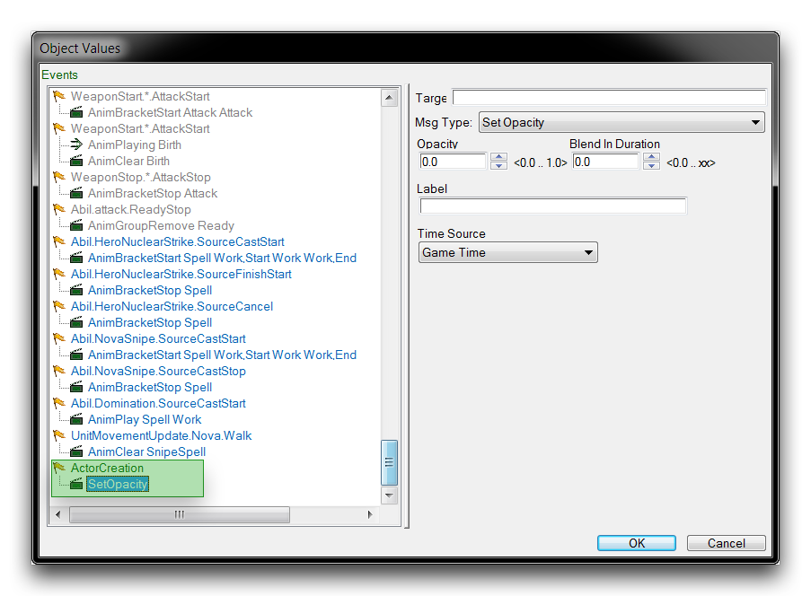

# Set Up A First Person Camera

Camera objects in the StarCraft engine are devices often used for storytelling. Applying a new camera during a narrative scene allows you to use angles and effects outside the traditional isometric view. A quick switch of the camera can be a very potent narrative tool.

Custom cameras can also be applied to gameplay itself, altering the player's viewpoint to a new perspective while they play. A favorite use of this technique for many developers is the First Person Camera. This is a camera set directly inside the head of a game's player character. A first person camera simulates a natural viewpoint of walking or moving around the environment and gives the user the impression that they are navigating the game themselves. Making this alteration to the engine's gameplay camera is quite straightforward. Follow the method laid out in this article and the map provided with it to set up a first person camera for any project.

## Field Of View

The Field of View (FOV) sets how much of the game world is visible to a camera. This an important figure for controlling the basic composition of a custom gameplay camera. Changing the FOV can be tricky and is best done through a live preview of a camera. There are actually two types of field of view available for use in the Editor, Vertical and Horizontal. A Vertical FOV is used by default, as it is more appropriate for a traditional RTS view.

For a first person camera, you should strongly consider a Horizontal FOV, as it tends to give a much more natural approximation of human eyesight. The field of view type can be changed in map properties by navigating to Map Options ▶︎ Options ▶︎ Use Horizontal Field of View. Checking this flag will change the FOV type of every camera to Horizontal. You should note that certain FOV values are a common cause of motion sickness amongst players. Having an in-game control to change the magnitude of the FOV value can be helpful.

*Enabling Horizontal Field of View*

## Creating The Camera

A first person camera should be oriented on the map alongside the player character in a fashion that would simulate that character's vision. You can do this by moving the camera effectively into the character model's head, or just behind their shoulders. The Free Camera Controls are crucial here, as they allow you to position the Editor camera easily with the mouse. The following controls are particularly useful for setting the camera.

| Control               | Effect                                                                                                                 |
| --------------------- | ---------------------------------------------------------------------------------------------------------------------- |
| Zoom                  | Zooms the camera in the target direction. Zooming in will decrease camera Distance.                                    |
| (Shift + Right Click) |                                                                                                                        |
| Rotate                | Spins the camera around its target point. This will alter Target -- Pitch and Target - Yaw.                            |
| (Ctrl + Right Click)  |                                                                                                                        |
| Height                | Moves the camera along a vertical axis, away from or closer to the map's ground level. This alters Target -- Z Offset. |
| (Alt + Right Click)   |                                                                                                                        |

A placed first person camera should look something like the image below.

*First Person Camera Setting*

Once oriented, the camera object can be created by hitting the 'Create Camera' button in the Cameras Palette, as shown below. Note that the unit model's blocking the view is only temporary. You should also make sure to get an idea of the unit's position relative to the camera, as this will be the anchor for the first person camera's movement.

*Creating Camera Object*

## Choosing Camera Properties

You can use 'Camera Properties' to preview the camera object and fine tune how it will look in game. Open this pane by selecting the first person camera from the Cameras Palette, then double clicking it. The standard first person camera settings are shown below.

*First Person Camera Property Settings*

There are several things you should take note of here. The basic camera shot target is composed of the Pitch and Yaw. These values will vary widely depending on a camera's position on the map. Typically, you'll need to use a Z Offset in the range of 0.5 to 1.5 to give a realistic ground-level view.

Distance in this case controls the separation of the camera and its target. For a first person camera it should be set to 0. A (Horizontal) Field of View set to 90 is the most common option for making a good-looking first person perspective. You should also set the Distance Far Clip to 10,000. This large distance will cause some performance dragging, but it is necessary to render the entirety of the scene from such a low, flat vantage.

## Setting Up The Camera Logic

A custom gameplay camera will require handling logic, triggers that handle how the camera will perform and be used by the player during game time. Logic like this can take on many forms depending on the type of project and its implementation. Still, there are some basic necessities that will likely be a part of any design. A standard example of first person camera logic is shown in the image below.

*First Person Camera Logic*

Each step of the camera logic is annotated below.

  - Reveal Area -- The map has been revealed, as RTS-style fog of war is not desirable here.

<!-- -->

  - Set Variable -- Sets the controllable player character, which serves as the camera anchor.

<!-- -->

  - Apply Camera Object -- Applies the first person camera to the in-game view.

<!-- -->

  - Follow Unit Group with Camera Area -- Attaches the first person camera to the player's movements.
  - Lock Camera Mouse Relative Mode On -- Ties camera movement to mouse control, which is a genre standard.
  - Turn Camera Rotation On -- Supports the mouse control by allowing the camera to free-look in 3D space.

<!-- -->

  - Hide the Mouse Cursor -- Removes the player cursor from view.
  - Hide the Game UI -- Removes the standard UI, allowing for a custom build.

Together, these actions help complete the illusion that the camera is actually a free moving entity. Combining this with any sort of keyboard controls for movement will form the basis of a first person game.

## Camera Smooth Time

The game camera has some built-in smoothing coefficients that affect how the camera moves around the map. When you're building a first person camera, the default values tend to be detrimental. You can change those defaults by moving to the Data Editor, then to the Cameras tab, as shown below.

*Camera Smooth Time Settings*

You can change these values by opening the 'Target Smooth' field. You'll want to alter the Smooth Time Maximum and Smooth Time Minimum values. These set the minimum time the camera can take while moving to the position of a moving target. Setting these values too low may cause stuttering, so a standard value of 0.08 is usually appropriate. The completed fields are shown below.

*Setting Smooth Times*

## Hiding The Player Unit

For a first person game, the player character's model should be removed from view. This is accomplished in the unit actor's events by adding an ActorCreation event that sends the SetOpacity message, setting the model's opacity to 0.0. You can see this in the following image.

*Set Opacity Actor Message*

## Testing The Results

In the demo map provided with this article, all of the listed modifications have already been made to the game. Testing it should give you the following result.

*First Person Map View*

## Attachments

 * [089_Set_Up_A_First_Person_Camera.SC2Map](./maps/089_Set_Up_A_First_Person_Camera.SC2Map)
