# Basic spellswap system

!!! info
    This tutorial attempts to be beginner friendly, however it is expected to have some minimal experience with both data and triggers, as we will need to work with both of those modules. The trigger part will feature creation of action definitions, as well as working with catalog triggers and data tables. All in all, there will be a total of 5 triggers made, with every one of them being pretty small. There is an example map attached for reference at the end of this tutorial.

## Introduction

Back in Patch 5.0 blizzard graced us with:

>**Dynamic Ability Support**
>
>    Modders can now use triggers to add or remove abilities from units.

We are going to take advantage of this feature to make something very cool.

Here are our objectives for this tutorial:

**Objective 1** – Check out how this feature works by giving unit an ability via trigger.

**Objective 2** – Create a simple ability equip/dequip system that is quick to setup and easy to work with.

## Objective 1 – ability addition test

**What we will do:**

Our goal is to successfully add an ability to a unit via triggers.

**Process:**

Let's take a Zeratul and place him on the map. From now on we'll refer to this unit as "***hero***".

We want to see how the trigger works. Open up the trigger module, remove default actions from the "Map Initialization" trigger and create a new action "**Add Ability**". Lets add ability called "***ArtanisVoidPsiStorm***" to our hero.

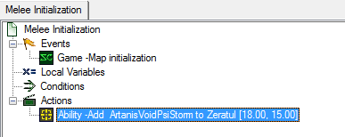

If we Test Document, or launch the map via the editor now, we'll notice that nothing happened. Let's check the description of that add ability action.

>Added ability may not be able to be cast without command buttons. You can set a ability to automatically create command button, by go to the ability's Command+ field, and assign a default button for them. "Use Default Button" and "Create Default Button" flags needs to be check to allow the button to be auto created. The position of the auto-created button can be set in the Button data.

Let's do just that. In the ability which we will be assigning ("***ArtanisVoidPsiStorm***"), go to the "**Commands+**" field, and as the tooltip tells us, check the "**Use Default Button**" and "**Create Default Button**" flags.

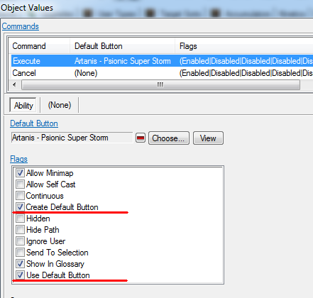

After that, go to the button that is linked to the Execute command ("***Artanis - Psionic Super Storm***") and find the field called "**Default Button Layout+**". Set "**CardID**" to "0001", "**Column**" to "1", "**Row**" to "1". Note that columns go from 0 to 4, rows go from 0 to 2. It should be easy to figure out what to put here to get desired button position.

Now, launch the map again. Everything should be working! Just in case if something went wrong, there is a map at the bottom of the tutorial to serve as reference.

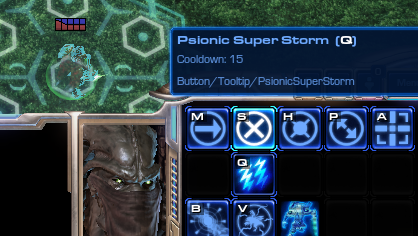

## Objective 2 - ability pickup/swap system.

**What we will make:**

The map will have different abilities stored in pickups that are placed around the map. Hovering your mouse over the pickups will display information about the ability it grants. Players will be able to right-click on them with their hero, causing their hero to approach the pickup and interact with it - thus gaining the ability stored within, and destroying the pickup in the process.

Due to the limitations of technology, all abilities must have a predefined position on the command card. We will design our system to have 3 abilities occupying the first three bottom left buttons of our unit's command card (let's call them Q, W, and E slots).

In case if our hero picks up an ability for a slot that is already taken by some other ability - they will remove and drop on the ground their currently equipped ability before equipping the new one.

**How we will make it:**

To create such a system, we will need to do 5 tasks:

**1) Data preparation.** First, we will need to create a unit type that will serve as the pickup. We will have to create an ability for which the hero will interact with the pickup.

**2) Store trigger.** Then, we will need to create a trigger to make the pickup unit store ability of choice + display that info.

**3) Data ability preparation.** Additionally, we will need to configure abilities for use (check those flags, define position on the Command Card + more).

**4) Equip/Dequip trigger.** Furthermore, we will need to create a trigger to transfer ability from pickup to hero when hero interacts with the pickup.

**5) Wrap up trigger.** Lastly, we will need to tie everything together in the interaction trigger.

Everything data-related will be simple – as we will just be changing values.

The trigger part will be mostly about fetching information from data via catalog triggers and saving/retrieving information via data tables.

### Part 1 – Preparation/Data

**Goal:**

Create a unit type that will serve as the pickup, as well as create an ability for the hero to interact with the pickup.

**Process:**

#### Step 1 – Pickup dummy unit:

Our goal is to create a pickup dummy (unit type) in which we will store ability references via triggers.

For this let's duplicate the "***New Equipment***" unit and name the duplicate "***Ability Pickup***" (also clear its abilities' field since we won't be needing it). Our plan is to display the ability's info in the pickup unit's tooltip, and for that we need to go to the pickup unit's "**Flags+**" field and uncheck the "**No Tooltip**" flag. Additionally, we will give the unit an unused collision flag ("**Air16**" is good), so that the pickups will not stack with each other when they are dropped on the ground.

#### Step 2 – Interact Ability:

Now let's make an ability for the hero-pickup interaction. It will have a single "**Set**" effect and a single validator that will make sure that the ability can only activate on specific unit types of our choosing.

1) Create an "**Effect - Target**" ability. Call it "***Pickup Interact***". Then, either create a new button or add any existing one as its "**Default Button**" for the "**Execute**" command. ("**Commands+**" field). I've decided to use the "***Pickup Scrap Small***" button.

2) Create a validator with its type being "**Unit Type**", then set its Value field to "***Ability Pickup***" (which is the unit we just duplicated).

3) Create a "**Set**" effect, and then add our "***Ability Pickup***" validator to the Validator field of the effect we just made.

4) In the "***Pickup Interact***" ability, set the Effect field to our newly created "**Set**" effect. Then, go to flags and check "**Smart Command**". This will ensure that the unit automatically uses the ability when right-clicking (but our validator makes it so that the ability will only execute when right-clicking on the "***Ability Pickup***" unit.).

5) Add this ability to Zeratul. Since it's a smart ability, we can go without adding a button to the Command Card.

#### Step 3 – Trigger:

Create a new trigger and name it "***Pickup Interact***". Right now, we will use this trigger simply to test that everything works, and later, once everything is done, we will make use of it again. 

Event – "**Unit Uses Ability**". In Ability, choose our "***Pickup Interact***" ability. In Stage, choose "**Effect3 - Cast**".

Actions – "***Add Ability*** and "**Kill Unit**". In the "***Add Ability***" action, for Ability, we can set it to "***ArtanisVoidPsiStorm***", and for Unit, we can set it to "**Triggering Unit**". For the "**Kill Unit**" action, set the Unit to "**Triggering Ability Target Unit**". This way, our ability isn't granted on map initialization, but rather when our hero right-clicks on a pickup unit.

Let's check that it works. First, remove "***Add Ability***" action from the Map Initialization trigger, and place the "***Ability Pickup***" unit next to our hero and launch the map. Right-clicking on the pickup dummy unit with our hero should make our hero gain the Psi Storm ability and destroy the pickup unit.

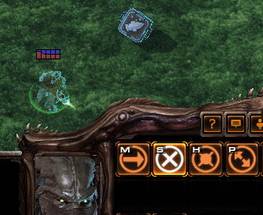

### Part 2 – Making pickup unit store ability data.

Goal:

Create a trigger to make the pickup unit store ability of choice + display that info.

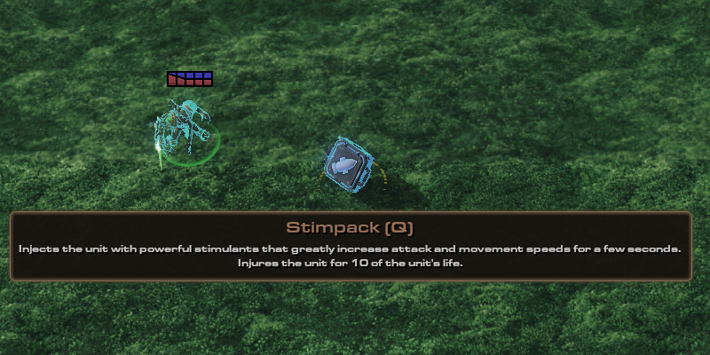

Overview:

We want 2 things:

1) For the pickup unit to display the ability's information (name, hotkey, description) when our mouse hovers over it. We will use catalog triggers to access necessary texts from the button that is linked to the ability.

2) To store the ability identifier in the unit. We can achieve that with data tables.

Process:

### Step 1 - displaying info when hovering mouse over pickup unit:

First, we will create a new action definition (In the Trigger module, right click the blank white area on the left -> New -> New Action Definition). Let's name it "***Set Pickup AbilityValue***". We will give it 2 parameters – "**Unit**" (name it "***UNIT***") and "**Game Link – Ability***" (name it "***ABILITY***").

Then create a local variable of type "**Game Link – Button**" and name it "***Button***".

#### Step 1.1 – Getting Button.

In actions, set our "***Button***" variable to "**Convert String to Game Link**".

In the string's value, choose the function called "**Catalog Field Value Get**".

In catalog, choose the preset -> "**Abilities**", and in entry, set our "***ABILITY***" parameter. In the field path for scope, choose "**Effect- Target**". Then, in the field, choose "**CmdButtonArray**". Furthermore in index, select "0", and in the field choose "**Default Button Face**".

>        Variable -Set Button = (Game Link((Value of Abilities ABILITY CmdButtonArray[0].DefaultButtonFace for player Any Player)))

Now we have easy access to the button that is used by the ability. We can get its catalog text values with catalog triggers.

However, it's worth noting that this will only fetch the button for abilities which have only 1 main execute button (abilities like "**Effect - Target**", "**Effect - Instant**", "**Behavior**", "**Augment**" and such. Abilities like "**Train**", "**Specialize**", "**Research**" and alike have an array of commands instead).

If we want to get a button info out of them, the process is the same up to when we need to set the path for the scope. Instead of "**Effect – Target**", put "**Train**" or some other ability type which uses an array of commands rather than a single command. After that, instead of "**CmdButtonArray**", we'll need to choose "**InfoArray**", and then select from which array position to fetch the button link (for now lets settle on the first entry of the array - index 0).

After having done that, we will now need to be able to distinguish between abilities which have one command, and abilities with an array of commands. Thankfully, we can find out the ability type in triggers via a function called "**Ability Matches Filters**". Make an "**If Then Else**" statement with the condition that if the ability is of a certain type – then use the button fetching function setup 1, else do function setup 2.

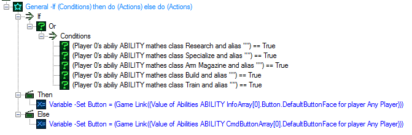

#### Step 1.2 – Getting text from button.

Now that we have acquired a button, we can fetch the text from it and prepare it for the tooltip display.

Let's create 4 variables of text types. We will name them "***Name***", "***Description***", "***Hotkey***", "***Final Text***".

Set the "***Name***" variable to the function called "**Convert Game Text**". In the path, choose the function called "**Catalog Field Value Get**". Then, for the catalog choose preset – "**Buttons**", and then for the entry choose our "***Button***" variable. For the field, choose "**Name**".

Do the same thing for the "***Description***" variable, but for the catalog's field, choose "**Tooltip**" instead.

"***Hotkey***" is going to be a little bit different, as we will have to use the "**Convert Game Hotkey**" function rather than the usual game text (for the path, use the same "**Catalog Field Value Get**" function again).

Now that we have all the information we need, we can display it in any way we want! I chose to combine all the gathered information in a "***Final Text***" variable using expressions.

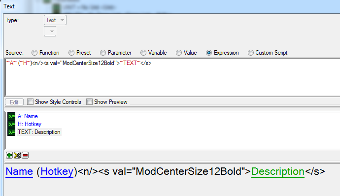

To make the pickup unit display all this text, we will use the "**Set Unit Info**" action. "**Info Text**" is what's displayed on the Command Card when you click on the unit, and "**Highlight Tooltip**" is the tooltip.

Apply the formatting of choice.

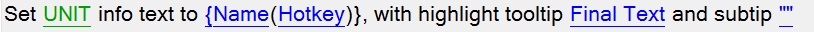

#### Step 2 - Storing ability.

Now, we will store the ability identifier in a data table entry, which will be called after the pickup unit's unit tag. This way, as long as we have the pickup unit, we can find out its data table entry. If you're unfamiliar with data tables, you can read more here: https://s2editor-guides.readthedocs.io/New_Tutorials/03_Trigger_Editor/041_Data_Tables/ (TL;DR it's variables that you can create and destroy on the go).

Create a new action called "**Save Data Table Value (String)**". For the value, use the function called "**Convert Game Link to String**", and then for game link, choose "***ABILITY***" parameter. For the name, we can use the unit's tag. Choose the "**Convert Integer To String**" function, and then pick the "**Unit Tag**" function. For the unit, select the "***UNIT***" parameter.

It is done!

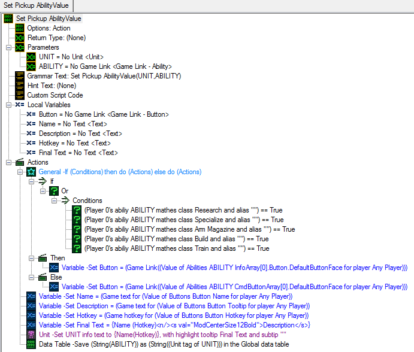

### Part 3 – Preparing abilities.

As established earlier, for the ability to be added to our hero via triggers, it needs:

- "**Use Default Button**" and "**Create Default Button**" flags toggled on.

- "**Default Button Layout+**" field modified to specify where exactly place those buttons.

We will also need to somehow determine which slot (Q,W or E) to where the ability belongs. Thankfully we have "**Categories+**" ability field, whose tooltip states:

>A method of categorizing abilities that can be useful for identifying certain abilities.

Perfect! Let's use "**User 1**" for Q, "**User 2**" for "W" and "**User 3**" for E.

Next, we need to decide which abilities to test out.

Let's check out all sorts of stuff.

|Slot|Abil Type|Abil Name|
| ------------- | ------------- |------------- |
|Q slot|Effect Target|High Templar - Psi Storm|
|Q slot|Effect Target|Vulture - Use Spider Mines|
|Q slot|Effect Instant|Marine - Stimpack|
|W slot|Behavior|Ghost - Personal Cloaking|
|W slot|Specialize|Vulture - Make Spider Mines (Hidden Build)|
|W slot|Train|Swarm Queen Train|
|E slot|Arm Magazine|Karax - Servitors|
|E slot|Research|Engineering Bay - Research (Engineering Bay)|

Now, let's go to these abilities and modify them so that they will be able to be used by our hero:

- In the ability's "**Commands+**" field, check the "**Use Default Button**" and "**Create Default Button**" flags on.

- In the "**Categories+**" field, check "**User 1**" for Q slots, "**User 2**" for W slots, "**User 3**" for E slots.

- In their linked buttons and in the "**Default Button Layout+**" field, set the "**Card ID**" to "0001", "**Row**" to "2" and "**Column**" to "0" for Q slots, "1" for W slots, "2" for E slots.

- *[Optional]* In the button, you can change the "**Hotkey**" to match Q/W/E.

- *[Optional]* You can add "Q", "W", or "E" to abilities' "**Editor Prefix**" field, as it will make it so much quicker to search for them in triggers.

- *[Note]* Some abilities (like stimpack) have research requirements, so don't forget to clear those (Requirements can be removed in "**Commands+**" field).

- For abilites that make use of multiple buttons (like Ghost's Cloak or any train/research/array abilities) we'll need to apply the above steps for each of buttons we want to be created when ability is added (don't forget to place those buttons in different slots so they don't overlap).

### Part 4 – Ability Equip/dequip.

The process of equipping the ability consists of 3 steps:

1 – finding out which slot the ability will use;

2 – discarding the already equipped ability if it's in the same slot as the one we're picking up;

3 – saving the information of that ability in our hero's ability slot.

To figure out slot (#1), we can use a simple loop which checks the ability's catalog.

To save information about the equipped ability (#3), we will use data tables again. Go to convert game link to string and save that string under the appropriate path. For the data table's path we will use both unit's tag and slot number. Saving this way will also allow us to check requirements for dequipping.

#### Ability dequip.

Overview:

Let's start with creating the dequip action, as it's something that we'll need to use in the equip process. We will create an action definition, which will discard the ability from the target unit's specified ability slot.

This process will consist of:

- finding out the ability that unit has in its ability slot

- removing the ability for the hero

- erasing the data table record that stores the information about which ability is stored in our unit's targeted ability slot

- creating a pickup unit

- implanting the ability into the pickup unit

Process:

Make a new action definition, call it "***Ability Dequip***", give it 2 parameters. A "**Unit**" type (name it "***UNIT***") and an "**Integer**" type (name it "***SLOT***").

Create a local variable of type "**Game Link – Ability**", name it "***Ability***".

Create a local variable of type "**String**", name it "***DataTable Path***".

We will create the data table's path name out of two variables known to us – our hero's unique unit tag, and the ability slot's ID. Additionally, we will add a "." character to separate them (for easier readability).

Now, set the "***DataTable Path***" variable to the expression that converts "**Unit Tag**" of "***UNIT***" parameter and "***SLOT***" parameter into a string and then combines them, just like in the example below.

>Variable -Set DataTable Path = {(String(SLOT)).(String((Unit tag of UNIT)))}.
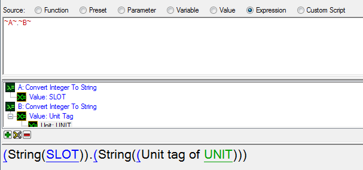

We will create this shortcut so that it will be easier to change and reuse it later in the code when we work with our data table.

Next, we shall retrieve the ability value from our data table.

Set the "***Ability***" variable to function - "**Convert String to Game Link**". For the string choose "**Value From Data Table (String)**", and use the "***DataTable Path***" variable for the path.

Use the "**Remove Ability**" value to remove the ability we just retrieved from our hero.

Use the "**Remove Data Table Value**" to clear data table record to avoid leaks.

>Theoretically, we don't need to do it for this setup, because we'll always replace the ability value stored in this data table path. But if we were using this trigger to remove ability without replacing it right away, then we should absolutely clean up after ourselves.

Next, we will create a pickup unit at the position of our hero.

And finally, we will inject the ability into the created shell unit by using the action we'd made earlier ("***Set Pickup AbilityValue***").

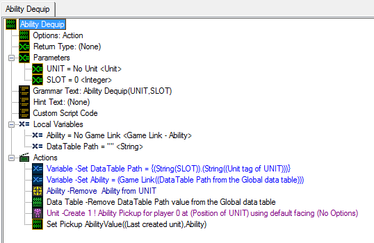

#### Ability Equip.

Overview:

The equip ability will be similar to our dequip ability. The actions that we will do are:

- detecting which slot our ability we're equipping belongs to

- if our hero already has the ability in the needed ability slot – dequip the currently equipped ability

- add the ability to our hero

- save the information that our hero has the specified ability in the ability slot to a data table record

Process:

Make a new action definition, call it "***Ability Equip***". Give it 2 parameters: A "**Unit**" type (name it "***UNIT***") and a "**Game Link - Ability**" type (name it "***ABILITY***").

Create a local variable of type "**Integer**", name it "***Hotkey Slot***".

Create a local variable of type "**String**", name it "***DataTable Path***".

First thing – we will need to understand which category flags are checked for the ability we're equipping.

In the data editor, if we toggled "**View**"->"**View Raw Data**" (Ctrl-D shortcut) and looked at the category flag in the ability, we'll notice that all those flags are just "0" and "1", "0" for unchecked and "1" for checked. So we can use the catalog trigger ("**Catalog Field Value Get As Integer**") to fetch the values of each flag as an integer.

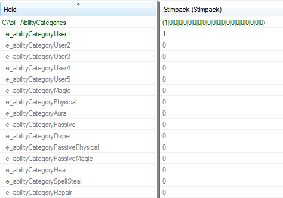

So let's loop through each flag, and if that flag returns "1" – save it's numeric ID to "***Hotkey Slot***" variable.

Create a "**Pick Each Integer**" loop, and set starting value to "0" (which will correspond with "**User 1**" flag), and then the finishing value to "2" (which will correspond with "**User 3**" flag).

Then inside of the loop create an "**If Then Else**" statement. In the conditions, use "**Catalog Field Value Get As Integer**" to see if the ability category's flag (corresponding with picked integer) is 1. If it is indeed 1 – then it will set our "**Hotkey Slot**" variable "**Picked Integer**" (so that we remember that category number  "**Picked Integer**" is checked).

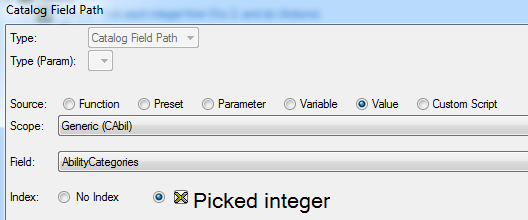

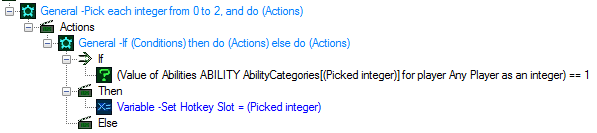

Once we've found our hotkey slot ID, we're ready to set our "***DataTable Path***" variable and access the data table to check if our hero already has something in that slot.

>Variable -Set DataTable Path = {(String(Hotkey Slot)).(String((Unit tag of UNIT)))}

Use a "**If Then Else**" statement with the "**Data Table Value Exists**" function to find out if the "***DataTable Path***" data table record exists – then use the "***Ability Dequip***" action to unequip and drop that ability to the ground.

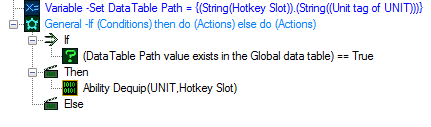

Once all that is done, we will add an ability using the "**Add Ability**" action.

Finally, we will save the ability identifier in the data table so that we can know in the future that we have stuff equipped. (Use "**Save Data Table Value (String)**". For the value, pick the "**Convert Game Link to String**" function For the path, we have our "***DataTable Path***" variable.)

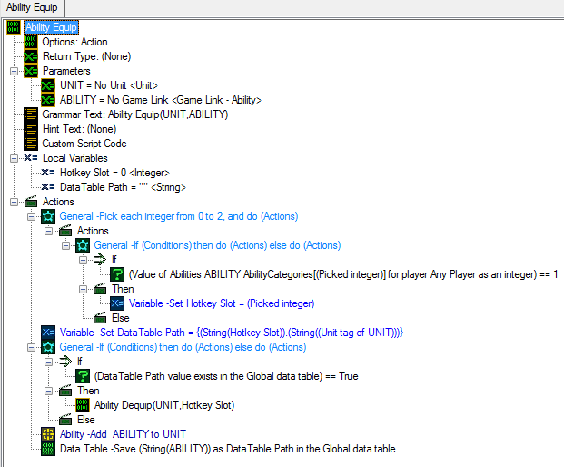

### Part 5 - Wrap up

Now we can go back and change our "***Pickup Interact***" trigger to make use of "***Ability Equip***" action.

We can also remove any actions we had in there.

After clearing it up, let's create a local variable of the type "**String**", name it "***DataTable Path***", and set it to reference the pickup's unit tag.

>DataTable Path = (String((Unit tag of (Triggering ability target unit))))

Next we can make an "**If Then Else**" statement. If the data table value exists, then it will equip ability stored in pickup and kill pickup unit.

>Ability Equip((Triggering unit),(Game Link((DataTable Path from the Global data table))))

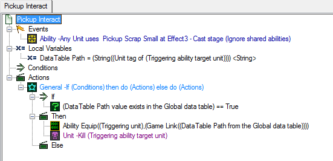

After that, we can place a bunch of empty pickup units on the map. Add abilities to them in our Map Initialization trigger. Then, remove the default ability buttons on the 3rd row on Zeratul's command card (so that nothing overlaps with our pickup acquired abilities) and also give him 10,000 energy so that he doesn't have issue casting the abilities. Run the map and see how it all works!

We now have a functional, quick, and simple spell equip/swap system. Well done!

* [SpellSwapTutorial.SC2Map](SpellSwapAssets/SpellSwapTutorial.SC2Map)

NOTES:

1) In my testing, I've noticed that giving unit a "**Brood Lord - Brood Lord Hangar**" ability will occasionally cause Starcraft to crash, while the "**Arm Magazine**" ability: "**Karax - Servitors**", didn't cause me any issues.

2) There exists a 32 ability limit on any unit. Remove old abilities to keep the currently equipped ability count within the limit. Going over this limit will cause Starcraft to crash.
