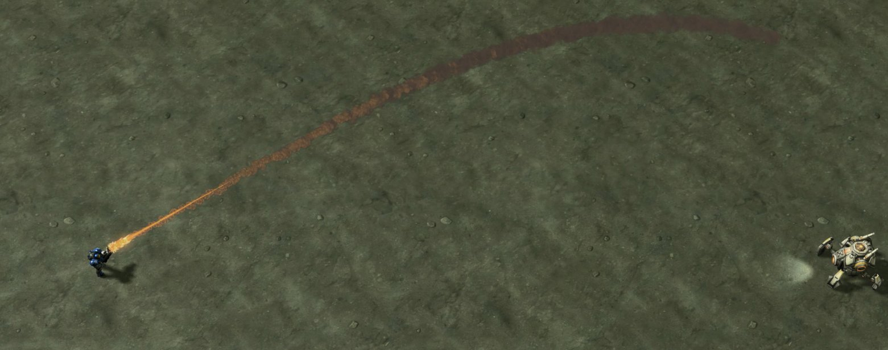
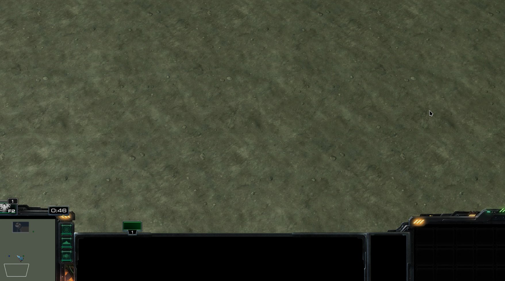
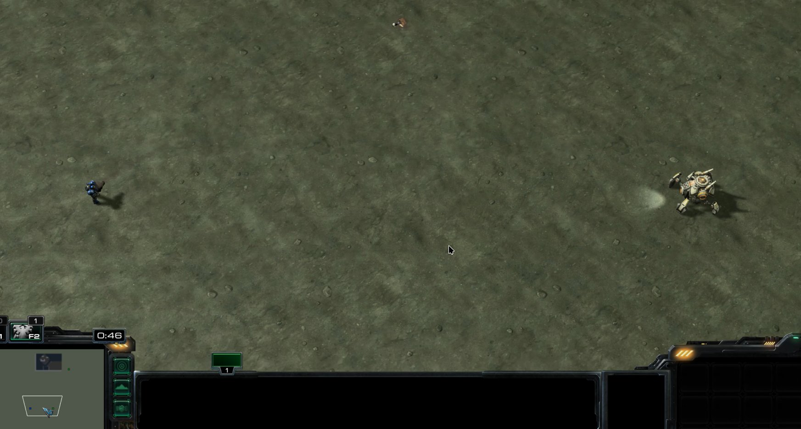
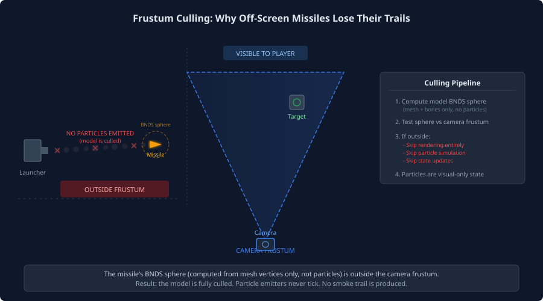
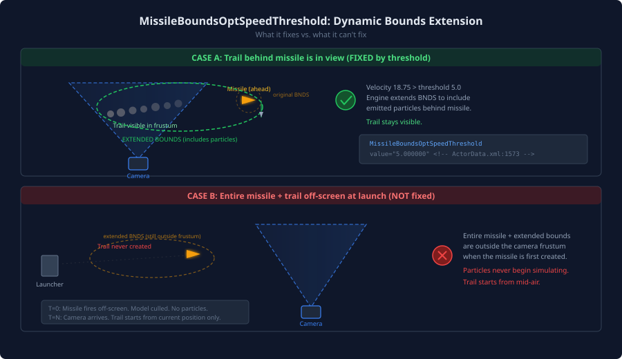
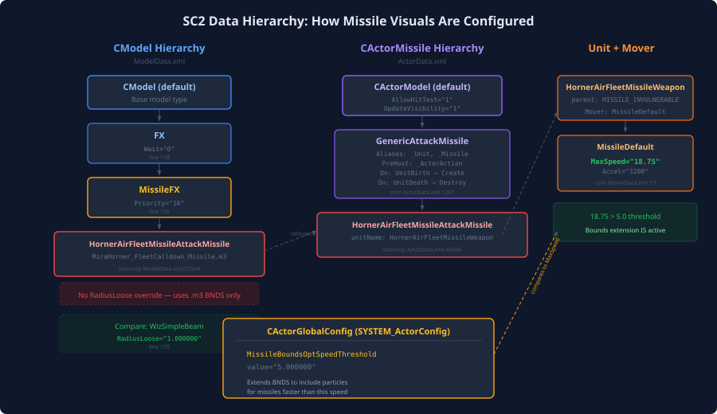
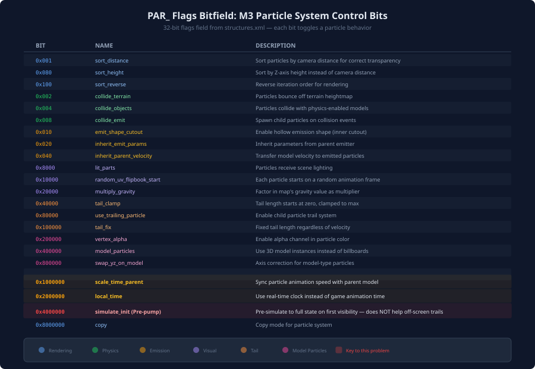
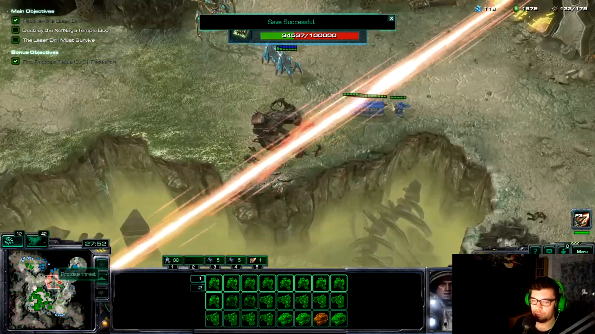
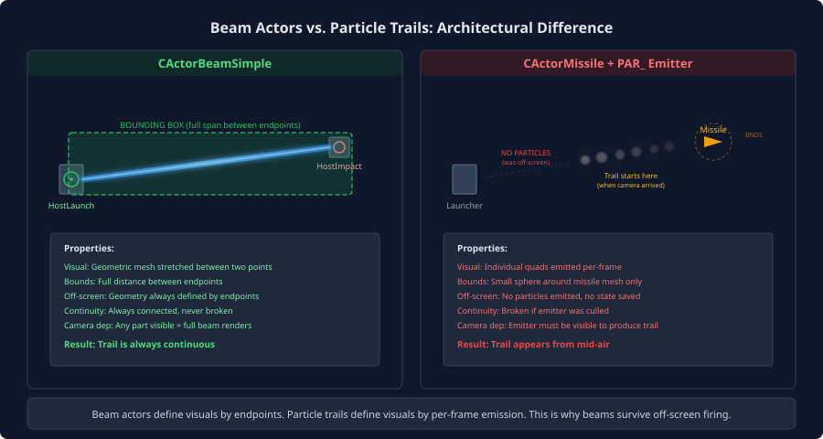
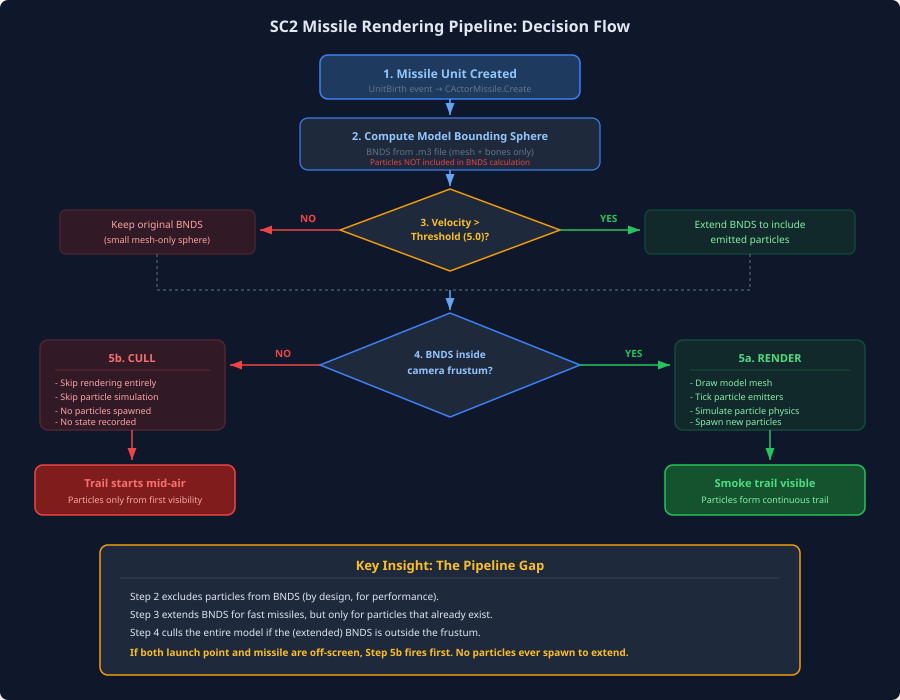

# Why Missile Smoke Trails Vanish Off-Screen — And How the Engine Tries to Fix It

When a long-range missile fires, the smoke trail should stretch from the launcher all the way to the target. But if the launcher is off-screen when it fires, the trail appears to start from mid-air — as though the missile materialized halfway through its flight. This isn't a bug you introduced. It's a direct consequence of how the SC2 engine draws particles, how model bounding spheres are baked at export time, and how view frustum culling disables simulation for anything outside the camera.

This article walks through the pipeline from the M3 file on disk to the pixel on screen, explains the engine's built-in mitigation (`MissileBoundsOptSpeedThreshold`), and shows why it isn't always enough — ending with the workarounds that actually hold up in practice, including the approach Blizzard itself took for the Drakken Laser Drill.

!!! note "Generated content"
    This article was generated automatically from research data and conversation context. While the technical claims are sourced from game data files and M3 tooling, treat it as a starting point for review rather than final editorial copy.

---

## The Scene

Three screenshots from the same engagement tell the story. A marine fires at a Viking across a large patch of terrain; the camera is parked in the middle of the map, not on the marine.

[](./resources/091_screenshot_01_working_case.png)
*Working case: when the marine is on-screen at the moment of firing, the smoke trail is continuous from muzzle to projectile.*

[](./resources/091_screenshot_02_empty_battlefield.png)
*The camera's view during flight: the missile is somewhere to the left, but the player sees empty terrain. Nothing is simulating here.*

[](./resources/091_screenshot_03_truncated_trail.png)
*The bug: when the missile enters the frustum, the trail starts from mid-air. The spatial origin (the marine) was never connected to the projectile because no particles were ever emitted there.*

The rest of this article explains exactly why this happens.

---

## The Rendering Pipeline: Models, Particles, and Bounding Boxes

### How M3 Models Define Their Bounds

Every `.m3` model stores a bounding sphere in a structure called `BNDS`. The structure is tiny — a minimum corner, a maximum corner, and a radius — which is all the engine needs for a conservative sphere test:

```c
// BNDS layout — see m3studio/structures.xml and CaptainD001/M3_Import
struct BNDS {
    vec3  min;      // Minimum corner of bounding box
    vec3  max;      // Maximum corner of bounding box
    float radius;   // Sphere radius = (max - min).length / 2
};
```

This is confirmed in two independent M3 format tools: [m3studio's `structures.xml`](https://github.com/Solstice245/m3studio/blob/d1993159b3afbb1c52cc591b5ff28259f685d2f1/structures.xml) and the [MAXScript `M3SD_BndSphere`](https://github.com/CaptainD001/M3_Import/blob/e522d7a6b4ae255e0edde3a58525a80cd95e213a/M3%20Import%20M3DataStruct.ms) which declares it as `struct M3SD_BndSphere (eMin, eMax, rad)` — the exact same three fields.

The critical detail is what goes *into* that sphere at export time. Looking at [`io_m3_export.py`](https://github.com/Solstice245/m3studio/blob/d1993159b3afbb1c52cc591b5ff28259f685d2f1/io_m3_export.py):

```python
# From io_m3_export.py — bounds computed from BONE positions only.
def bounding_vectors_from_bones(bone_rest_bounds, bone_to_matrix_dict):
    vals = ([], [], [])
    for bone, coords in bone_rest_bounds.items():
        matrix = bone_to_matrix_dict[bone]
        for co in coords:
            mat_co = matrix @ co
            vals[0].append(mat_co.x)
            vals[1].append(mat_co.y)
            vals[2].append(mat_co.z)
    return (Vector(min(val) for val in vals),
            Vector(max(val) for val in vals))
```

**Particles, ribbons, and other emitters are not included in the BNDS calculation.** This is intentional. A trail particle system that emits 20 units behind the missile would bloat the bounding sphere enormously, forcing the renderer to process the model every time a stray wisp of smoke was barely visible at the edge of the screen. For most models — units standing on the ground, buildings, doodads — excluding emitters is the right tradeoff.

For missiles that leave long trails, it's the source of the bug.

### The Frustum Culling Step

SC2's renderer performs **view frustum culling** per model: if a model's bounding sphere falls entirely outside the camera's view pyramid, the engine skips it completely. No rendering. No particle ticking. No state updates.



The Data Editor exposes two fields on `CModel` that control this sphere:

| Field | Editor String | Purpose |
|-------|--------------|---------|
| `Radius` | `CModel_Radius` | Base model radius |
| `RadiusLoose` (Visual Radius) | `CModel_RadiusLoose` | Override sphere for visibility checks |

From [`EditorCatalogStrings.txt`](https://github.com/SC2Mapster/SC2GameData/blob/b7bd2b94a1cb8b715dab63ba02d36335e6c09723/mods/core.sc2mod/enus.sc2data/LocalizedData/Editor/EditorCatalogStrings.txt#L9688):

> *"If this value is not 0, it will override data that is normally queried from the model file. This radius creates a virtual sphere around the model. The model will only update its state when this sphere is within the camera's FOV. This value typically needs to be larger than the actual radius of the model so the model will not pop in the fog of war."*

That "only update its state" phrase is the heart of the problem. A culled model doesn't just not render — it doesn't *update*. And a particle emitter that doesn't update doesn't emit.

### Inside the Particle Pipeline: Why Culling Breaks the Trail

Particles in SC2 are not a CPU-stepped simulation. They're a **GPU-analytical** system. The CPU emitter does only one thing each frame: decide whether a new particle needs to be spawned, and if so, push a record into a GPU batch containing:

- birth time
- initial position (the emitter bone, in world or local space)
- initial velocity (from `inherit_parent_velocity` plus the emission cone)
- mass, drag coefficient, gravity multiplier
- size/rotation/color keyframes

From that point on, the GPU does the rest. Every frame, the vertex shader runs `CalculatePositionAndVelocity` for each live particle, computing its current position purely from its stored birth parameters and the elapsed time:

```hlsl
// Particle.fx — every frame, GPU replays each particle's analytical trajectory
float fTime = p_vSystemTime - vertIn.vBirthDeathAndDrag.x;  // age
float3 vInitialVelocity = vertIn.vInterpolator1.xyz;
float fDrag    = vertIn.vBirthDeathAndDrag.z;
float fGravity = -vertIn.vInterpolator2.w;

CalculateDisplacmentAndVelocity(
    fTime, vInitialVelocity, fMass, fInvMass, fDrag, fInvDrag, fGravity,
    vOffsetFromOrigin, vInstantaneousVelocity
);

vertIn.vPosition.xyz += vOffsetFromOrigin;
```

This architecture has a consequence that's easy to miss: **once a particle record is in the GPU batch, it doesn't need the CPU to keep it alive**. It animates analytically from its birth parameters until its `lifespan` expires. The CPU's only job is pushing new records at the `emit_rate` cadence.

Now consider what happens when the missile's model is frustum-culled:

1. The model actor doesn't tick — no emitter callback fires.
2. No new particle records are pushed into the batch.
3. Live particles (from before culling, if any) keep animating via the shader.
4. When the model un-culls, emission resumes — but the records for the missed interval were never created.

There's no "replay from history" step. The GPU can't fabricate records it never received. The trail has a gap exactly the size of the culled interval.

The shader also defines eleven particle instance types:

| Constant | Value | Description |
|----------|-------|-------------|
| `PARTICLE_BILLBOARD` | 0 | Camera-facing quad (most smoke, dust, sparks) |
| `PARTICLE_TAIL` | 1 | Streak that scales with speed — weapon tracers |
| `PARTICLE_FACE_TRAVEL_DIR` | 2 | Oriented along velocity vector |
| `PARTICLE_FACE_WORLD_DIR` | 3 | Oriented along a fixed world axis |
| `PARTICLE_SINGLE_AXIS` | 4 | Rotates around a single axis |
| `PARTICLE_TERRAIN_ORIENTED` | 5 | Flat on terrain surface |
| `PARTICLE_TERRAIN_DIR_ORIENTED` | 6 | Flat on terrain + aligned with velocity |
| `PARTICLE_EMITTER_ORIENTED` | 7 | Inherits emitter basis vectors |
| `PARTICLE_PHYSICS_ORIENTED` | 8 | Uses physics body orientation |
| `PARTICLE_PINNED` | 9 | Stretches between spawn and current position |
| `PARTICLE_TRAIL` | 10 | Like TAIL but with a backward offset |

`PARTICLE_PINNED` is the closest a particle can come to beam-like behavior — it stretches a quad between its spawn point and its current position. But like every other particle type, it still requires the CPU emitter to push the initial record, and a culled emitter pushes nothing.

### Pre-pump Is Not a Fix

The `simulate_init` flag (the editor calls it "Pre-pump") is often the first thing modders reach for when particles don't look right. The description from [`m3_particles.py`](https://github.com/Solstice245/m3studio/blob/d1993159b3afbb1c52cc591b5ff28259f685d2f1/m3_particles.py):

> *"Simulates particle emission so that it appears to have been emitting previously for an indefinite amount of time."*

This runs *once*, when the emitter first becomes visible, to fast-forward the emitter state so a smoke column or a torch flame appears fully established instead of freshly started. It solves a very specific problem: ambient emitters that should look like they've been running forever.

It cannot reconstruct a **spatial trail**. The missile's position while off-screen was never recorded anywhere — not in the game simulation (which only tracks the projectile's current position), not in the renderer (which had nothing to draw). Pre-pump has nothing to pre-pump *from*. It only simulates the emitter in place at its current location.

---

## The Engine's Mitigation: MissileBoundsOptSpeedThreshold

Blizzard recognized that fast missiles with persistent trails would have problems and built a targeted fix into the actor system. The [`CActorGlobalConfig`](https://github.com/SC2Mapster/SC2GameData/blob/b7bd2b94a1cb8b715dab63ba02d36335e6c09723/mods/core.sc2mod/base.sc2data/GameData/ActorData.xml#L1570) entry contains:

```xml
<!-- core.sc2mod ActorData.xml, line 1570 -->
<CActorGlobalConfig id="SYSTEM_ActorConfig">
    <MissileBoundsOptSpeedThreshold value="5.000000"/>
    ...
</CActorGlobalConfig>
```

From [`EditorCatalogStrings.txt`](https://github.com/SC2Mapster/SC2GameData/blob/b7bd2b94a1cb8b715dab63ba02d36335e6c09723/mods/core.sc2mod/enus.sc2data/LocalizedData/Editor/EditorCatalogStrings.txt#L8961):

> *"Missiles that are travelling at a velocity greater than the value specified in this field will automatically extend the bounds of their model to include any emitted particles. Models typically do not extend their bounds to include particles in order to improve game performance, but fast travelling missiles can experience visual issues with emitted particles if the bounds are not extended."*

### What It Does

When a `CActorMissile`'s velocity exceeds 5.0 game units/second, the engine dynamically grows the model's bounding sphere to encompass any particles the emitter has produced. The effect is that if the camera can see where the trail *currently is*, the engine keeps the model un-culled even if the projectile itself has flown ahead of the visible trail segment.

### What It Doesn't Do



The optimization extends the bounding sphere *around existing particles*. It doesn't conjure simulation state when the entire missile-plus-trail is outside the frustum. Consider the timeline of a cross-map missile fired from an off-screen launcher:

```
t = 0.00s  Missile fires from off-screen launcher.
           Model BNDS is entirely outside camera frustum.
           Model is culled. No particles emitted. No trail exists yet.

t = 0.40s  Missile crosses into camera view.
           Model is un-culled. Emitter starts producing particles NOW.
           Trail begins from the missile's current position mid-air.
           The launch origin is never connected.

t = 0.80s  Missile reaches target.
           Trail is visible only for the camera-visible portion.
           The "trail starts in mid-air" artifact is already permanent.
```

The 5.0 threshold is trivial to exceed. The [default missile mover](https://github.com/SC2Mapster/SC2GameData/blob/b7bd2b94a1cb8b715dab63ba02d36335e6c09723/mods/core.sc2mod/base.sc2data/GameData/MoverData.xml#L13) has `MaxSpeed="18.75"`:

```xml
<!-- core.sc2mod MoverData.xml, line 13 -->
<CMoverMissile id="MissileDefault">
    <MotionPhases>
        <Driver value="Guidance"/>
        <Acceleration value="3200"/>
        <MaxSpeed value="18.75"/>
        <ClearanceAcceleration value="75"/>
        <Outro value="-1"/>
        <YawPitchRoll value="719.2968"/>
    </MotionPhases>
    <MotionPhases YawPitchRoll="MAX"/>
</CMoverMissile>
```

So the bounds extension *is* active for essentially every missile in the game. Which means: the problem only manifests when the **entire trajectory** — launch point through current position — is outside the camera view at the moment of firing. Unfortunately, that's exactly the scenario in cross-map engagements where the camera sits between launcher and target.

---

## The Model Hierarchy: How Blizzard's Missiles Are Configured



Understanding the data hierarchy helps diagnose why some models are affected and others aren't.

### The CModel Inheritance Chain

The Horner missile (used as the reference case here) inherits from a very plain chain:

```
CModel (default)
  └── FX                          # Flags: Wait=0
       └── MissileFX              # Priority: 16
            └── HornerAirFleetMissileAttackMissile
                  Model: MiraHorner_FleetCalldown_Missile.m3
```

The [`MissileFX` template](https://github.com/SC2Mapster/SC2GameData/blob/b7bd2b94a1cb8b715dab63ba02d36335e6c09723/mods/core.sc2mod/base.sc2data/GameData/ModelData.xml#L118) sets `Priority="16"` (medium priority for visual culling) but inherits no special `RadiusLoose` override — so the visibility sphere comes directly from the `.m3` file's `BNDS` data:

```xml
<!-- core.sc2mod ModelData.xml, line 118 -->
<CModel default="1" id="FX">
    <Flags index="Wait" value="0"/>
</CModel>
<CModel default="1" id="MissileFX" parent="FX">
    <Priority value="16"/>
</CModel>
```

Contrast this with [beam models](https://github.com/SC2Mapster/SC2GameData/blob/b7bd2b94a1cb8b715dab63ba02d36335e6c09723/mods/core.sc2mod/base.sc2data/GameData/ModelData.xml#L169), which **do** set an explicit `RadiusLoose`:

```xml
<!-- core.sc2mod ModelData.xml, line 169 -->
<CModel default="1" id="WizSimpleBeam" parent="PersistentSpellFX">
    <RadiusLoose value="1.000000"/>
</CModel>
```

### The Actor Chain

The missile actor inherits from [`GenericAttackMissile`](https://github.com/SC2Mapster/SC2GameData/blob/b7bd2b94a1cb8b715dab63ba02d36335e6c09723/mods/core.sc2mod/base.sc2data/GameData/ActorData.xml#L1297), which is a `CActorMissile`:

```xml
<!-- core.sc2mod ActorData.xml, line 1297 -->
<CActorMissile default="1" id="GenericAttackMissile">
    <Aliases value="_Unit"/>
    <Aliases value="_Missile"/>
    <PreHost value="_ActorAction"/>
    <Model value="##unitName##"/>
    <On Terms="UnitBirth.##unitName##" Send="Create"/>
    <On Terms="UnitBirth" Send="AnimBracketStart Lifetime Birth Stand"/>
    <On Terms="UnitDeath" Send="Destroy"/>
    <On Terms="ActorOrphan" Send="Destroy"/>
</CActorMissile>
```

The Horner-specific coop missile:

```xml
<!-- starcoop ActorData.xml, line 45545 -->
<CActorMissile id="HornerAirFleetMissileAttackMissile"
    parent="GenericAttackMissile"
    unitName="HornerAirFleetMissileWeapon">
    <Model value="HornerAirFleetMissileAttackMissile"/>
</CActorMissile>
```

No special flags. No visibility overrides. Standard configuration — which means it relies entirely on the M3's baked-in bounding sphere plus the `MissileBoundsOptSpeedThreshold` dynamic extension. There's nothing about it that would make it immune to the problem. Every stock SC2 missile with a particle-based trail is in the same boat.

---

## The M3 Particle System: Anatomy of a Smoke Trail

### Particle System Structure (PAR_)

The `PAR_` chunk is the largest per-object structure in the M3 format. The MAXScript importer [`M3_Import M3DataStruct.ms`](https://github.com/CaptainD001/M3_Import/blob/e522d7a6b4ae255e0edde3a58525a80cd95e213a/M3%20Import%20M3DataStruct.ms) documents the size of each PAR_ version:

| Version flag | Bytes |
|--------------|-------|
| `0x0C` | 1,316 |
| `0x12`, `0x13`, `0x15` | 1,464 |
| `0x16` | 1,484 |
| `0x17` | 1,492 |
| `0x18` | 1,496 |

Those are per-particle-system configuration blobs, not per-particle. A single emitter carries roughly 1.5 KB of parameters. The fields most relevant to trail behavior:

| Field | Type | Purpose |
|-------|------|---------|
| `emit_rate` | animated float | Particles spawned per second |
| `emit_max` | uint32 | Hard cap on simultaneous particles |
| `lifespan` | animated float | How long each particle lives |
| `distance_limit` | float | Kill sphere — max distance from emitter |
| `particle_type` | enum | Rendering mode (see shader types above) |
| `world_space` | flag bit | Particles detach from emitter transform |
| `simulate_init` | flag bit | Pre-pump on first visibility |
| `inherit_parent_velocity` | flag bit | Transfer emitter velocity to particles |
| `lod_cut` | enum | Graphics setting below which system is disabled entirely |
| `lod_reduce` | enum | Graphics setting below which particle count is reduced |

### The Flags Bitfield



For a missile smoke trail, the critical flags are:

- **`world_space`** — Particles stay where they were emitted in world coordinates rather than following the emitter. This is what creates the "trail" effect: smoke spawns at the missile's position, then stays behind as the missile moves forward.
- **`inherit_parent_velocity`** — Gives particles some of the missile's velocity at emission time, preventing them from appearing to "freeze" the instant they spawn.
- **`simulate_init`** (Pre-pump) — As established above, cannot reconstruct a spatial trail — only a static-emitter steady state.

### Emission Shapes vs. Particle Types

It's worth separating two things that sound similar: **emission shape** (where particles spawn) and **particle type** (how they render).

| Shape | Description |
|-------|-------------|
| Point | Single origin point — common for trails |
| Plane | Rectangular emission surface |
| Sphere | Volumetric spherical emission |
| Cube | Volumetric cubic emission |
| Cylinder | Cylindrical emission zone |
| Disc | Circular disk emission |
| Spline | Path-based emission with bounds control |
| Mesh | Object mesh surface emission |

Missile trails almost always use **Point** emission at a bone on the missile's tail, combined with `PARTICLE_BILLBOARD` or `PARTICLE_TAIL` as the type.

### LOD and Distance Culling

Beyond the frustum-culling story above, particles have their own quality tiers — orthogonal reasons they might not appear:

- **`lod_cut`**: The graphics quality level below which the entire particle system is disabled.
- **`lod_reduce`**: Progressively reduces particle count at lower quality settings.
- **`distance_limit`**: A hard kill sphere around the emitter — particles beyond this distance are destroyed instantly. If set too low, the trail will truncate regardless of camera position.

These aren't the cause of the off-screen-launcher problem, but they're useful to rule out when debugging why a trail *looks wrong* in a given scenario.

---

## What the Laser Drill Does Differently

A careful look at Blizzard's own long-distance visual effects shows that when the launch point and the target can be far apart on-screen, they don't rely on particle trails at all. The Drakken Laser Drill in the Wings of Liberty campaign uses a [beam actor](https://github.com/SC2Mapster/SC2GameData/blob/b7bd2b94a1cb8b715dab63ba02d36335e6c09723/campaigns/liberty.sc2campaign/base.sc2data/GameData/ActorData.xml#L6840):

```xml
<!-- liberty.sc2campaign ActorData.xml, line 6840 -->
<CActorBeamSimple id="LaserDrillTripodBiggerAttackBeam"
    parent="BeamSimpleAnimationStyleContinuous">
    <On Terms="Effect.LaserBeamFinalPersistant.Stop; At Effect"
        Send="Destroy"/>
</CActorBeamSimple>
```

[](./resources/091_screenshot_04_laser_drill_beam_frame.png)
*The Drakken Laser Drill beam: always connected between emitter and target, with no dependency on where the camera was when the shot started.*

### Beam vs. Particle: A Fundamental Architecture Difference



A **beam actor** (`CActorBeamSimple` or `CActorBeamStandard`) connects two endpoints — a launch host and an impact host. The beam's M3 model stretches between these two points, and its bounding box spans the full distance between them. If any part of that box intersects the camera frustum, the entire beam renders. There's no particle simulation to miss — the visual is purely geometric, defined by its endpoints.

A **particle trail** on a missile model, by contrast, is a stream of individual billboard (or tail) quads emitted over time at the missile's changing position. Each particle exists independently. The trail only exists because particles were emitted *while the emitter was visible*. If the emitter was off-screen, no particles were emitted, and no trail exists for that part of the path.

| Property | `CActorMissile` + particles | `CActorBeamSimple` |
|----------|-----------------------------|---------------------|
| Visual defined by | Per-frame particle emission | Two endpoint positions |
| Bounding box | Small sphere around missile mesh | Full span between endpoints |
| Off-screen behavior | No particles emitted | Geometry always defined |
| Trail continuity | Broken if emitter was culled | Always continuous |
| Camera dependency | Visual requires emitter visibility | Visual requires any part of span visible |
| Performance | GPU particle sim per frame | Single stretched mesh |

This is not a detail Blizzard overlooked for the Laser Drill. They actively chose beams over particles *because* a laser fired across the map needs to look connected regardless of where the camera is looking.

---

## Ribbons: The Missing Middle Ground

Ribbons (`RIB_` in the M3 format) are continuous strips that follow attachment points. They share many properties with particles but behave fundamentally differently:

| Property | Particles (PAR_) | Ribbons (RIB_) |
|----------|-------------------|-----------------|
| Structure | Individual quads | Continuous mesh strip |
| Shape | Billboard / tail / ground | Cylinder / star / planar |
| Culling method | Per system via `lod_cut` | `cull_method`: TIME or LENGTH |
| Continuity | Independent particles | Connected segments |
| Division control | `emit_rate` (particles/sec) | `divisions` (segments/sec) |
| Emission | From bone position | Between spline points |
| `simulate_init` | Pre-pump available | Pre-pump available |

Ribbons are defined inside `.m3` files and rendered by the engine as part of the model. Like particles, **they are subject to the same frustum culling**: if the parent model's bounding sphere is outside the camera, the ribbon's segment generator won't tick either. The smoke-trail-from-mid-air bug replicates identically with ribbons as the trail mechanism.

---

## Solutions and Workarounds

### 1. Beam Actor Replacement (Blizzard's Approach)

Replace the particle-based trail with a `CActorBeamSimple` that connects the launch point to the missile. Use a beam `.m3` model with a trail-like material (scrolling texture, alpha fade).

**Pros**: Completely solves the problem. No camera dependency. This is what Blizzard uses for the Laser Drill.

**Cons**: Beams look different from particle trails — they're smooth geometric shapes, not organic, turbulent smoke. May not match the desired aesthetic.

```xml
<!-- Example beam actor setup -->
<CActorBeamSimple id="MyMissileTrailBeam"
    parent="BeamSimpleAnimationStyleContinuous">
    <On Terms="Effect.MyMissileLaunch.Start" Send="Create"/>
    <On Terms="UnitDeath; At MissileUnit" Send="Destroy"/>
</CActorBeamSimple>
```

### 2. `RadiusLoose` Override

Set a large `RadiusLoose` on the missile's `CModel` entry to force a massive visibility sphere:

```xml
<CModel id="MyMissileModel" parent="MissileFX">
    <Model value="Assets\...\MyMissile.m3"/>
    <RadiusLoose value="50.000000"/>
</CModel>
```

**Pros**: Simple. One field change. May work when the missile launches just barely off-screen.

**Cons**: The sphere is centered on the *missile*, not on the launch point. If the camera is far from the launcher but close to the missile, `RadiusLoose` around the missile doesn't help. Also wastes GPU cycles forcing the engine to process the model when it's not genuinely visible.

### 3. Lower `MissileBoundsOptSpeedThreshold`

If using custom slow-moving missiles that fall below the 5.0 threshold, override the global config:

```xml
<CActorGlobalConfig id="SYSTEM_ActorConfig">
    <MissileBoundsOptSpeedThreshold value="1.000000"/>
</CActorGlobalConfig>
```

**Pros**: Enables the bounds extension for slower missiles.

**Cons**: Only helps when the *trail* is in view but the missile has moved ahead. Doesn't help when the missile launches from off-screen — the fundamental problem.

### 4. Hybrid Approach: Missile + Separate Trail Actor

Keep the missile model for the projectile visual, but create a second `CActorModel` hosted on a persistent effect at the launch point with a large `RadiusLoose`. This secondary model plays a looping trail animation that covers the launch zone while the real missile handles the projectile visual.

**Pros**: Preserves the particle aesthetic near the launcher.

**Cons**: Complex setup. Two separate visuals must align seamlessly. If the missile's flight path curves, the stationary launch-point trail won't match.

### 5. Accept the Limitation

For missiles where the launch point is typically near the camera (short and medium range), `MissileBoundsOptSpeedThreshold` handles everything cleanly. The problem is only visible for very long-range cross-map missiles where the camera can end up between the launcher and the target. If that's an edge case in your scenario, it may not be worth the complexity of workarounds.

---

## Summary

The smoke trail problem is not a configuration error — it's an architectural consequence of SC2's rendering pipeline:



1. **M3 models exclude particles from bounding box calculations** at export time ([`io_m3_export.py`](https://github.com/Solstice245/m3studio/blob/d1993159b3afbb1c52cc591b5ff28259f685d2f1/io_m3_export.py)).
2. **Frustum culling operates on the model's bounding sphere** — if the sphere is outside the camera, the model is fully culled, including every particle emitter attached to it.
3. **Particles are GPU-analytical, CPU-emitted** — the shader replays each particle's trajectory from its birth parameters, but a culled emitter pushes no birth parameters, so no record exists to replay.
4. **The `MissileBoundsOptSpeedThreshold` system** dynamically extends bounds for fast missiles to prevent trail clipping, but only when the missile itself (or its existing trail) is already partially visible.
5. **`simulate_init` (Pre-pump) cannot reconstruct a spatial trail** — it only simulates emitter steady-state, not historical positions.
6. **Beam actors solve this** by defining visuals between two endpoints rather than through frame-by-frame particle emission. That's why Blizzard uses them for the Laser Drill.

---

## Appendix: Data References

All permalinks below pin to the exact commits used while researching this article.

### SC2 Game Data ([`SC2Mapster/SC2GameData` @ b7bd2b9](https://github.com/SC2Mapster/SC2GameData/tree/b7bd2b94a1cb8b715dab63ba02d36335e6c09723))

- [`mods/core.sc2mod/base.sc2data/GameData/ActorData.xml`](https://github.com/SC2Mapster/SC2GameData/blob/b7bd2b94a1cb8b715dab63ba02d36335e6c09723/mods/core.sc2mod/base.sc2data/GameData/ActorData.xml) — default `CActorModel` (line 75), `GenericAttackMissile` (line 1297), `CActorGlobalConfig` / `MissileBoundsOptSpeedThreshold` (line 1570)
- [`mods/core.sc2mod/base.sc2data/GameData/ModelData.xml`](https://github.com/SC2Mapster/SC2GameData/blob/b7bd2b94a1cb8b715dab63ba02d36335e6c09723/mods/core.sc2mod/base.sc2data/GameData/ModelData.xml) — `FX`/`MissileFX` hierarchy (line 118), `WizSimpleBeam` with `RadiusLoose` (line 169)
- [`mods/core.sc2mod/base.sc2data/GameData/MoverData.xml`](https://github.com/SC2Mapster/SC2GameData/blob/b7bd2b94a1cb8b715dab63ba02d36335e6c09723/mods/core.sc2mod/base.sc2data/GameData/MoverData.xml) — `MissileDefault` mover (line 13, MaxSpeed 18.75)
- [`mods/core.sc2mod/enus.sc2data/LocalizedData/Editor/EditorCatalogStrings.txt`](https://github.com/SC2Mapster/SC2GameData/blob/b7bd2b94a1cb8b715dab63ba02d36335e6c09723/mods/core.sc2mod/enus.sc2data/LocalizedData/Editor/EditorCatalogStrings.txt) — official field documentation
- [`mods/core.sc2mod/base.sc2data/Shaders/Particle.fx`](https://github.com/SC2Mapster/SC2GameData/blob/b7bd2b94a1cb8b715dab63ba02d36335e6c09723/mods/core.sc2mod/base.sc2data/Shaders/Particle.fx) — particle vertex shader, instance-type constants
- [`mods/starcoop/starcoop.sc2mod/base.sc2data/GameData/ActorData.xml`](https://github.com/SC2Mapster/SC2GameData/blob/b7bd2b94a1cb8b715dab63ba02d36335e6c09723/mods/starcoop/starcoop.sc2mod/base.sc2data/GameData/ActorData.xml) — Horner missile actor (line 45545)
- [`mods/starcoop/starcoop.sc2mod/base.sc2data/GameData/ModelData.xml`](https://github.com/SC2Mapster/SC2GameData/blob/b7bd2b94a1cb8b715dab63ba02d36335e6c09723/mods/starcoop/starcoop.sc2mod/base.sc2data/GameData/ModelData.xml) — Horner missile model (line 37554)
- [`campaigns/liberty.sc2campaign/base.sc2data/GameData/ActorData.xml`](https://github.com/SC2Mapster/SC2GameData/blob/b7bd2b94a1cb8b715dab63ba02d36335e6c09723/campaigns/liberty.sc2campaign/base.sc2data/GameData/ActorData.xml) — Laser Drill beam actor (line 6840)

### M3 Format Tooling ([`Solstice245/m3studio` @ d199315](https://github.com/Solstice245/m3studio/tree/d1993159b3afbb1c52cc591b5ff28259f685d2f1))

- [`structures.xml`](https://github.com/Solstice245/m3studio/blob/d1993159b3afbb1c52cc591b5ff28259f685d2f1/structures.xml) — M3 binary format structure definitions, including `PAR_` and `BNDS`
- [`m3_particles.py`](https://github.com/Solstice245/m3studio/blob/d1993159b3afbb1c52cc591b5ff28259f685d2f1/m3_particles.py) — Particle system property definitions and flags
- [`m3_ribbons.py`](https://github.com/Solstice245/m3studio/blob/d1993159b3afbb1c52cc591b5ff28259f685d2f1/m3_ribbons.py) — Ribbon system properties and `cull_method`
- [`io_m3_export.py`](https://github.com/Solstice245/m3studio/blob/d1993159b3afbb1c52cc591b5ff28259f685d2f1/io_m3_export.py) — M3 export logic confirming particles excluded from bounds
- [`bl_enum.py`](https://github.com/Solstice245/m3studio/blob/d1993159b3afbb1c52cc591b5ff28259f685d2f1/bl_enum.py) — Enum definitions for particle types, LOD levels, emission shapes

### Third-Party M3 Importer

- [`CaptainD001/M3_Import/M3 Import M3DataStruct.ms`](https://github.com/CaptainD001/M3_Import/blob/e522d7a6b4ae255e0edde3a58525a80cd95e213a/M3%20Import%20M3DataStruct.ms) — MAXScript M3 importer; provides independent confirmation of PAR_ chunk sizes and the minimal BNDS layout.

### Official Editor Strings (verbatim)

```
CActorGlobalConfig_MissileBoundsOptSpeedThreshold:
  "Missiles that are travelling at a velocity greater than the value
   specified in this field will automatically extend the bounds of their
   model to include any emitted particles."

CModel_RadiusLoose (Visual Radius):
  "If this value is not 0, it will override data that is normally queried
   from the model file. This radius creates a virtual sphere around the
   model. The model will only update its state when this sphere is within
   the camera's FOV."

CActorModel_ModelFlags:
  "Flags that apply to all model actors. These flags change certain aspects
   of model behavior such as whether it can be hit tested (clicked on),
   whether it ignores walkables, and whether visibility tests are performed
   at all."
```
