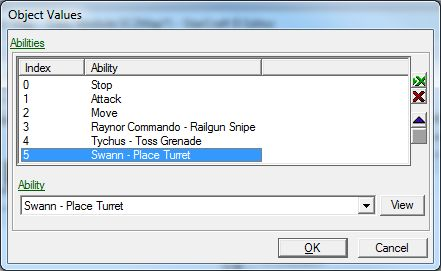

# Data Module - Part 3

## IV. Modifying a unit's spellkit

Next, we're going to modify the abilities that our hero is able to cast. There are two steps to setting up units with abilities: adding the ability to the unit, and adding a button to the command card that links to the ability.

### A. Abilities Array

We won't be able to add ability commands to our hero's command card if he does not possess the corresponding abilities, so before we modify the command card, we need to look at his abilities list.

1. With the Units catalog open, select The People's Hero.
2. Locate the "Abilities +" field, and double click on the values section. In the window that opens, we will see a list of abilities that the unit has.
3. 

Before we go adding the abilities that we want our hero to have, we should remove the ones we don't want him to have.

1. To remove an ability, select it and press the red "x" button on the right side of the window.
2. Repeat step 1 for all abilities in the list except for Stop, Attack, and Move. These three are important for our unit to perform normal functions like moving, patrolling, and attacking.
3. 

Now that we are left with just the basic abilities, we are going to add the special abilities that we want our unit to have.

1. With the same "Abilities +" window open, press the green "x" button right above the red "x" button we just pressed.
2. 

3. In the pop-up window that opens, open the drop-down menu and select the Raynor Commando - Railgun Snipe ability.
4. Repeat steps 1 and 2 to add the Tychus - Toss Grenade and Swann - Place Turret abilities. Press the �Ok� button after all of the abilities have been added to close the window.
5. 

Now that we have our abilities all ready to go, we can put them on the unit's command card.

### B. Removing Command Card Buttons

Like we did with the Abilities list, we should remove unwanted command card buttons before adding new ones.

1. Select the button in the bottom left corner of the command card button section.
2. 

3. You will notice that the fields below the button section change to show the settings for that particular button. We can see that the button is called "Plant Breaching Charge," the Command Type is "Ability Command," etc. The Ability and Ability Command sections are blank because we deleted the ability that this button referenced from the unit just before this.

4. To delete this button assignment and its corresponding ability information, press the red "x" button to the right of the Buttons section below the command card section.
5. 

6. Repeat steps 1 and 2 for the Grenade, Chrono Rift Device, and Experimental Plasma Gun buttons.

Now we can add the new buttons and commands we'd like our hero to use.

1. Select the bottom left button position.
2. Press the green "x" button just above the red "x" button that we used to delete our button.
3. 

4. In the window that pops up, find and select the Penetrator Round (Raynor) button and press OK.
5. 

6. With the Command Type drop-down menu, select Ability Command. Ability Command lets us associate this button with one of the abilities that the unit possesses.
7. Leave the Requirements set to (None). The Requirements section helps determine when this button will be shown or hidden, and when it will be enabled or disabled and greyed out. We want this ability to be always enabled, and always shown.
8. For the Ability section, select Raynor Commando - Railgun Snipe from the list of abilities.
9. For Ability Command, select Penetrator Round (Raynor).

Repeat these steps to add command buttons for the Tychus - Toss Grenade and Swann - Place Turret abilities:

### C. Test It Out

Now that our unit, The People's Hero, has a new set of abilities, let's jump into the game and test them out! And don't forget to save your work first.

